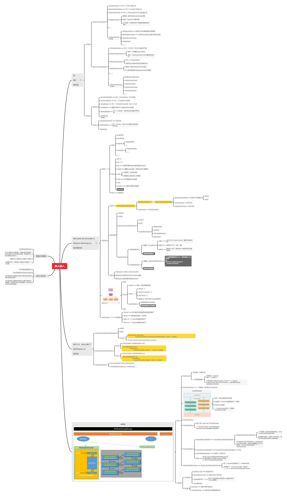

### 前序：学习Java IO ,NIO ,AIO ,Netty时的脑图


尝试着用nio和netty分别写了个聊天室，nio写的代码丢了，误删了，真是哭了。

> 附一句： netty 真牛逼




### 一、NIO

Java Nio 中的SocketChannel 与ServerSocketChannel 其实都是一个Channel，只不过ServerSocketChannel 在注册到selector中时，它关心的事件是accept。当select到accept事件时，调用ServerSocketChannel 的accept方法，即可在服务端开启一个 SocketChannel与客户端的SocketChannel进行通信。


### 二、Netty分析

#### 1、ChannelPipeline

ChannelPripeline是netty中的核心概念，每个SocketChannel都包含一个ChannelPipeline。ChannelPipeline中包含了一系列的ChannelHandler实例，当数据从SocketChannel中读入或输出时，这些实例就会被依次调用。ChannelPipeline中有两个指针，一个head指针，一个tail指针，分别指向两个默认的ChannelHandler


#### 2、ChannelHandler


ChannelHandler有两个子接口：

- ChannelInboundHandler
- ChannelOutboundHandler

其工作模型如图：


ChannelPipeline中维护着一个head指针，指向一个默认的HeadChannelHandler，当字节流从SocketChannle读入后，字节流就读入了这个head handler。然后每一个handler都可以在处理完数据之后选择继续将数据传递给下一个ChannelHandler。

实际上，ChannelInboundHandler可以在将接收到的数据传递到管道中的下一个处理程序之前对其进行转换。例如，原始字节可以转换为HTTP对象或其他对象。然后，管道中的下一个处理程序将看到HTTP对象，而不是原始数据。


#### 3、Channel

是netty封装的Channel，在AbstractNioChannel中，有两个非常重要的成员变量，分别是：

* 一个EventLoop，代表这个Channel绑定的EventLoop事件处理线程

* 一个DefaultChannelPipeline，代表Channel关联的ChannelPipeline

* 一个Jdk nio中的SelectableChannel，即可理解为Channel是对 jdk nio中的 Channel的封装，对应关系为：

| Jdk [SelectableChannel] |    Netty [Channel]     |
| :---------------------: | :--------------------: |
|   ServerSocketChannel   | NioServerSocketChannel |
|      SocketChannel      |    NioSocketChannel    |


#### 3、Netty源码解读

##### SelectStrategy & DefaultSelectStrategy

netty封装的select策略，用来动态调整多路复用器的select策略的。

```java
public interface SelectStrategy {

    /**
     * Indicates a blocking select should follow.
     * 表示应该进行 阻塞式的select()
     */
    int SELECT = -1;
    /**
     * Indicates the IO loop should be retried, no blocking select to follow directly.
     * 表示这次 循环应该直接continue，不进行任何select 操作
     */
    int CONTINUE = -2;
    /**
     * Indicates the IO loop to poll for new events without blocking.
     * 这种方式NIO不支持，可以忽略这个枚举值
     */
    int BUSY_WAIT = -3;

    /**
     * 调用此方法，返回一个枚举值，指示下一次的选择策略
     * @param selectSupplier The supplier with the result of a select result.
     * @param hasTasks true if tasks are waiting to be processed.
     */
    int calculateStrategy(IntSupplier selectSupplier, boolean hasTasks) throws Exception;
}
```


```java
//默认的select策略实现，单例
final class DefaultSelectStrategy implements SelectStrategy {
    static final SelectStrategy INSTANCE = new DefaultSelectStrategy();

    private DefaultSelectStrategy() { }
   
   
    //  如果当前队列有任务的话，根据传入的selectSupplier获得枚举值；队列中没有任务的话，返回SELECT，表示进行阻塞的select()
    @Override
    public int calculateStrategy(IntSupplier selectSupplier, boolean hasTasks) throws Exception {
        return hasTasks ? selectSupplier.get() : SelectStrategy.SELECT;
    }
}
```


##### NioEventLoop

openSelector方法，替换了jdk中select的结果集的底层实现替换为了数组实现，加快了遍历的效率

```java
//这个方法主要是对原生的Jdk提供的selector作了一些增强，例如原生的Jdk的selector select返回的selectionKeySet的底层是HashSet，
//netty通过反射将 selector的 Set替换为了使用数组实现的一个自定义Set类。
private SelectorTuple openSelector() {
}
```


run方法，永远在轮询处理新的事件

```java
@Override
protected void run() {
    for (;;) {
        try {
            try {
                // 根据当前线程中是否有事件队列，来动态的调整select策略。
                switch (selectStrategy.calculateStrategy(selectNowSupplier, hasTasks())) {
                case SelectStrategy.CONTINUE:
                    continue;

                case SelectStrategy.BUSY_WAIT:
                    // fall-through to SELECT since the busy-wait is not supported with NIO

                case SelectStrategy.SELECT:
                    select(wakenUp.getAndSet(false));

                    if (wakenUp.get()) {
                        selector.wakeup();
                    }
                default:
                }
            } catch (IOException e) {
                // If we receive an IOException here its because the Selector is messed up. Let's rebuild
                // the selector and retry. https://github.com/netty/netty/issues/8566
                rebuildSelector0();
                handleLoopException(e);
                continue;
            }

            cancelledKeys = 0;
            needsToSelectAgain = false;
            final int ioRatio = this.ioRatio;

            // 处理select到的事件
            if (ioRatio == 100) {
                try {
                    processSelectedKeys();
                } finally {
                    // 执行任务队列中的任务
                    runAllTasks();
                }
            } else {
                final long ioStartTime = System.nanoTime();
                try {
                    processSelectedKeys();
                } finally {
                    // Ensure we always run tasks.
                    final long ioTime = System.nanoTime() - ioStartTime;
                    runAllTasks(ioTime * (100 - ioRatio) / ioRatio);
                }
            }
        } catch (Throwable t) {
            handleLoopException(t);
        }
        // Always handle shutdown even if the loop processing threw an exception.
        try {
            if (isShuttingDown()) {
                closeAll();
                if (confirmShutdown()) {
                    return;
                }
            }
        } catch (Throwable t) {
            handleLoopException(t);
        }
    }
}
```


select方法，修复了jdk的空轮询bug

```java
private void select(boolean oldWakenUp) throws IOException {
    Selector selector = this.selector;
    try {
        int selectCnt = 0;
        long currentTimeNanos = System.nanoTime();
        //每次select都计算一个deadline时间
        long selectDeadLineNanos = currentTimeNanos + delayNanos(currentTimeNanos);

        for (;;) {
            
            long timeoutMillis = (selectDeadLineNanos - currentTimeNanos + 500000L) / 1000000L;
            //1.超过deadline时间就直接selectNow()然后返回。
            if (timeoutMillis <= 0) {
                if (selectCnt == 0) {
                    selector.selectNow();
                    selectCnt = 1;
                }
                break;
            }

            // If a task was submitted when wakenUp value was true, the task didn't get a chance to call
            // Selector#wakeup. So we need to check task queue again before executing select operation.
            // If we don't, the task might be pended until select operation was timed out.
            // It might be pended until idle timeout if IdleStateHandler existed in pipeline.
            
            // 2.如果没有超时，且队列中有新的任务，则直接selectNow然后返回
            if (hasTasks() && wakenUp.compareAndSet(false, true)) {
                selector.selectNow();
                selectCnt = 1;
                break;
            }

            //未超时，且任务队列为空的话，进行阻塞式的select,直到检测到一个已注册的IO事件发生 
            int selectedKeys = selector.select(timeoutMillis);
            selectCnt ++;

            //如果select到任何事件或者线程被唤醒， 或者 有新的任务， 直接退出
            if (selectedKeys != 0 || oldWakenUp || wakenUp.get() || hasTasks() || hasScheduledTasks()) {
                // - Selected something,
                // - waken up by user, or
                // - the task queue has a pending task.
                // - a scheduled task is ready for processing
                break;
            }
            if (Thread.interrupted()) {
                // Thread was interrupted so reset selected keys and break so we not run into a busy loop.
                // As this is most likely a bug in the handler of the user or it's client library we will
                // also log it.
                //
                // See https://github.com/netty/netty/issues/2426
                if (logger.isDebugEnabled()) {
                    logger.debug("Selector.select() returned prematurely because " +
                                 "Thread.currentThread().interrupt() was called. Use " +
                                 "NioEventLoop.shutdownGracefully() to shutdown the NioEventLoop.");
                }
                selectCnt = 1;
                break;
            }
            
            

            // 防止jdk空轮询bug，当空轮询次数大于512次时，重新创建一个新的selector
            long time = System.nanoTime();
            if (time - TimeUnit.MILLISECONDS.toNanos(timeoutMillis) >= currentTimeNanos) {
                // timeoutMillis elapsed without anything selected.
                selectCnt = 1;
            } else if (SELECTOR_AUTO_REBUILD_THRESHOLD > 0 &&
                       selectCnt >= SELECTOR_AUTO_REBUILD_THRESHOLD) {
                // The code exists in an extra method to ensure the method is not too big to inline as this
                // branch is not very likely to get hit very frequently.
                selector = selectRebuildSelector(selectCnt);
                selectCnt = 1;
                break;
            }

            currentTimeNanos = time;
        }

    } catch (CancelledKeyException e) {
        if (logger.isDebugEnabled()) {
            logger.debug(CancelledKeyException.class.getSimpleName() + " raised by a Selector {} - JDK bug?",
                         selector, e);
        }
        // Harmless exception - log anyway
    }
}
```

processSelectedKeys 方法，处理多路复用器select到的事件

```java
private void processSelectedKeys() {
    if (selectedKeys != null) {
        processSelectedKeysOptimized();   //如果selector的 selectionKeySet 被优化过（即被替换为了数组）
    } else {
        processSelectedKeysPlain(selector.selectedKeys());  //jdk原生使用的hashSet
    }
}
```

优化过后的selectionKey的处理实现

```java
private void processSelectedKeysOptimized() {
    for (int i = 0; i < selectedKeys.size; ++i) {
        final SelectionKey k = selectedKeys.keys[i];
        // help  gc
        selectedKeys.keys[i] = null;

        final Object a = k.attachment();

        // netty封装的 SocketChannel
        if (a instanceof AbstractNioChannel) {
            processSelectedKey(k, (AbstractNioChannel) a);
        } else {
            // jdk nio中的 SocketChannel
            @SuppressWarnings("unchecked")
            NioTask<SelectableChannel> task = (NioTask<SelectableChannel>) a;
            processSelectedKey(k, task);
        }

        if (needsToSelectAgain) {
            // null out entries in the array to allow to have it GC'ed once the Channel close
            // See https://github.com/netty/netty/issues/2363
            selectedKeys.reset(i + 1);

            selectAgain();
            i = -1;
        }
    }
}
```


#### 4、JDK NIO selector空轮询bug

JDK NIO 原生Selector提供了一个阻塞的select()方法，但是这个阻塞方法有可能被意外唤醒，导致死循环select，进而导致CPU使用频率过高，这是个臭名昭著的bug，具体原因请看图解:


对上图的解释：

- 正常情况下，selector.select()操作是阻塞的，只有被监听的fd有读写操作时，才被唤醒
- 但是，在这个bug中，没有任何fd有读写请求，但是select()操作依旧被唤醒
- 很显然，这种情况下，selectedKeys()返回的是个空数组
- 然后按照逻辑执行到while(true)处，循环执行，导致死循环。 

**原因**：

在部分Linux的2.6的kernel中，poll和epoll对于突然中断的连接socket会对返回的eventSet事件集合置为POLLHUP，也可能是POLLERR，eventSet事件集合发生了变化，这就可能导致Selector会被唤醒。 

**解决办法：**

创建一个新的Selector， 参见netty NioEventLoop中的 select()方法。


### 三、其他知识点

#### 1、什么是IO多路复用


