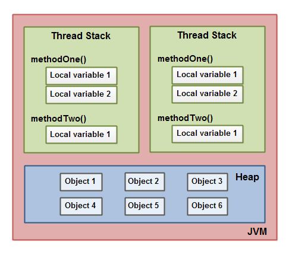
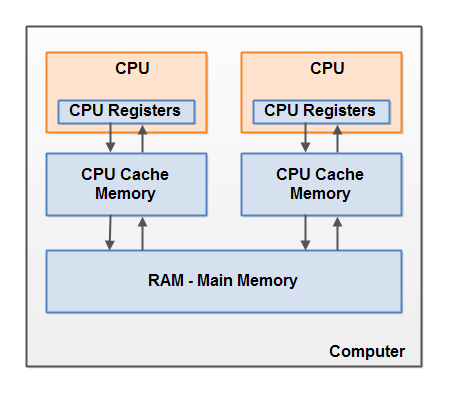
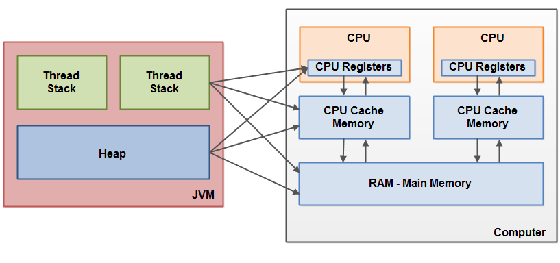
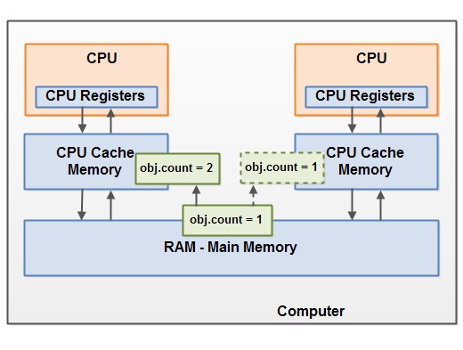
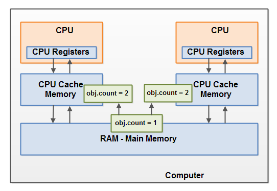
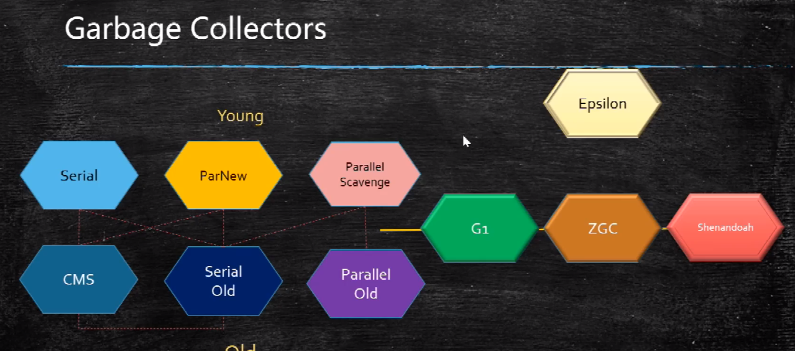
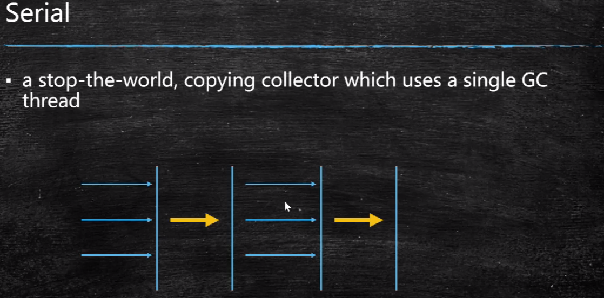
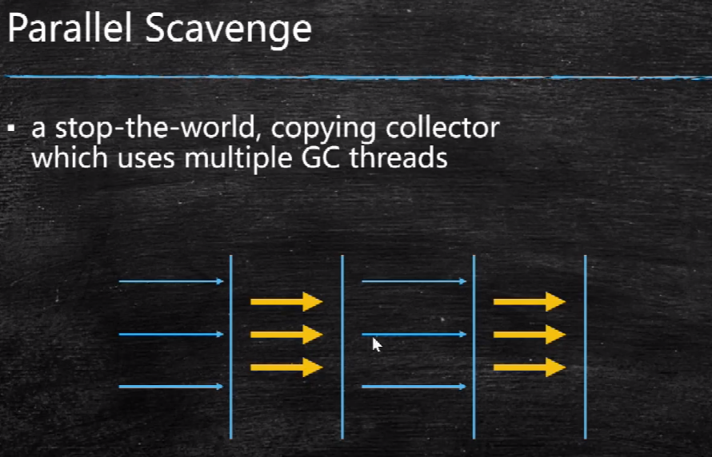

### JVM规范

前段时间读了一下《Java语言规范》与《JVM规范》，记录了一些阅读笔记。首先有个层次的概念，我们所说的JVM主要由3个部分组成：

* 类加载子系统
* 运行时数据区（内存结构）
* 执行引擎

整个JVM模型图如下：


#### 1、java中的类型

**基础类型与值**

原始类型包括8种，分别为：

- boolean类型，true or false

- byte 类型，取值范围是从-128至127 （[- 2^7, 2^7 - 1]） 

- short 类型，取值范围是从−32768至32767（[- 2^15, 2^15 - 1]） 

- int 类型，取值范围是从−2147483648至2147483647（[- 2^31, 2^31 - 1]） 

- long 类型，取值范围是从−9223372036854775808至9223372036854775807（[- 2^63, 2^63 - 1]） 

- char 类型，取值范围是从0至65535

- float 类型，占用4个字节

- double 类型，占用8个字节

  常用进制的表示法：

  0x  十六进制  例如 0Xff (int类型)  0XffL (Long类型)   =十进制的 255
  
  0   八进制   例如077 (int类型)  077L(long类型)  = 十进制的 63
  
  0b 二进制  

**引用类型与值**

引用类型有3种，分别为：

- class  类

- interface 接口

- array  数组

  引用类型的默认值为null， null可以类型转换为任意引用类型。


#### 2、运行时数据区


* PC寄存器

  每一条Java虚拟机线程都有自己的pc(program counter)寄存器，用来保存正在执行的字节码指令的地址。在任意时刻， 一条Java虚拟机线程只会执行一个方法的代码。

* 线程栈

  每一条Java虚拟机线程都有自己私有的Java虚拟机栈(JavaVirtual Machine stack)， 这个栈与线程同时创建，用于储存栈帧， 栈帧用于存储局部变量与一些尚未算好的结果。Java虚拟机栈所使用的内存不需要保证是连续的。如果线程请求分配的栈容量超过Java虚拟机栈允许的最大容量，Java虚拟机将会抛出一个StackOverflowError异常；如果Java虚拟机栈可以动态扩展， 并且在尝试扩展的时候无法申请到足够的内存，或者在创建新的线程时没有足够的内存去创建对应的虚拟机栈， 那Java虚拟机将会抛出一个OutOfMemoryError异常。

* java堆

  在Java虚拟机中， 堆( heap) 是可供各个线程共享的运行时内存区域 也是供所有**类实例**和**数组对象**分配内存的区域。如果实际所需的堆超过了自动内存管理系统能提供的最大容量， 那Java虚拟机将会抛出一OutOfMemoryError异常。

* 方法区

  方法区是个逻辑概念，jdk1.8以前，方法区实际是位于永久代里的，即堆中；而JDK1.8开始，方法区被移除，方法区实际是在元数据区域meta space中的；方法区(method area)是可供各个线程共享的运行时内存区域。它存储了每一个类的结构信息（元数据）， 例如， 运行时常量池(runtime constant pool)、 字段和方法数据、 构造函数和普通方法的字节码内容。

* 运行时常量池 (runtime constant pool)

  运行时常量池是class文件中的contant pool 的运行时的表现形式，它包括了若干种不同的变量，从编译器可知的数值字面量到必须在运行时解析后才能获得的方法或字段引用。

* 本地方法栈

  与naive方法有关，随线程创建时创建。

 

#### 3、类加载子系统

##### 1.类的生命周期

当程序主动使用某个类时，如果该类还未被加载到内存中，则JVM会通过加载、连接、初始化3个步骤来对该类进行初始化。如果没有意外，JVM将会连续完成3个步骤，所以有时也把这个3个步骤统称为类加载或类初始化，类的声明周期如下图：


###### 1.加载

  加载指的是将类的class文件读入到内存，并为之创建一个java.lang.Class对象，也就是说，当程序中使用任何类时，系统都会为之建立一个java.lang.Class对象。

  类的加载由类加载器完成，类加载器通常由JVM提供，这些类加载器也是前面所有程序运行的基础，JVM提供的这些类加载器通常被称为系统类加载器。除此之外，开发者可以通过继承ClassLoader基类来创建自己的类加载器。

  通过使用不同的类加载器，可以从不同来源加载类的二进制数据，通常有如下几种来源。

  - 从本地文件系统加载class文件，这是前面绝大部分示例程序的类加载方式。
  - 从JAR包加载class文件，这种方式也是很常见的，前面介绍JDBC编程时用到的数据库驱动类就放在JAR文件中，JVM可以从JAR文件中直接加载该class文件。
  - 通过网络加载class文件。
  - 把一个Java源文件动态编译，并执行加载。

  类加载器通常无须等到“首次使用”该类时才加载该类，Java虚拟机规范允许系统预先加载某些类。

  

###### 2.链接

当类被加载之后，系统为之生成一个对应的Class对象，接着将会进入连接阶段，连接阶段负责把类的二进制数据合并到JRE中。类连接又可分为如下3个阶段。

**1)验证：**验证阶段用于检验被加载的类是否有正确的内部结构，并和其他类协调一致。Java是相对C++语言是安全的语言，例如它有C++不具有的数组越界的检查。这本身就是对自身安全的一种保护。验证阶段是Java非常重要的一个阶段，它会直接的保证应用是否会被恶意入侵的一道重要的防线，越是严谨的验证机制越安全。验证的目的在于确保Class文件的字节流中包含信息符合当前虚拟机要求，不会危害虚拟机自身安全。其主要包括四种验证，文件格式验证，元数据验证，字节码验证，符号引用验证。

四种验证做进一步说明：

**文件格式验证：**主要验证字节流是否符合Class文件格式规范，并且能被当前的虚拟机加载处理。例如：主，次版本号是否在当前虚拟机处理的范围之内。常量池中是否有不被支持的常量类型。指向常量的中的索引值是否存在不存在的常量或不符合类型的常量。

**元数据验证：**对字节码描述的信息进行语义的分析，分析是否符合java的语言语法的规范。

**字节码验证：**最重要的验证环节，分析数据流和控制，确定语义是合法的，符合逻辑的。主要的针对元数据验证后对方法体的验证。保证类方法在运行时不会有危害出现。

**符号引用验证：**主要是针对符号引用转换为直接引用的时候，是会延伸到第三解析阶段，主要去确定访问类型等涉及到引用的情况，主要是要保证引用一定会被访问到，不会出现类等无法访问的问题。

2)**准备：**类准备阶段负责为类的静态变量分配内存，并设置默认初始值。

3)**解析：**将类的二进制数据中的符号引用替换成直接引用。说明一下：符号引用：符号引用是以一组符号来描述所引用的目标，符号可以是任何的字面形式的字面量，只要不会出现冲突能够定位到就行。布局和内存无关。直接引用：是指向目标的指针，偏移量或者能够直接定位的句柄。该引用是和内存中的布局有关的，并且一定加载进来的。


###### 3.初始化

初始化主要是初始他的静态成员变量和静态方法，static成员方法与成员变量初始化的顺序取决于代码中的顺序，从上到下挨个初始化。

类被初始化的时机：

  - 被new关键字直接实例化时
  - 类的static方法被调用时
  - 在被反射调用时，例如Class.forname()
  - 其子类被初始化时。


##### 4.类加载器

类加载器的作用主要就是将来源不同的字节码加载到内存当中。

类加载器可以分别两类，一类是Java自带的类加载器，包括：

* BootStrapClassLoader    加载JRE核心类库，如JRE/LIB 下的rt.jar 等等
* Extension ClassLoader    加载JRE拓展目录中的拓展类库  JRE/LIB/EXT
* Application ClassLoader  加载ClassPath路径下的用户自定义类库

另一类是用户自定义的类加载器：可以继承ClassLoader类，实现一些方法。

> 注：除了BootStrapClassLoader，所有类加载器都继承自抽象类ClassLoader，包括ExtClassLoader与AppClassLoader；
>
> ClassLoader中有一个 parent引用，指向了它的父类加载器。

##### 5.全盘负责委托机制

当要加载一个类时，如果没有显示的使用另一个ClassLoader去加载类，则默认使用当前类的加载器去加载目标类。

##### 6.双亲委派模型

###### **双亲委派：**

双亲委派模式的工作原理的是;如果一个类加载器收到了类加载请求，它并不会自己先去加载，而是把这个请求委托给父类的加载器去执行，如果父类加载器还存在其父类加载器，则进一步向上委托，依次递归，请求最终将到达顶层的启动类加载器，如果父类加载器可以完成类加载任务，就成功返回，倘若父类加载器无法完成此加载任务，就会抛异常；子加载器捕获异常，并尝试自己去加载，这就是双亲委派模式，即每个儿子都不愿意干活，每次有活就丢给父亲去干，直到父亲说这件事我也干不了时，儿子自己想办法去完成，这不就是传说中的双亲委派模式.那么这种模式有什么作用呢?

###### 双亲委派的意义：

* **避免类的重复加载  **当父亲已经加载了该类时，就没有必要子ClassLoader再加载一次。其次是考虑到

* **安全因素**   java核心api中定义类型不会被随意替换，假设通过网络传递一个名为java.lang.Integer的类，通过双亲委托模式传递到启动类加载器，而启动类加载器在核心Java API发现这个名字的类，发现该类已被加载，并不会重新加载网络传递的过来的java.lang.Integer，而直接返回已加载过的Integer.class，这样便可以防止核心API库被随意篡改。 

###### 模型图：


核心代码：

```java
//摘抄自ClassLoader抽象类的 loadClass方法；
//当需要加载类时，会先调用本地方法，检查类是否早已经被加载过;
//类加载请求会优先交给父类去执行，当父类加载器为空时，查找指定类是否被BootStrapClass加载过。
//如果仍然没有找到对应的类，则

protected Class<?> loadClass(String name, boolean resolve)
        throws ClassNotFoundException
    {
        synchronized (getClassLoadingLock(name)) {
            // 当需要加载类时，会先调用本地方法，检查类是否早已经被加载过
            Class<?> c = findLoadedClass(name);
            if (c == null) {
                long t0 = System.nanoTime();
                try {
                    if (parent != null) {
                        c = parent.loadClass(name, false);
                    } else {
                        c = findBootstrapClassOrNull(name);
                    }
                } catch (ClassNotFoundException e) {
                    // 如果父类尝试加载类失败，忽略异常信息，
                    // 接下来尝试自身去加载类！
                }
				//调用此方法去查找类并加载；
                //如果加载失败！会抛出异常，意味着再交给调用它的子类去加载！
                if (c == null) {
                    
                    c = findClass(name);  //找不到会抛出异常

                }
            }
            if (resolve) {
                resolveClass(c);
            }
            return c;
        }
    }
```


#### 4、Java的内存模型

Java的内存模型如下图所示，主要理解两个部分，一个是线程栈；一个是堆；理解了JMM模型，就理解了一切。



以一个Student类为实例：说明这些变量都是存在于内存中的哪里：

```java
public class Student{
  
    // member variables  成员变量, 随对象存储在 heap
    String name;
    int age;
    
    public String getName(){
        
        //local variables  本地变量, 永远寄存 thread stack 中
        String tempS =.....
        int tempI = ...
        
        Student b =new Student();   // 新new出来的对象存放在heap中, b只是对象的引用。
    }
    
        //静态成员变量
    static String test ="test";
    // 静态方法
    public static Class<?> getClass(){
        return Student.class;
    }
}
```

>  注：Class实例保存在堆中，而从jdk1.7后，类的静态成员变量保存在class对象中。改动日志见 https://bugs.java.com/bugdatabase/view_bug.do?bug_id=7017732

#### 5、计算机硬件内存模型



##### 寄存器（cpu registers）

现在的计算机一般都有多个cpu核心，每个cpu都有自己的cpu registers（cpu寄存器），寄存器的本质其实是cpu内部的内存。cpu访问寄存器的速度要远远高于访问主存的速度。

##### cpu缓存 （cpu cache memory）

现在的计算机一般也都有大小不一的缓存，可能有多级缓存，即平常所说的L1 cache、L2 cache，cpu直接访问缓存的速度也是高于直接访问主存的。

##### 主存（main memory）

即平常所说的内存，内存的容量一般比较大，相对前两者，cpu对其的访问速度要慢了许多。

**cpu的执行方式**

一般来讲，当cpu需要访问主存时，可能会将主存的一部分内容缓存到cpu缓存中；然后再将缓存中的一部分读取到寄存器中；然后基于寄存器进行快速的计算。当cpu需要将计算结果写回主存时，cpu会将计算结果从寄存器中刷新到缓存中；随后cpu在某个时间点再将结果从缓存中刷新到主存当中。

缓存中储存的结果一般通常是在cpu需要读取别的数据到缓存中时刷回到主存中的。cpu读写缓存还涉及到个概念，叫做缓存对齐（cache lines），记不太清了。

#### 6、JAVA内存模型与计算机硬件模型的关系



从硬件的角度上来看，线程栈、堆都是存在于计算机主存上的。而线程栈和堆中的部分内容可能在某个时间节点上出现在cpu缓存或cpu寄存器中，而这种方式可能会引发一系列问题，最主要的问题有两点：

1. 共享变量在多线程并发修改时的可见性。
2. 读写共享变量时的竞态条件。

##### 共享变量的多线程可见性 

多个线程共享一个变量，并发编程时，如果没有用volatile或同步机制做合理的控制，一个线程对变量值的修改对其他线程可能是不可见的。

想象一下，一个共享变量A起初存储在主存当中。一个运行在cpu1中的从主存中读取变量A到它的cpu缓存中，然后cpu1对这个共享变量作出了修改。只要变量A在cpu1 的缓存中的最新值还未被刷新到主存中，运行在其他cpu中的线程就无法获取到变量A的最新状态。这样的话，处于不同cpu中的多个线程最终可能对变量A都持有不同的副本。如下图所示：



解决办法是使用java中的关键字 volatile，这个关键字可以保证一个变量总是从主存中读取，当变量更新后立刻被刷新到主存当中。

##### 竞态条件

>  当两个线程竞争同一资源时，如果对资源的访问顺序敏感，就称存在竞态条件）

如果两个或多个线程共享一个对象，并且有多个线程更新该共享对象中的变量，可能会出现竞态条件。

想象一下，如果分别处于CPU1、CPU2中两个线程A、B，同时从主存中读取变量var=1到各自的cpu缓存中；然后各自将变量++1；那么无论cpu1、cpu2将变量值刷回主存的先后顺序，主存中变量var的值最终都为2。如下图：



解决办法是使用java的同步锁。同步锁保证了在任何时刻只有一个线程能访问指定的变量；并且保证了在同步代码块中，所有的变量，无论是否被volatile声明，都会从主存中读取，当退出同步代码块时，变量的值会被刷回到主存当中。


#### 7.Java 内存回收

>  参考:
>
>  * 马老师视频[地址](https://www.bilibili.com/video/BV1uK4y1x7gq?p=5)
>* [垃圾回收算法介绍与JVM垃圾回收器选择指北](https://www.jianshu.com/p/592618435f79)
>  * [JVM垃圾回收器区别](https://zhuanlan.zhihu.com/p/58896728)

##### 1.什么是垃圾

* 堆内存中的一个对象没有任何引用时，就是垃圾对象；
* 或者是被其他对象引用，但归根结底是不被引用的对象，是一堆垃圾对象。

##### 2.如何定位垃圾

1. 引用计数法

   根据对象的引用计数来判断是否为垃圾，但是有缺陷：多个垃圾对象的循环引用会造成内存泄露。

2. 根可达算法

   从GC Roots开始遍历内存池中的所有对象，任何能够从GC Roots直接或间接引用到的对象便被标记为“可达”，待遍历完成后，所有未被标记为“可达”的对象即为待回收的垃圾对象。

##### 3.垃圾清理算法

1. 标记清除算法（Mark Clean）

   * 标记阶段：从GC Roots开始进行可达性分析，将所有可达对象标记出来
   * 清除阶段：将所有未标记可达的对象清理掉

   > 缺陷：会产生内存碎片(内存不连续)。

2. 拷贝算法

   * 将内存划分为两个区域，一次只使用其中一个（暂称为from区）
   * 在进行可达性分析的同时，将可达对象复制到另一个空白的内存区域中（暂称为to区）
   * 可达性分析完成后，将to区与from区的身份互换，同时将原先的from区（现在的to区）中的对象清除

   > 优先：没有内存碎片，效率最高
   >
   > 缺点：但是浪费空间。

3. 标记压缩算法

   * 与标记-清除算法类似，

   * 区别在于在标记阶段完成后，将所有可达对象移动到内存池的另一端，形成一整块连续的内存空间，

   * 然后再将范围外的内存池清空。

   >  分析：垃圾回收后的内存连续，且不浪费空间，但是效率较低。

##### 4.常见的垃圾回收器

先贴出目前常见的一些垃圾回收器，如图：

   

其中：

* 分带垃圾回收算法：左侧六个垃圾回收器是区分新生代和老年代的，上边三个用于新生代的垃圾回收，下边三个用于老年代的垃圾回收，之间的虚连线表示可以配合使用。
* 不分带的垃圾回收算法：右侧几个垃圾回收器是新的垃圾回收期，效率比较高，但是还没有普遍使用，JDK默认的垃圾回收器是 **Parallel Scavenge + Parallel Old**


下面分别介绍这几个垃圾回收器：

1. serial （年轻代垃圾回收）

   >  a stop-the=world, copying collector which uses a single GC thread. 串行回收

   用于YGC，年轻代垃圾回收，垃圾回收时会阻塞所有线程，垃圾回收结束后其他线程继续运行。图示：

   

   

2. parallel scavenge （年轻代）

   > a stop-the-world, copying collector which use mutiple GC threads ,并行垃圾回收

   用于YGC，年轻代垃圾回收，垃圾回收时会阻塞所有线程，垃圾回收结束后其他线程继续运行，但使用了多个线程进行GC

   

3. ParNew（年轻代）

   配合CMS使用的年轻代并行垃圾回收器

4. Serial Old（老年代）

   单线程的算法在Old区使用

5. Parallel Old（老年代）

   多线程的算法放在Old区使用

   ***

   以上都是单gc线程或多gc线程并行垃圾回收的，从CMS开始，跨越到并发垃圾回收的时代，即业务线程与gc线程并发工作。

6. Concurrent Mark Sweep(CMS)(老年代)

   在垃圾回收的过程中，应用程序也可以继续运行，降低STW的时间。（可以降至200ms以内）。

   >  缺陷： 
   >
   >  * 对CPU要求高，由于部分标记和清除阶段是免STW并且多线程并行的，这就给CPU增加了很大的线程切换压力，核数少的CPU使用CMS回收器的效果并不好，多核多CPU的高性能主机更加适合使用
   >  * 垃圾回收的同时老年代中仍然在产生新的对象，这是CMS的并行机制导致的。所以CMS回收器不能在老年代满时才开始工作，Hotspot VM 6/7中，CMS回收器在老年代使用率92%时便开始工作。如果在CMS垃圾回收的过程中，新增的对象占满了剩余的8%空间，便会导致CMS回收失败，自动降级至SerialOld重新进行垃圾回收。（CMS垃圾回收触发的时机可以使用-XX:CMSInitiatingOccupancyFraction参数进行设置）
   >  * CMS使用的是标记-清除算法，而不是标记-压缩算法，这就导致会出现大量的内存碎片。随着内存碎片的增多，最终势必会出现垃圾回收的并发阶段中内存不足的情况，如上所说，此时CMS回收器会自动降级为SerialOld回收器，以标记-压缩算法进行垃圾回收，同时也就会整理好内存碎片。
   >
   >  
   >
   >  在启动参数中指定-XX:+UseConcMarkSweepGC，会开启ParNew+CMS的回收器组合。
   >
   >  CMS回收器在控制STW时长的表现上要比Parallel Old好很多，然而代价是占用更多的计算资源，如果服务器的计算资源有冗余，使用CMS是更好的选择。

7. **Garbage-First**   G1  (10ms)

   G1回收器诞生于Hotspot VM的7update4版本，这一最新型的垃圾回收器吸取了CMS回收器的经验和教训，旨在解决CMS回收器的各类弊端，同时提供更短更可控的STW时长。G1的机制比CMS更加复杂，此处同样尽可能简明的进行介绍：

   * 与其他回收器不同，G1是一个全代回收器，同时负责新生代和老年代的垃圾回收工作。

   * G1回收器打破了Hotspot VM以往的分代概念，新生代的Eden、S0、S1，以及老年代不再是物理分隔，而变成了灵活的逻辑分隔。G1将堆内存划分为2000个左右相等的内存块，每个内存块的大小为1-32Mb。每个内存块可以作为Eden、S0、S1或老年代使用，也就是说这些块的身份是不固定的。随着每次垃圾回收的完成，有些块的内存会被完全释放掉，成为空白块，而这些空白块在接下来可能成为任何一种角色。

     

值得注意的是，G1的垃圾回收并非每次都将所有不可达对象完全清除，G1倾向于优先清除活跃度低的内存块，因为这些块中的存活对象少（或者压根没有存活对象），清理速度更快。对于那些活跃度高的内存块，G1会放置不管，直至某个时间点该块的活跃度足够低时再进行回收。
正因为如此，G1进行垃圾回收的时机更早，默认在堆内存使用率达到45%时就会开始垃圾回收。这体现了G1（Garbage-First/垃圾回收优先）这一名字的含义。

至于活跃度多低才会进行回收，则是由G1决定的，G1会调整自己的回收策略来尽可能满足用户设置的最大STW时长。
同时，由于使用拷贝算法，G1回收器不会产生内存碎片，这也是相较CMS的巨大优势之一。
G1回收器能够根据需要动态调整各个分代的内存占比，在快速实例化大量对象时表现尤佳。
G1回收器接收一个最大STW时长的任务指标，并会努力控制每次垃圾回收的STW时长来完成这一指标。默认的指标是200ms，注意不要给G1设置过于过分的任务指标，否则它为了完成任务可能是会乱来的……

 **结论：**G1适合运行在配有强大CPU的主机上的，且占用较大堆内存空间的应用程序中。如果你想要得到最佳的STW时长，并且愿意为此进行一些参数调优工作的话，使用G1回收器通常来说是最好的选择。 

   > 通过参数
   >
   > -XX:+UseG1GC                                                 启用G1回收器
   >
   > -XX:MaxGCPauseMillis=n                               来设置最大的STW时长
   >
   > -XX:InitiatingHeapOccupancyPercent=n     来设置触发垃圾回收的堆内存占用比

***

除了GC之外，还有几种不分代的垃圾回收器，如ZGC (1ms)  、Shenandoah 、Eplison等等，但是尚处于实验阶段，没有正式使用。


> 附：
>
> * JDK1.8默认的垃圾回收器是 2 + 4 ，即年轻代和老年代都是采用多线程GC垃圾回收的。
> * JDK1.9默认的垃圾回收器是 G1。
> * idea使用的垃圾回收器是CMS


##### 6.JVM调优工具

马老师入门JVM调优[视频](https://www.bilibili.com/video/BV1uK4y1x7gq?p=10)

* Arthas  （生产环境）

  阿里开源的在线问题定位工具。

  > Arthas可以替代JVM自带的所有命令行工具，除了 jmap命令，jmap命令可以输出某进程内的所有对象

  命令集合：

  * help     可查看命令帮助文档
  * jad {全限定类名}   反编译指定类，可查看生产环境源代码是否有版本差异。
  * heapdump   可以输出内存dump文件
  
* Jconsole （测试环境）

* Jdk自带命令：

  * jps  列出有哪些java 进程

  * jinfo pid   列出java进程的一些详细信息

  * jmap      `jmap -histo {pId} | head -20`   //根据对象占用空间大小的逆序输出  

    > 注：此命令线上谨慎使用！因为这个命令会耗时很久，对进程造成严重影响。

  * jstack {pid}    列出所有线程的栈调用信息


#### 8.JVM堆内存分区

JVM运行时数据区中占用内存量最大的当属堆内存了，但是堆中内存在JDK1.8之前都是有物理区域划分的，一般划分为：

##### 1.新生代 

新生代内存又划分为三个区域：

* 一个Eden Space

  所有新new出来的对象都是直接位于此区域内的，如果eden space放不下新申请的对象，则新申请的对象直接进入老年代。

* 两个1:1的Survivor Space

  用来在每次YGC之后，重复的做内存拷贝的。

>  **GC过程**：新生代的 GC 叫做 Young GC、Minor Gc；一般新生代一次GC过程中，90%、大多数的对象会被作为垃圾被回收。新生代的GC过程大概分为三个步骤：
>
> 1. Eden Space 进行一次YGC，使用的是垃圾回收算法中的拷贝算法，在定位垃圾后，将非垃圾对象直接拷贝至Survivor0中；
> 2. Eden Space 与 Survivor0，同时进行一次YGC，将非垃圾对象使用拷贝算法，全部复制到Survivor1区中；清空Survivor1；
> 3. 不断重复第2步，在survivor0与survivor1中来回拷贝；
> 4. 当对象的年龄足够时，或在复制拷贝的过程中，如果survivor空间不足，对象进入老年代。 

##### 2.老年代

用来存放一些从新生代晋级过来的顽固对象，新生代有YGC，同样的，老年代有OGC；而FGC =  Young GC + Old GC。

> **GC过程**：
>
> * 首先，要清楚，老年代的垃圾清除算法使用的是 标记压缩算法（效率低）。
>
> 当老年代的对象也满了或者到达一定比例的时候，会进行一次FGC，当在FGC的过程中，业务线程将被阻塞，堆内存越大，GC的耗时就越久。


> 注：新生代与老年代的大小比例默认为 1:2；其中，新生代中的eden space与survivor space的比例默认为8:2（两个survivor space 各占1）

##### 3.GC调优的目标

减少FGC的次数，因为FGC会产生STW。


##### 4.永久代（jdk<=1.7) / 元空间(jdk >=1.8)

jdk<=1.7之前，永久代是堆内内存；但从jdk1.8起，永久区的概念被移除了，取而代之的是元数据空间（meta space），是堆外内存。

用来装载Class信息，Class实例的，考虑到动态代理，可能占用很大内存。

区别：

* 永久代必须指定大小
* 元空间可以设置，也可以不设置，没有上限
* String常量 1.7时在永久代，1.8在堆里


#### 9.JVM参数

##### 1.参数分类

* 首先，了解一些一下JVM的命令行参考：[oracle官方文档](https://docs.oracle.com/javase/8/docs/technotes/tools/unix/java.html)

* 其次，了解一下JVM命令的分类：

  > * 标准命令：  - 开头，所有HotSpot都支持
  > * 非标准命令： -X 开头，特定版本HotSpot支持
  > * 不稳定命令：-XX开头，下个版本可能会取消


##### 2.一些常用的参数：

| 参数                            | 解释：                                                       |
| ------------------------------- | ------------------------------------------------------------ |
| -XX:+PrintCommandLineFlags      | 启动时输出所有JVM参数。 //可以放心使用，只会输出，不会改变任何配置。 |
| -XX:+PrintFlagsFinal            | 输出可选的XX参数                                             |
| -Xmx2048m                       | 最大堆大小                                                   |
| -Xms2048m                       | 初始堆大小                                                   |
| -Xmn1024m                       | 年轻代大小                                                   |
| -Xss512k                        | 每个线程栈大小，JDK5.0以后每个线程堆栈大小为1M               |
| -XX:SurvivorRatio=8             | Eden区与Survivor区的大小比值，设置为8,则两个Survivor区与一个Eden区的比值为2:8<br />,一个Survivor区占整个年轻代的1/10 |
| -XX:+UseG1GC                    | 使用 G1 (Garbage First) 垃圾收集器                           |
| -XX:MaxTenuringThreshold=14     | 提升年老代的最大临界值(tenuring threshold). 默认值为 15[每次GC，<br />增加1岁，到15岁如果还要存活，放入Old区] |
|                                 |                                                              |
| -Duser.timezone=GMT+8           | 设定GMT区域，避免CentOS坑爹的时区设置                        |
| -XX:+HeapDumpOnOutOfMemoryError | OOM时导出堆到文件                                            |
| -XX:HeapDumpPath=d:/a.dump      | 导出OOM的路径                                                |
| -XX:+PrintGCDetails             | 打印GC详细信息                                               |
| -XX:+PrintGCTimeStamps          | 打印CG发生的时间戳                                           |
|                                 |                                                              |

##### 3.使用例子

```
JAVA_OPTS="-server -Xmx4g -Xms4g -Xmn256m -Xss256k -XX:+DisableExplicitGC  -XX:+UseConcMarkSweepGC -XX:+CMSParallelRemarkEnabled -XX:LargePageSizeInBytes=128m -XX:+UseFastAccessorMethods -XX:+UseCMSInitiatingOccupancyOnly -XX:CMSInitiatingOccupancyFraction=70 -Duser.timezone=GMT+8"
```

然后在java启动命令后插入这一些列参数即可调整虚拟机的启动配置。


#### 10.测试

##### 1.String常量池在哪里？

问题：String常量池到底是在哪里呢？

```
	public static void main(String[] args) {
        String str = "abc";
        char[] array = {'a', 'b', 'c'};
        String str2 = new String(array);
        //使用intern()将str2字符串内容放入常量池
        str2 = str2.intern();
        //这个比較用来说明字符串字面常量和我们使用intern处理后的字符串是在同一个地方
        System.out.println(str == str2);
        //那好，以下我们就拼命的intern吧
        ArrayList<String> list = new ArrayList<String>();
        for (int i = 0; i < 10000000; i++) {
            String temp = String.valueOf(i).intern();
            list.add(temp);
        }
    }
```

使用上面这个小程序，基于JDK1.8可以测试出，字符串常量池是在堆里面的。

```
Exception in thread "RMI TCP Connection(idle)" java.lang.OutOfMemoryError: Java heap space
	at java.io.BufferedOutputStream.<init>(BufferedOutputStream.java:76)
	at java.io.BufferedOutputStream.<init>(BufferedOutputStream.java:59)
	at sun.rmi.transport.tcp.TCPTransport$ConnectionHandler.run0(TCPTransport.java:769)
	at sun.rmi.transport.tcp.TCPTransport$ConnectionHandler.lambda$run$0(TCPTransport.java:688)
	at sun.rmi.transport.tcp.TCPTransport$ConnectionHandler$$Lambda$3/25972658.run(Unknown Source)
	at java.security.AccessController.doPrivileged(Native Method)
	at sun.rmi.transport.tcp.TCPTransport$ConnectionHandler.run(TCPTransport.java:687)
	at java.util.concurrent.ThreadPoolExecutor.runWorker(ThreadPoolExecutor.java:1149)
	at java.util.concurrent.ThreadPoolExecutor$Worker.run(ThreadPoolExecutor.java:624)
	at java.lang.Thread.run(Thread.java:748)
Exception in thread "RMI TCP Connection(idle)" java.lang.OutOfMemoryError: Java heap space
Exception in thread "main" java.lang.OutOfMemoryError: Java heap space
```


基于JDK1.7测试时，看网友好像是报的 永久代内存溢出；

所以，综上：字符串常量池在小于等于1.7时，位于堆的永久代中；1.8后永久代被溢出，字符串常量池位于堆中。


同时：阅读String.intern方法可知：String的常量池是由String类单独维护的。