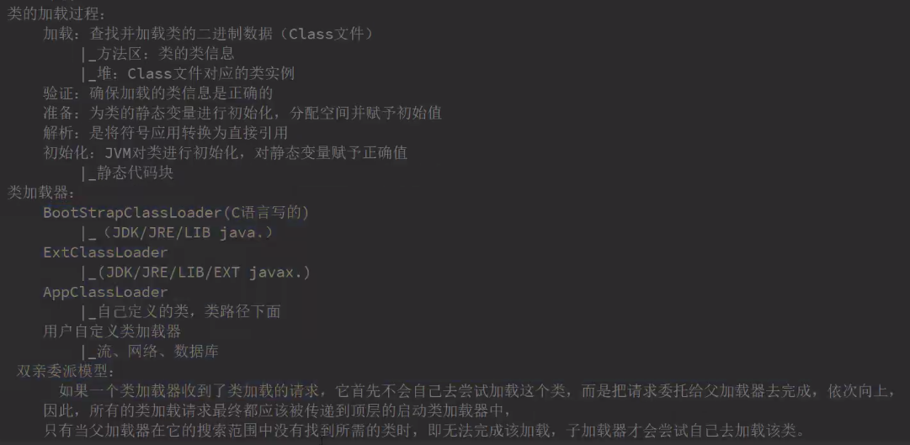

### JVM规范

前段时间读了一下

#### 1、java中的类型

**基础类型与值**

原始类型包括8种，分别为：

- boolean类型，true or false

- byte 类型，取值范围是从-128至127 （[- 2^7, 2^7 - 1]） 

- short 类型，取值范围是从−32768至32767（[- 2^15, 2^15 - 1]） 

- int 类型，取值范围是从−2147483648至2147483647（[- 2^31, 2^31 - 1]） 

- long 类型，取值范围是从−9223372036854775808至9223372036854775807（[- 2^63, 2^63 - 1]） 

- char 类型，取值范围是从0至65535

- float 类型，占用4个字节

- double 类型，占用8个字节

  常用进制的表示法：

  0x  十六进制  例如 0Xff (int类型)  0XffL (Long类型)   =十进制的 255
  
  0   八进制   例如077 (int类型)  077L(long类型)  = 十进制的 63
  
  0b 二进制  

**引用类型与值**

引用类型有3种，分别为：

- class  类

- interface 接口

- array  数组

  引用类型的默认值为null， null可以类型转换为任意引用类型。


#### 2、运行时数据区


**pc寄存器**

每一条Java虚拟机线程都有自己的pc(program counter)寄存器。在任意时刻， 一条Java虚拟机线程只会执行一个方法的代码。

**java虚拟机栈（LIFO）**

每一条Java虚拟机线程都有自己私有的Java虚拟机栈(JavaVirtual Machine stack)， 这

个栈与线程同时创建， 用于存储局部变量与一些尚未算好的结果。Java虚拟机栈所使用的内存不需要保证是连续的。

如果线程请求分配的栈容量超过Java虚拟机栈允许的最大容量，Java虚拟机将会抛出一个StackOverflowError异常；如果Java虚拟机栈可以动态扩展， 并且在尝试扩展的时候无法申请到足够的内存，或者在创建新的线程时没有足够的内存去创建对应的虚拟机栈， 那Java虚拟机将会抛出一个OutOfMemoryError异常。

**java堆**

在Java虚拟机中， 堆( heap) 是可供各个线程共享的运行时内存区域 也是供所有**类实例**和**数组对象**分配内存的区域。

如果实际所需的堆超过了自动内存管理系统能提供的最大容量， 那Java虚拟机将会抛出一OutOfMemoryError异常。

**方法区**

方法区(me thod area)是可供各个线程共享的运行时内存区域。它存储了每一个类的结构信息（元数据）， 例如， 运行时常量池(runtime constant pool)、 字段和方法数据、 构造函数和普通方法的字节码内容。

**运行时常量池** (属于方法区)

区别于编译时期的Class文件常量池。

**本地方法栈**

与naive方法有关，随线程创建时创建。

 

#### 3、类加载机制

- 当程序主动使用某个类时，如果该类还未被加载到内存中，则JVM会通过加载、连接、初始化3个步骤来对该类进行初始化。如果没有意外，JVM将会连续完成3个步骤，所以有时也把这个3个步骤统称为类加载或类初始化。

  
  
##### 1.加载

  加载指的是将类的class文件读入到内存，并为之创建一个java.lang.Class对象，也就是说，当程序中使用任何类时，系统都会为之建立一个java.lang.Class对象。

  类的加载由类加载器完成，类加载器通常由JVM提供，这些类加载器也是前面所有程序运行的基础，JVM提供的这些类加载器通常被称为系统类加载器。除此之外，开发者可以通过继承ClassLoader基类来创建自己的类加载器。

  通过使用不同的类加载器，可以从不同来源加载类的二进制数据，通常有如下几种来源。

  - 从本地文件系统加载class文件，这是前面绝大部分示例程序的类加载方式。
  - 从JAR包加载class文件，这种方式也是很常见的，前面介绍JDBC编程时用到的数据库驱动类就放在JAR文件中，JVM可以从JAR文件中直接加载该class文件。
  - 通过网络加载class文件。
  - 把一个Java源文件动态编译，并执行加载。

  类加载器通常无须等到“首次使用”该类时才加载该类，Java虚拟机规范允许系统预先加载某些类。

  

##### 2.链接

当类被加载之后，系统为之生成一个对应的Class对象，接着将会进入连接阶段，连接阶段负责把类的二进制数据合并到JRE中。类连接又可分为如下3个阶段。

**1)验证：**验证阶段用于检验被加载的类是否有正确的内部结构，并和其他类协调一致。Java是相对C++语言是安全的语言，例如它有C++不具有的数组越界的检查。这本身就是对自身安全的一种保护。验证阶段是Java非常重要的一个阶段，它会直接的保证应用是否会被恶意入侵的一道重要的防线，越是严谨的验证机制越安全。验证的目的在于确保Class文件的字节流中包含信息符合当前虚拟机要求，不会危害虚拟机自身安全。其主要包括四种验证，文件格式验证，元数据验证，字节码验证，符号引用验证。

四种验证做进一步说明：

**文件格式验证：**主要验证字节流是否符合Class文件格式规范，并且能被当前的虚拟机加载处理。例如：主，次版本号是否在当前虚拟机处理的范围之内。常量池中是否有不被支持的常量类型。指向常量的中的索引值是否存在不存在的常量或不符合类型的常量。

**元数据验证：**对字节码描述的信息进行语义的分析，分析是否符合java的语言语法的规范。

**字节码验证：**最重要的验证环节，分析数据流和控制，确定语义是合法的，符合逻辑的。主要的针对元数据验证后对方法体的验证。保证类方法在运行时不会有危害出现。

**符号引用验证：**主要是针对符号引用转换为直接引用的时候，是会延伸到第三解析阶段，主要去确定访问类型等涉及到引用的情况，主要是要保证引用一定会被访问到，不会出现类等无法访问的问题。

2)**准备：**类准备阶段负责为类的静态变量分配内存，并设置默认初始值。

3)**解析：**将类的二进制数据中的符号引用替换成直接引用。说明一下：符号引用：符号引用是以一组符号来描述所引用的目标，符号可以是任何的字面形式的字面量，只要不会出现冲突能够定位到就行。布局和内存无关。直接引用：是指向目标的指针，偏移量或者能够直接定位的句柄。该引用是和内存中的布局有关的，并且一定加载进来的。


##### 3.初始化

初始化主要是初始他的静态成员变量和静态方法，static成员方法与成员变量初始化的顺序取决于代码中的顺序，从上到下挨个初始化。

类被初始化的时机：

  - 被new关键字直接实例化时
  - 类的static方法被调用时
  - 在被反射调用时，例如Class.forname()
  - 其子类被初始化时。


##### 4.类加载器



###### **双亲委派：**

双亲委派模式的工作原理的是;如果一个类加载器收到了类加载请求，它并不会自己先去加载，而是把这个请求委托给父类的加载器去执行，如果父类加载器还存在其父类加载器，则进一步向上委托，依次递归，请求最终将到达顶层的启动类加载器，如果父类加载器可以完成类加载任务，就成功返回，倘若父类加载器无法完成此加载任务，子加载器才会尝试自己去加载，这就是双亲委派模式，即每个儿子都不愿意干活，每次有活就丢给父亲去干，直到父亲说这件事我也干不了时，儿子自己想办法去完成，这不就是传说中的双亲委派模式.那么这种模式有什么作用呢?

###### 双亲委派的意义：

* **避免类的重复加载  **当父亲已经加载了该类时，就没有必要子ClassLoader再加载一次。其次是考虑到

* **安全因素**   java核心api中定义类型不会被随意替换，假设通过网络传递一个名为java.lang.Integer的类，通过双亲委托模式传递到启动类加载器，而启动类加载器在核心Java API发现这个名字的类，发现该类已被加载，并不会重新加载网络传递的过来的java.lang.Integer，而直接返回已加载过的Integer.class，这样便可以防止核心API库被随意篡改。 


#### 4、Java的内存模型

Java的内存模型如下图所示，主要理解两个部分，一个是线程栈；一个是堆；理解了JMM模型，就理解了一切。


以一个Student类为实例：说明这些变量都是存在于内存中的哪里：

```java
public class Student{
  
    // member variables  成员变量, 随对象存储在 heap
    String name;
    int age;
    
    public String getName(){
        
        //local variables  本地变量, 永远寄存 thread stack 中
        String tempS =.....
        int tempI = ...
        
        Student b =new Student();   // 新new出来的对象存放在heap中, b只是对象的引用。
    }
    
        //静态成员变量
    static String test ="test";
    // 静态方法
    public static Class<?> getClass(){
        return Student.class;
    }
}
```

>  注：Class实例保存在堆中，而从jdk1.7后，类的静态成员变量保存在class对象中。改动日志见 https://bugs.java.com/bugdatabase/view_bug.do?bug_id=7017732

#### 5、计算机硬件内存模型


##### 寄存器（cpu registers）

现在的计算机一般都有多个cpu核心，每个cpu都有自己的cpu registers（cpu寄存器），寄存器的本质其实是cpu内部的内存。cpu访问寄存器的速度要远远高于访问主存的速度。

##### cpu缓存 （cpu cache memory）

现在的计算机一般也都有大小不一的缓存，可能有多级缓存，即平常所说的L1 cache、L2 cache，cpu直接访问缓存的速度也是高于直接访问主存的。

##### 主存（main memory）

即平常所说的内存，内存的容量一般比较大，相对前两者，cpu对其的访问速度要慢了许多。

**cpu的执行方式**

一般来讲，当cpu需要访问主存时，可能会将主存的一部分内容缓存到cpu缓存中；然后再将缓存中的一部分读取到寄存器中；然后基于寄存器进行快速的计算。当cpu需要将计算结果写回主存时，cpu会将计算结果从寄存器中刷新到缓存中；随后cpu在某个时间点再将结果从缓存中刷新到主存当中。

缓存中储存的结果一般通常是在cpu需要读取别的数据到缓存中时刷回到主存中的。cpu读写缓存还涉及到个概念，叫做缓存对齐（cache lines），记不太清了。

#### 6、JAVA内存模型与计算机硬件模型的关系


从硬件的角度上来看，线程栈、堆都是存在于计算机主存上的。而线程栈和堆中的部分内容可能在某个时间节点上出现在cpu缓存或cpu寄存器中，而这种方式可能会引发一系列问题，最主要的问题有两点：

1. 共享变量在多线程并发修改时的可见性。
2. 读写共享变量时的竞态条件。

##### 共享变量的多线程可见性 

多个线程共享一个变量，并发编程时，如果没有用volatile或同步机制做合理的控制，一个线程对变量值的修改对其他线程可能是不可见的。

想象一下，一个共享变量A起初存储在主存当中。一个运行在cpu1中的从主存中读取变量A到它的cpu缓存中，然后cpu1对这个共享变量作出了修改。只要变量A在cpu1 的缓存中的最新值还未被刷新到主存中，运行在其他cpu中的线程就无法获取到变量A的最新状态。这样的话，处于不同cpu中的多个线程最终可能对变量A都持有不同的副本。如下图所示：


解决办法是使用java中的关键字 volatile，这个关键字可以保证一个变量总是从主存中读取，当变量更新后立刻被刷新到主存当中。

##### 竞态条件

>  当两个线程竞争同一资源时，如果对资源的访问顺序敏感，就称存在竞态条件）

如果两个或多个线程共享一个对象，并且有多个线程更新该共享对象中的变量，可能会出现竞态条件。

想象一下，如果分别处于CPU1、CPU2中两个线程A、B，同时从主存中读取变量var=1到各自的cpu缓存中；然后各自将变量++1；那么无论cpu1、cpu2将变量值刷回主存的先后顺序，主存中变量var的值最终都为2。如下图：


解决办法是使用java的同步锁。同步锁保证了在任何时刻只有一个线程能访问指定的变量；并且保证了在同步代码块中，所有的变量，无论是否被volatile声明，都会从主存中读取，当退出同步代码块时，变量的值会被刷回到主存当中。


#### 7.Java 内存回收

>  参考:
>
> * 马老师视频[地址](https://www.bilibili.com/video/BV1uK4y1x7gq?p=5)
> * [垃圾回收算法介绍与JVM垃圾回收器选择指北](https://www.jianshu.com/p/592618435f79)
> * [JVM垃圾回收器区别](https://zhuanlan.zhihu.com/p/58896728)

##### 1.什么是垃圾

* 堆内存中的一个对象没有任何引用时，就是垃圾对象；
* 或者是被其他对象引用，但归根结底是不被引用的对象，是一堆垃圾对象。

##### 2.如何定位垃圾

1. 引用计数法

   根据对象的引用计数来判断是否为垃圾，但是有缺陷：多个垃圾对象的循环引用会造成内存泄露。

2. 根可达算法

   从GC Roots开始遍历内存池中的所有对象，任何能够从GC Roots直接或间接引用到的对象便被标记为“可达”，待遍历完成后，所有未被标记为“可达”的对象即为待回收的垃圾对象。

##### 3.垃圾清理算法

1. 标记清除算法（Mark Clean）

   * 标记阶段：从GC Roots开始进行可达性分析，将所有可达对象标记出来
   * 清除阶段：将所有未标记可达的对象清理掉

   > 缺陷：会产生内存碎片(内存不连续)。

2. 拷贝算法

   * 将内存划分为两个区域，一次只使用其中一个（暂称为from区）
   * 在进行可达性分析的同时，将可达对象复制到另一个空白的内存区域中（暂称为to区）
   * 可达性分析完成后，将to区与from区的身份互换，同时将原先的from区（现在的to区）中的对象清除

   > 优先：没有内存碎片，效率最高
   >
   > 缺点：但是浪费空间。

3. 标记压缩算法

   * 与标记-清除算法类似，

   * 区别在于在标记阶段完成后，将所有可达对象移动到内存池的另一端，形成一整块连续的内存空间，

   * 然后再将范围外的内存池清空。

   >  分析：垃圾回收后的内存连续，且不浪费空间，但是效率较低。

##### 4.常见的垃圾回收器

先贴出目前常见的一些垃圾回收器，如图：

   

其中：

* 左侧六个垃圾回收器是区分新生代和老年代的，上边三个用于新生代的垃圾回收，下边三个用于老年代的垃圾回收，之间的虚连线表示可以配合使用。
* 右侧几个垃圾回收器是新的垃圾回收期，效率比较高，但是还没有普遍使用，JDK默认的垃圾回收器是 **Parallel Scavenge + Parallel Old**


下面分别介绍这几个垃圾回收器：

1. serial （年轻代垃圾回收）

   >  a stop-the=world, copying collector which uses a single GC thread. 串行回收

   用于YGC，年轻代垃圾回收，垃圾回收时会阻塞所有线程，垃圾回收结束后其他线程继续运行。图示：

   

   

2. parallel scavenge （年轻代）

   > a stop-the-world, copying collector which use mutiple GC threads ,并行垃圾回收

   用于YGC，年轻代垃圾回收，垃圾回收时会阻塞所有线程，垃圾回收结束后其他线程继续运行，但使用了多个线程进行GC

   

3. ParNew（年轻代）

   配合CMS使用的年轻代并行垃圾回收器

4. Serial Old（老年代）

   单线程的算法在Old区使用

5. Parallel Old（老年代）

   多线程的算法放在Old区使用

   ***

   以上都是单gc线程或多gc线程并行垃圾回收的，从CMS开始，跨越到并发垃圾回收的时代，即业务线程与gc线程并发工作。

6. Concurrent Mark Sweep(CMS)(老年代)

   在垃圾回收的过程中，应用程序也可以继续运行，降低STW的时间。（可以降至200ms以内）。

   >  缺陷： 毛病多，bug多
   >
   > CMS是个承前启后的垃圾回收器。

7. G1  (10ms)

8. ZGC (1ms)  实验期

9. Shenandoah 

10. Eplison

> 注意：目前JVM调优主要是在调 1 2 4 5 
>
> 原因：JDK1.8默认的垃圾回收器是 2 + 4 ，即年轻代和老年代都是采用多线程GC垃圾回收的。


#####  5.了解你使用的垃圾回收器

* 首先，了解一些一下JVM的命令行参考：[oracle官方文档](https://docs.oracle.com/javase/8/docs/technotes/tools/unix/java.html)

* 其次，了解一下JVM命令的分类：

  > * 标准命令：  - 开头，所有HotSpot都支持
  > * 非标准命令： -X 开头，特定版本HotSpot支持
  > * 不稳定命令：-XX开头，下个版本可能会取消


* -XX:+PrintCommandLineFlags   启动时输出所有JVM参数。 //可以放心使用，只会输出，不会改变任何配置。

* -XX:+PrintFlagsFinal   输出可选的XX参数

  

##### 6.JVM调优工具

马老师入门JVM调优[视频](https://www.bilibili.com/video/BV1uK4y1x7gq?p=10)

* Arthas  （生产环境）

  阿里开源的在线问题定位工具。

  > Arthas可以替代JVM自带的所有命令行工具，除了 jmap命令，jmap命令可以输出某进程内的所有对象

  命令集合：

  * help     可查看命令帮助文档
  * jad {全限定类名}   反编译指定类，可查看生产环境源代码是否有版本差异。
  * heapdump   可以输出内存dump文件
  * 

* Jconsole （测试环境）

* Jdk自带命令：

  * jps  列出有哪些java 进程

  * jinfo pid   列出java进程的一些详细信息

  * jmap      `jmap -histo {pId} | head -20`   //根据对象占用空间大小的逆序输出  

    > 注：此命令线上谨慎使用！因为这个命令会耗时很久，对进程造成严重影响。

  * jstack {pid}    列出所有线程的栈调用信息


#### 8.JVM内存分代模型

##### 1.新生代


##### 2.老年代

##### 3.永久代（jdk<=1.7) / 元空间(jdk 1.8)

用来装Class实例的，考虑到动态代理，可能占用很大内存。

区别：

* 永久代必须指定大小
* 元空间可以设置，也可以不设置，没有上限
* String常量 1.7时在永久代，1.8在堆里
* 