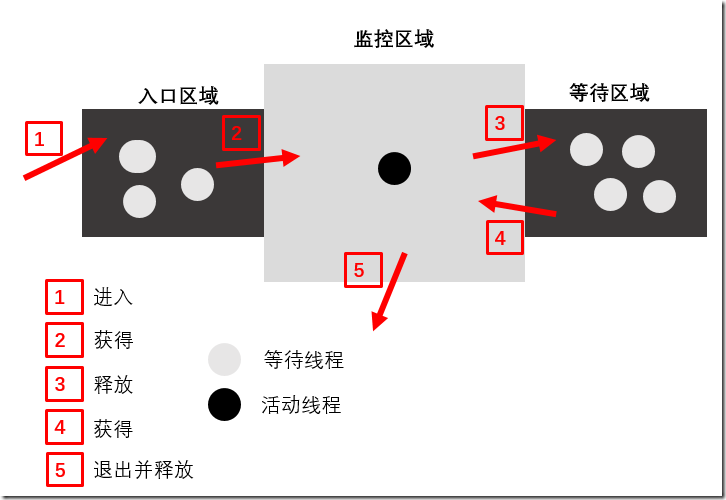
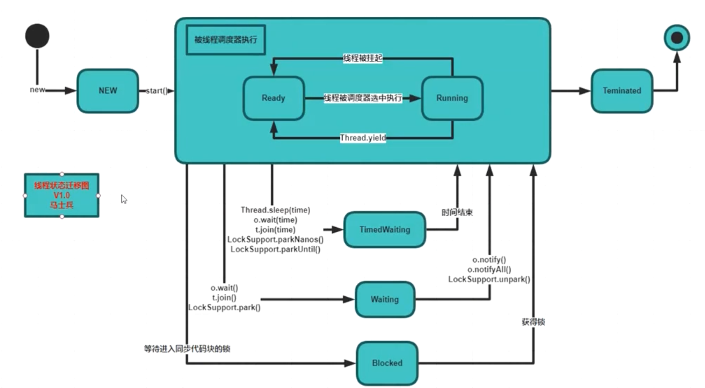

### 一、Java原生并发支持

#### 一、synchornized 关键字

首先，理解JMM关于synchronized的两条规定：

> 1）线程解锁前，必须把共享变量的最新值刷新到主内存中
>
> 2）线程加锁时，将清空工作内存中共享变量的值，从而使用共享变量时需要从主内存中重新获取最新的值
>
> 注意：加锁与解锁需要是同一把锁

   通过以上两点，可以看到synchronized能够实现可见性。同时，由于synchronized具有同步锁，所以它也具有原子性。

##### 1.修饰实例方法

修饰实例同步方法，锁的是方法所在实例。会阻塞该实例的其他同步方法 √ ；不会阻塞非同步方法。

```
public synchronized  void run() {
}
```

##### 2.修饰静态同步方法

锁的是被方法所处的class对象，会阻塞该class的其他静态同步方法 √ 。

```
public static synchronized void run(){
        i++;
}
```

##### 3.修饰同步代码块

锁的是括号中的对象。

```
synchronized (this) {
    for (int i = 0; i < 1000; i++) {
        acctNumber++;
    }
    System.out.println(Thread.currentThread().getName());
}
```

注：锁定的对象不可以是 基础类型，String常量，Integet、Long等包装类型。


#### 二、Thread.join()方法

在当前线程a调用另一个线程b的join()方法时，a线程会等待B线程执行结束后再继续执行。

join方法的本质调用的是Object中的wait方法实现线程的阻塞，**调用wait方法必须要获取对象的监视器**，所以join方法是被synchronized修饰的，synchronized修饰在方法层面相当于synchronized(this)

什么时候会使用Thread.join

在实际应用开发中，我们很少会使用thread.join。在实际使用过程中，**我们可以通过调用指定线程的join方法来等待指定线程执行结束**

#### 三、Thread.interrupt()方法

Thread类的实例方法。调用此方法，

* 当线程正处于阻塞状态，例如调用其他对象的wait() 或Thread类的 join() sleep() 方法时，线程会收到 InterruptedException，线程的中断状态会被清空（不可通过isInterrupted()方法判断）

* 当线程因I/O操作阻塞时，会收到ClosedByInterruptException，线程的状态会被设置为中断（可通过isInterrupted()方法判断）

* 当不是上述任何状态时，线程的状态会被设置为中断，只可通过isInterrupted()方法判断。

>  注：单独调用interrupt()方法不能中断正在运行过程中的线程，只能中断阻塞过程中的线程（即上述1，2两种情况） synchronized 等待获取对象锁时也无法被interupted** 

#### 四、线程的生命周期

- NEW：初始状态，线程被创建时候的状态，还没有调用start方法。
- RUNNABLE：运行状态，运行状态包含就绪和运行两种状态，因为线程启动以后，并不是立即执行，而是需要通过调度去分配CPU时间片。
- BLOCKED：阻塞状态，当线程去访问一个加锁的方法时，如果已经有其他线程获得锁，那么当前线程会处于阻塞状态。
- WAITING：等待状态，设置线程进入等待状态等待其他线程做一些特定的动作进行触发。
- TIME_WAITING：超时等待状态，和WAITING状态的区别在于超时以后自动返回。
- TERMINATED：终止状态，线程执行完毕。

> 注：一个线程start()，并结束运行之后，不可以再次start()，不然会报错。
>
> Exception in thread "main" java.lang.IllegalThreadStateException    	at java.lang.Thread.start(Thread.java:708)

#### 五、#Object wait()、notify()、notifyall()

某线程A调用某对象B的wait()方法时，会使这个线程进入等待状态，直到发生以下情况中的一种：

- 其他线程调用这个对象B的notify()方法，且线程A正好被选择为被唤醒的那个线程（可能有多个线程在等待对象B）
- 其他线程调用对象B的notifyAll()方法
- 其他线程调用线程A的interrupt方法，线程A收到InterruptException异常。
- 线程A调用wait方法时传入时间参数，指定时长过去后，线程恢复执行。如果不传入参数，则线程A永远等待

>  而且需要注意的是，**除非是明确的知道只有一个等待线程，否则应该使用notify all**，否则，就可能出现某个线程等待的时间过长，或者永远等下去的几率。

#### 六、拓展：监视器流程

首先：

- 一个监视区域前后各有一个区域：入口区域，等待区域：
- 如果监视区域有线程，那么入口区域需要等待，否则可以进入；
- 监视区域内执行的线程可以通过命令进入等待队列，也可以将等待队列的线程唤醒，唤醒后的线程就相当于是入口区域的队列一样，可以等待进入监控区域；



- 线程到达监控区域开始处，通过途径1进入入口区域，如果没有任何线程持有监控区域，通过途径2进入监控区域，如果被占用，那么需要在入口区域等待；
- 一个活动线程在监控区域内，有两种途径退出监控区域，当条件不满足时，可以通过途径3借助于等待命令进入等待或者顺利执行结束后通过途径5退出并释放监视器
- 当监视器空闲时，入口区域的等待集合将会竞争进入监视器，竞争成功的将会进入监控区域，失败的继续等待（如果有等待的线程被唤醒，将会一同参与竞争）
- 对于等待区域，要么通过途径3进入，要么通过途径4退出，只有这两条途径，而且只有一个线程持有监视器时才能执行等待命令，也只有再次持有监视器时才能离开等待区
- 对于等待区域中的线程，如果是有超时设置的等待，时间到达后JVM会自动通过唤醒命令将他唤醒，不需要其他线程主动处理

 



#### 七、volatile关键字

volatile关键字有两层含义：

1. 第一层含义：保证多线程之间同一个变量的内存可见性、一致性。底层原理可拓展至JMM内存模型、cpu底层多核之间有的L1 L2 L3 cache与主存
2. 第一层含义：防止指令的重排序，因为cpu在针对一些耗时指令时有可能做乱序执行。

**volatile 与 synchronized区别：**

- **volatile只保证线程之间的可见性，一致性，不保证原子性。**
- **synchronized 即保证了原子性，也保证了可见性。**
- volatile关键字只是用来修饰变量，并且保证变量的可见性；synchronized关键字只是用来修饰方法和代码块，并且保证里面的所有操作是原子性和可见性的。

### 二、JUC对并发的支持

JUC（java.util.concurrent）是什么？

juc这个包是jdk1.5中新引入的并发编程包，提供了很多实用的类，包结构如下：


#### 1、aotmic包

atomic包提供了一些原子操作封装类，包括AtomicInter，AtomicBoolean，AtomicLong，LongAdder等，其操作皆被封装为原子性。

其中有一个方法需要重点理解 compareAndSet，以AtomicBoolean为例：

public final boolean compareAndSet(boolean expect, boolean update)  //将当前值与expect比较, 如果相等则将当前值更新为update;否则返回false //实用compareAndSet,而不是手动 get compare  set的原因是因为前者保证了操作的原子性;后者在多线程环境中,三次操作分别是原子性的, //但是连续操作则不是原子性的，atomic包是基于CAS操作完成的。

#### 2、locks包

提供了一系列锁的功能。

##### Lock接口

接口的方法说明见代码：

```java
public interface Lock {
    // 尝试加锁,阻塞方法(锁被其他线程占用时)
    void lock();
    // 尝试立即加锁,非阻塞方法,加锁成功则返回true,加锁失败返回false
    boolean tryLock();
    // 类似于无参方法tryLock() ,但是会等待一段之间,在这段时间内加锁成功则返回true,加锁失败返回false。
    boolean tryLock(long time, TimeUnit unit) throws InterruptedException;
    // 尝试加锁,阻塞方法。（在等待获取锁的阻塞过程中，如果其他线程调用了当前线程的interrupt（）方法，则抛出异常）
    void lockInterruptibly() throws InterruptedException;
    //释放锁
    void unlock();
    //
    Condition newCondition();
}
```

**更具体地**，使用以上方法时需要注意：使用lock，trylock时，应该在finally语句块中主动调用unlock（）方法主动释放锁，防止死锁情况的发生。

```java
Lock lock = ...;
lock.lock();
try{
    //处理任务
}catch(Exception ex){
     
}finally{
    lock.unlock();   //释放锁
}

---------------------------------------------------
Lock lock = ...
if(lock.tryLock()) {
     try{
         //处理任务
     }catch(Exception ex){
         
     }finally{
         lock.unlock();   //释放锁
     } 
}else {
    //如果不能获取锁，则直接做其他事情
}
```


##### Lock接口的实现类

jdk 为Lock接口提供了一个可重入锁的实现，reentrantLock  ，这个锁同时支持选择是公平锁（FIFO）还是不公平锁（随机获得锁，可能会导致某个线程永远获不到锁）。

该类提供了两个构造方法

```java
public ReentrantLock() {   //默认为不公平锁
        sync = new NonfairSync();
    }
    public ReentrantLock(boolean fair) {   //可选公平或不公平
        sync = fair ? new FairSync() : new NonfairSync();
    }
```


##### ReadWriteLock  （接口）读写锁

```java
public interface ReadWriteLock {
    //Returns the lock used for reading.
    Lock readLock();

    //Returns the lock used for writing.
    Lock writeLock();
}
```


**ReentrantReadWriteLock   可重入读写锁**

类似于读写锁，它也提供了两种模式，fair模式与non-fair模式（默认）

该类使用时的重点：

- 调用此类的readLock（）方法，会返回一个可**共享**的读锁，同时刻多个线程可同时拥有。
- 调用此类的writeLock（）方法，会返回一个**独享**的写锁，即同时刻只可有一个线程拥有。
- 写锁尝试加锁时，必须等待所有持有读锁的线程释放。
- 拥有写锁的线程，可以同时拥有读锁。这被称为锁降级。
- ReentrantReadWriteLock不支持锁升级，即获取读锁后不可再获取写锁。除非先释放读锁。

看一下ReentrantReadWriteLock  在jdk的注释中正确的使用姿势：


```java
class CachedData {
   Object data;
   volatile boolean cacheValid;
   final ReentrantReadWriteLock rwl = new ReentrantReadWriteLock();

   void processCachedData() {
     rwl.readLock().lock();
     if (!cacheValid) {
       // Must release read lock before acquiring write lock
       rwl.readLock().unlock();
       rwl.writeLock().lock();
       try {
         // Recheck state because another thread might have
         // acquired write lock and changed state before we did.
         if (!cacheValid) {
           data = ...
           cacheValid = true;
         }
         // Downgrade by acquiring read lock before releasing write lock
         rwl.readLock().lock();
       } finally {
         rwl.writeLock().unlock(); // Unlock write, still hold read
       }
     }

     try {
       use(data);
     } finally {
       rwl.readLock().unlock();
     }
   }
 }
```

eg2:

```java
class RWDictionary {
   private final Map<String, Data> m = new TreeMap<String, Data>();
   private final ReentrantReadWriteLock rwl = new ReentrantReadWriteLock();
   private final Lock r = rwl.readLock();
   private final Lock w = rwl.writeLock();

   public Data get(String key) {
     r.lock();
     try { return m.get(key); }
     finally { r.unlock(); }
   }
   public String[] allKeys() {
     r.lock();
     try { return m.keySet().toArray(); }
     finally { r.unlock(); }
   }
   public Data put(String key, Data value) {
     w.lock();
     try { return m.put(key, value); }
     finally { w.unlock(); }
   }
   public void clear() {
     w.lock();
     try { m.clear(); }
     finally { w.unlock(); }
   }
 }
```

但是，ReentrantReadWriteLock 有一个缺陷就是，在non-fair模式下，如果读线程很多，写线程比较少，就会导致写线程处于饥饿的状态；虽然使用fair模式可以缓解这个问题，但是fair模式会牺牲部分性能。所以java.util.concurrent.lock包下还有个更牛逼的锁---- **StampedLock** (since jdk 1.8)

##### StampedLock

//todo 太复杂了，回头再研究。。


***

#### 线程通讯工具类

##### CountDownLatch （倒数计时   一次性，不可重用）

用于多线程之前通信的工具类，提供一个构造方法设置初始值，调用countDown方法完成 -1操作。

线程可以调用其await方法实现阻塞，直到这个变量被countDown至0时，阻塞线程继续执行。


##### CyclicBarrier （循环屏障）

该类允许一组线程互相等待，直到指定数量的线程**到达某个公共屏障点，屏障放行一次。**

提供了两个构造方法与两个阻塞方法：

```java
// 当多少个线程到达此屏障时会放行。
public CyclicBarrier(int parties);
// 当多少个线程到达此屏障时会放行，并且提供一个放行动作。每轮调用一次
public CyclicBarrier(int parties, Runnable barrierAction);
//调用该方法,该线程会进入阻塞状态; 当线程被中断或当前屏障被破坏时,会抛出异常
public int await() throws InterruptedException, BrokenBarrierException 
//调用该方法,该线程会进入阻塞状态; 当线程被中断或当前屏障被破坏时,会抛出异常,
//    超时时会抛出异常,并且时这个屏障破坏
public int await(long timeout, TimeUnit unit) throws InterruptedException,
           BrokenBarrierException,
           TimeoutException

//判断当前屏障是否已被破坏
public boolean isBroken()
```


##### 对比一下CountDownLatch和CyclicBarrier：

1. 这两个工具类的关注点不一样，CountDownLatch关注的是某一类线程等待另一类线程的信号（执行countDown方法），而CyclicBarrier关注的是同一类线程互相等待彼此的信号（执行await方法）。

2. CyclicBarrier可以重复使用，而CountDownLatch只能使用一次。

   

**Semaphore（信号）**

内部维护了一个许可集合，线程可以申请1或n个许可，如果许可数量不足则阻塞线程，用完需要归还许可。可以用来控制同时访问的线程个数。也支持 fair 与 non-fair两种模式（FIFO）

```
//构造方法, 最大许可数
public Semaphore(int permits)；
public Semaphore(int permits, boolean fair) ;

//申请单个许可,线程中断时会抛出异常
public void acquire() throws InterruptedException ;
//申请多个许可
public void acquire(int permits) throws InterruptedException;

//申请许可,线程中断也不会抛异常
public void acquireUninterruptibly();
public void acquireUninterruptibly(int permits);

//申请许可,成功返回true;失败返回false。非阻塞
public boolean tryAcquire();
public boolean tryAcquire(int permits);

//归还一个许可
public void release();
//归还多个许可
public void release(int number);
```


### 三、java 中锁的分类

#### 一、乐观锁/悲观锁

**乐观锁：**顾名思义，就是很乐观，每次去拿数据的时候都认为别人不会修改，所以不会上锁，但是在更新的时候会判断一下在此期间别人有没有去更新这个数据，一般使用“数据版本机制、时间戳、CAS操作”实现。

适用场景：适用于多读的应用类型，这样可以提高吞吐量

例如：juc中的aomic原子包，如AtomicInteger，利用CAS + 自旋锁实现。

**悲观锁：**总是假设最坏的情况，每次去拿数据的时候都认为别人会修改，所以每次在拿数据的时候都会上锁，这样别人想拿这个数据就会阻塞直到它拿到锁。

适用场景：适用于大量写的场景。

例如：java中的sychronized语法。


#### 二、独享锁（互斥锁）/共享锁（读写锁） 

**独享锁：**独享锁是指该锁一次只能被一个线程所持有。

**共享锁：**是指该锁可被多个线程所持有。

 

#### 三、可重入锁

又名递归锁，就是说一个线程已经获得一把锁后，再访问需要同一把锁的其他方法时，可直接访问。这样设计可以防止死锁发生。


#### 四：公平锁、非公平锁

即多线程同时竞争同一个锁时，是否按先后顺序获得锁。

公平锁的优点是可能造成某个线程永远获取不到锁。

非公平锁的有点是吞吐量较大。


#### 五、分段锁

是一种锁设计的思想，设计思想是细化锁的粒度。


#### 六、偏向锁、轻量级锁、重量级锁

就锁的状态而言的

偏向锁是指一段同步代码一直被一个线程所访问，那么该线程会自动获取锁。降低获取锁的代价。

轻量级锁是指当锁是偏向锁的时候，被另一个线程所访问，偏向锁就会升级为轻量级锁，其他线程会通过自旋的形

式尝试获取锁，不会阻塞，提高性能。	

重量级锁是指当锁为轻量级锁的时候，另一个线程虽然是自旋，但自旋不会一直持续下去，当自旋一定次数的时候，还没有获取到锁，就会进入阻塞，该锁膨胀为重量级锁。重量级锁会让他申请的线程进入阻塞，性能降低。


#### 七、自旋锁

在Java中，自旋锁是指尝试获取锁的线程不会立即阻塞，而是采用循环的方式去尝试获取锁，好处是减少线程上下文切换的消耗，缺点是循环会消耗CPU。