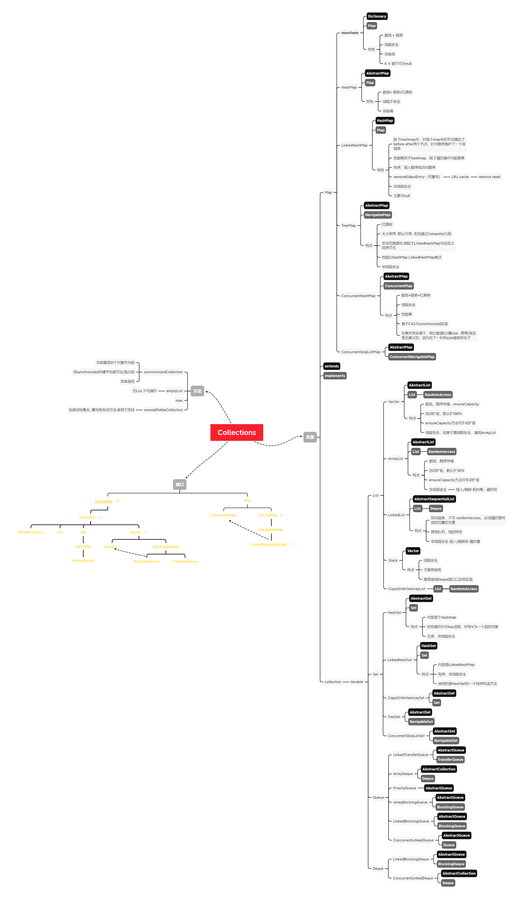

### Java集合

集合这块其实Java提供的支持是非常丰富的，之前也把一些常见的集合的源码看了看，写的非常巧妙。没怎么写笔记，直接用xmind记下来不同的集合类之间的区别了，直接贴图吧，看不清的可以看附件的xmind文件

//todo  还有好多源码没看，回头看吧，工作经常打断思路，没法系统性的看




### 1.HashMap

> 参考: [美团关于hashMap的解释](https://mp.weixin.qq.com/s/oIE4Nnqs5_lOE1D-r9xXWg)

首先，要知道，一个Object的hashCode值，不是唯一的，即几个Object的hashCode值可能相同，即hash冲突。

HashMap底层是通过数组+链表/红黑树实现的。当hash冲突时，冲突的元素会以链表的形式存储。

```java
//hashMap  hash算法。也称为hash值扰动函数
static final int hash(Object key) {
    int h;
    return (key == null) ? 0 : (h = key.hashCode()) ^ (h >>> 16);
}
```

**HashMap扰动函数的实现原理：**

Java对象的hashCode是一个int类型的整数，可以认为对象的hash特性均匀的反映在这32个bit中，但是在做数组下标运算时，用的是 `&`运算，在数组长度很小的时候，参与下标运算的其实只有hashKey的低n位，一般来讲可能只有9位左右。为了通过这低n位充分的反映对象的特性，将其高16位与低16位做XOR运算，最终将原32位的特征值以16位的方式保留下来，可以有效减少hash冲突。

```java
//数组下标寻址算法
index = (n - 1) & hash
```


**与运算的效率高于模运算的效率：**

经测试，10000万次与运算耗时为33ms，而模运算却用了73ms。

**hashMap扩容的时机：**

当map中存放的 node元素数量大于 threadhold时，就要扩容了！

**hashMap扩容为何总是2的倍数**：

为什么hashMap扩容时，总是扩大为原容量的2倍，并且容量永远是2的n次幂呢。这是因为hashmap通过hashCode与掩码（长度-1）做与运算时，新的map的槽位永远等于旧槽位 或 旧槽位+[原容量]。


### 2.ConcurrentHashMap


分析一下其put方法（基于jdk1.8）：

```java
final V putVal(K key, V value, boolean onlyIfAbsent) {
    if (key == null || value == null) throw new NullPointerException();
    int hash = spread(key.hashCode());
    int binCount = 0;
    
    //自旋，不停尝试CAS 操作
    for (Node<K,V>[] tab = table;;) {
        Node<K,V> f; int n, i, fh;
        if (tab == null || (n = tab.length) == 0)
            tab = initTable();
        
        // 对应的桶为空，尝试CAS插入（即使数组在扩容时也是可以插入的，因为插入的是旧桶，而扩容时，旧元素不可能重分配至这个桶中）
        else if ((f = tabAt(tab, i = (n - 1) & hash)) == null) {
            if (casTabAt(tab, i, null,
                         new Node<K,V>(hash, key, value, null)))
                break;                   // 插入成功时停止自旋
        }
        // 数组正在扩容，帮助扩容
        else if ((fh = f.hash) == MOVED)
            tab = helpTransfer(tab, f);
        // 对应的桶已有元素
        else {
            V oldVal = null;
            //锁住对应的桶
            synchronized (f) {
                //DCL 二次检测，防止f被改变了
                if (tabAt(tab, i) == f) {
                    //链表 形式插入
                    if (fh >= 0) {
                        binCount = 1;
                        // 遍历链表
                        for (Node<K,V> e = f;; ++binCount) {
                            K ek;
                            //如果key 和 链表当前元素相同，根据 onlyIfAbsent判断是否替换value
                            if (e.hash == hash &&
                                ((ek = e.key) == key ||
                                 (ek != null && key.equals(ek)))) {
                                oldVal = e.val;
                                if (!onlyIfAbsent)
                                    e.val = value;
                                break;
                            }
                            //如果链表下个元素为null，则将新node插入链表尾部
                            Node<K,V> pred = e;
                            if ((e = e.next) == null) {
                                pred.next = new Node<K,V>(hash, key,
                                                          value, null);
                                break;
                            }
                        }
                    }
                    // 
                    else if (f instanceof TreeBin) {
                        Node<K,V> p;
                        binCount = 2;
                        if ((p = ((TreeBin<K,V>)f).putTreeVal(hash, key,
                                                              value)) != null) {
                            oldVal = p.val;
                            if (!onlyIfAbsent)
                                p.val = value;
                        }
                    }
                }
            }
            //链表长度大于 TREEIFY_THRESHOLD（8）时，将链表转化为二叉树
            if (binCount != 0) {
                if (binCount >= TREEIFY_THRESHOLD)
                    treeifyBin(tab, i);
                if (oldVal != null)
                    return oldVal;
                break;
            }
        }
    }
    addCount(1L, binCount);
    return null;
}
```

