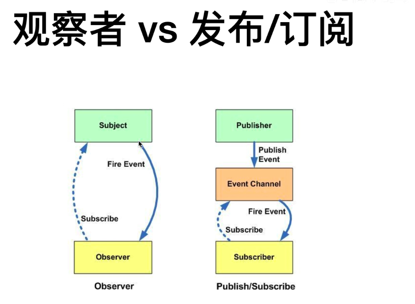

观察者模式是同步的。
发布/订阅模式是异步的，且相对于前者更一步解耦。
发布事件（implements ApplicationEventPublisherAware 一个bean实现这个接口，spring会自动注入publisher）
ApplicationContext
自定义事件 
extends ApplicationEvent  （spring 4.2之后可以不用继承这个类了）
定义监听器
@EventListener，注解某方法 ,@Async 可异步 @Order 多个监听器的执行顺序