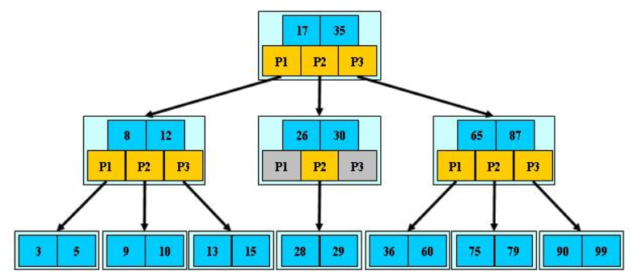
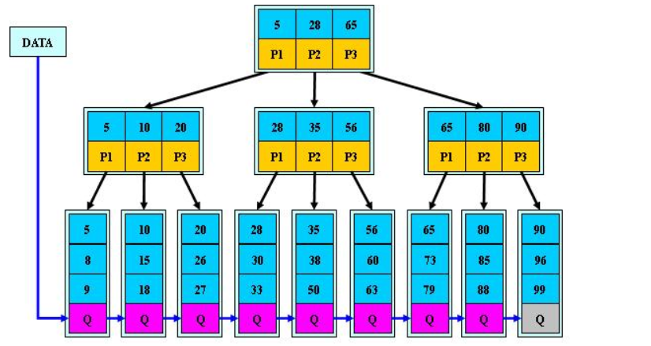
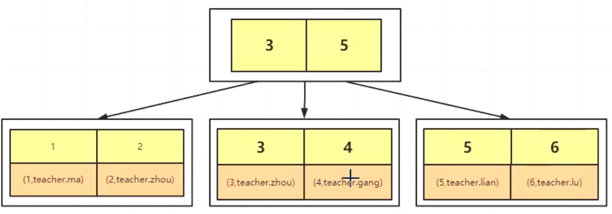
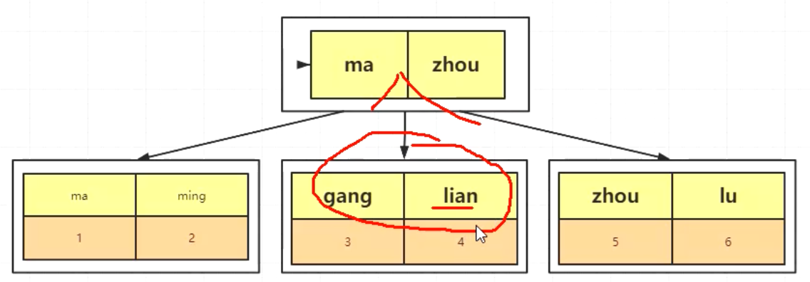
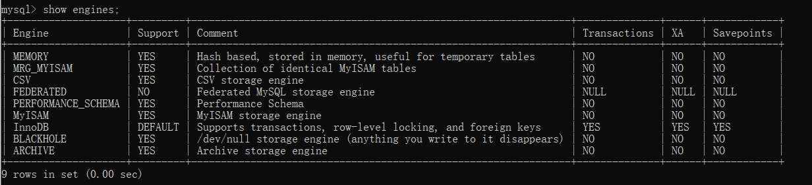

## MySQL学习笔记

之前在项目中使用的一直是Oracle，没办法，客户侧比较有钱，都是直接上的Oracle一体机，定期还会找工程师还维护。但是最近打算跳槽换公司了，现在外面公司用的MySQL比较多，几乎所有的面试都会问到MySQL，今天来试试MySQL的使用。

### 一、安装

#### 1.Windows

先下载免安装的硬盘版，解压，在解压目录下创建data目录

1. 进入bin目录输入:

   ```
   mysqld --install mysql8
   ```

2. 安装完后开始初始化：

   ```
   mysqld --initialize --console
   ```

   > 注意搭建的时候输出的初始化密码；如果丢失初始化密码的话，删掉Data目录，重新执行步骤2

3. 开启服务

   ```
   net start mysql8
   ```

4. 登录

   ```
   mysql -hlocalhost -uroot -p{初始密码}
   ```

5. 修改初始密码

   ```
   ALTER USER 'root'@'localhost' IDENTIFIED WITH mysql_native_password BY '123456';
   ```

***

### 二、常用命令

```sql
#启动数据库  前提是mysql已经作为服务安装到windows中了。
net  start mysql80
net stop mysql80


#连接至mysql server
cd 至安装目录/bin 路径下
./mysql.exe -hlocalhost -uroot -p123456    
 
###权限管理

#创建新用户
create user test_mysql_b identified by '123456';
#创建数据库
CREATE DATABASE IF NOT EXISTS test_db_b DEFAULT CHARSET utf8 COLLATE utf8_general_ci;
#删除数据库
drop database {DBName}
#授权
grant all privileges on test_db_b.* to test_mysql_b;
#刷新权限
flush privileges;


###数据库相关

#查看当前mysql的各种信息
status
#查看时区
show variables like '%time_zone%';
#设置时区
set global time_zone = '+8:00';

show databases;  //查看当前用户可用的所有数据库
use database;   //选择使用哪个数据库

describe {tableName}  //查看表结构信息


### 事务相关
select @@autocommit; //查看事务提交方式 1 自动  0 手动
set autocommit=0;    //关闭事务自动提交
commit;     //提交事务
rollback    //提交之前可回滚
select @@transaction_isolation;  //查看当前session事务级别

set session transaction isolation level   read uncommitted;  
//设置当前session的事务级别  可选四种：
Read Uncommitted
Read Committed
Repeatable Read
Serializable

注：将session 替换为global可替换为全局设置

start  transaction   //开启事务


###DDL
#创建索引
alter table {tableName} add index  {idx_name}({column_1},{column_2});
#查看索引
show index from {tableName};
#删除索引
drop index {indexName} on {tableName};
# 另： 在select 之前添加 explain 关键字可以查看sql的查询计划。


```


***

### 三、MySQL中的数据类型

MySQL中的数据类型和Oracle对比来讲，还是有些出入的。

#### 数值型

|   字段类型   | 占用字节数 | 表示范围【有符号数】 | 表示范围【无符号数】 |
| :----------: | :--------: | :------------------: | :------------------: |
|   TINYINT    |     1      |       略。。。       |                      |
|   SMALLINT   |     2      |                      |                      |
|  MEDIUMINT   |     3      |                      |                      |
| INT或INTEGER |     4      |                      |                      |
|    BIGINT    |     8      |                      |                      |
|    FLOAT     |     4      |                      |                      |

#### 日期类型

MySQL的时间单位只能精确到秒级，更精确的时间只能另想办法了，例如用字符串存储更精确的时间单位。

|   类型    | 占用字节数 |        格式         |
| :-------: | :--------: | :-----------------: |
|   DATE    |     3      |     yyyy-mm-dd      |
|   TIME    |     4      |      HH:MM:SS       |
| DATETIME  |     8      | YYYY-MM-DD HH:MM:SS |
| TIMESTAMP |     4      | YYYY-MM-DD HH:MM:SS |

注：timestamp与时区有关，在不同的时区看到的时间点不同，而DATETIME无关。


### 四、类型转换

```sql
-- 获取当前时间
select now() from dual;
select sysdate() from dual;

-- 时间转字符串
select date_format(now(), '%d-%m-%Y %H:%i:%s');
-- 字符串转datetime
select str_to_date('19-05-2020 10:33:35', '%d-%m-%Y %H:%i:%s') from dual ;

-- 时间转时间戳
select unix_timestamp(now());
-- 字符串转时间戳
select unix_timestamp('2019-01-20');
-- 字符串转时间戳
select from_unixtime(1596273904,'%Y-%d-%d %H:%i:%s');
```

附单位转换表达式：

| 值   | 含义 |                                                       |
| :--- | ---- | :---------------------------------------------------- |
| 秒   | %s   | 两位数字形式的秒（ 00,01, ..., 59）                   |
| 分   | %i   | 两位数字形式的分（ 00,01, ..., 59）                   |
| 小时 | %H   | 24小时制，两位数形式小时（00,01, ...,23）             |
|      | %h   | 12小时制，位数形式小时（00,01, ...,12）               |
|      | %r   | 12小时制，时间形式（hh:mm:ss AM 或 PM）               |
|      | %p   | AM上午或PM下午                                        |
| 周   | %W   | 一周中每一天的名称（Sunday,Monday, ...,Saturday）     |
|      | %a   | 一周中每一天名称的缩写（Sun,Mon, ...,Sat）            |
|      | %w   | 以数字形式标识周（0=Sunday,1=Monday, ...,6=Saturday） |
|      | %U   | 数字表示周数，星期天为周中第一天                      |
|      | %u   | 数字表示周数，星期一为周中第一天                      |
| 天   | %d   | 两位数字表示月中天数（01,02, ...,31）                 |
|      | %e   | 数字表示月中天数（1,2, ...,31）                       |
|      | %D   | 英文后缀表示月中天数（1st,2nd,3rd ...）               |
|      | %j   | 以三位数字表示年中天数（001,002, ...,366）            |
| 月   | %M   | 英文月名（January,February, ...,December）            |
|      | %b   | 英文缩写月名（Jan,Feb, ...,Dec）                      |
|      | %m   | 两位数字表示月份（01,02, ...,12）                     |
|      | %c   | 数字表示月份（1,2, ...,12）                           |
| 年   | %Y   | 四位数字表示的年份（2015,2016...）                    |
|      | %y   | 两位数字表示的年份（15,16...）                        |

***

### 五、MySQL中的事务隔离

#### 1、事务的基本要素（ACID）

　　1、原子性（Atomicity）：事务开始后所有操作，要么全部做完，要么全部不做，不可能停滞在中间环节。事务执行过程中出错，会回滚到事务开始前的状态，所有的操作就像没有发生一样。也就是说事务是一个不可分割的整体，就像化学中学过的原子，是物质构成的基本单位。

　　 2、一致性（Consistency）：事务开始前和结束后，数据库的完整性约束没有被破坏 。比如A向B转账，不可能A扣了钱，B却没收到。

　　 3、隔离性（Isolation）：同一时间，只允许一个事务请求同一数据，不同的事务之间彼此没有任何干扰。比如A正在从一张银行卡中取钱，在A取钱的过程结束前，B不能向这张卡转账。

　　 4、持久性（Durability）：事务完成后，事务对数据库的所有更新将被保存到数据库，不能回滚。

#### 2、事务的并发问题

参考[金融业务系统中的事务问题](https://www.cnblogs.com/zhouwei0213/archive/2013/03/30/2991065.html)

* **脏读**：事务A读取了事务B更新的数据，然后B回滚操作，那么A读取到的数据是脏数据。

* **不可重复读**：事务A在事务B提交某条更新数据的前后，对该条数据访问时，会产生不一致的情况，eg：

| 时间 |   取款事务A    |        转账事务B         |
| :--: | :------------: | :----------------------: |
|  T1  |                |         开始事务         |
|  T2  |    开始事务    |                          |
|  T3  |                |        余额1000元        |
|  T4  | 查询余额1000元 |                          |
|  T5  |                | 转出100元，余额改为900元 |
|  T6  |                |         提交事务         |
|  T7  | 查询余额900元  |                          |
|  T8  |    提交事务    |                          |

​	上面事务A 在T4 和T7 两次查询时，得到的结果不一致，即为不可重复读。　　

*  **幻读**的现象是：事务A在事务B插入某条数据的前后，对数据记录进行统计时，读取到事务B新插入的一条记录。幻读容易与不可重复读混淆，幻读指的是读取了新插入的数据，不可重复读指的是读取了新更新(修改，删除)的数据。在数据库中，防止这两类问题所采取的策略是不同的，不可重复读采取行级锁防止更新，而幻读需要采取表级锁防止插入。

  >  注：幻读只有在可重复读的事务隔离级别下才会出现。

  | 时间 | 统计账户总额事务A |         转账事务B         |
  | :--: | :---------------: | :-----------------------: |
  |  T1  |     开始事务      |         开始事务          |
  |  T2  |                   |                           |
  |  T3  | 查询总额为1000元  |        余额1000元         |
  |  T4  |                   |                           |
  |  T5  |                   | 新增一个账户，并存款100元 |
  |  T6  |                   |         提交事务          |
  |  T7  | 查询总额为1100元  |                           |
  |  T8  |     提交事务      |                           |

> **小结：不可重复读的和幻读很容易混淆，不可重复读侧重于修改，幻读侧重于新增或删除。解决不可重复读的问题只需锁住满足条件的行，解决幻读需要锁表**

#### 3、MySQL的事务隔离级别

注意，在oralce中，只提供了两种事务隔离级别，Read Committed和Serializable级别，默认是前者。而MySQL提供了四种隔离级别，模式人Repeatable Read。

1. **Read Uncommitted（读取未提交内容）**

在该隔离级别，**所有事务都可以看到其他未提交事务的执行结果**，即如果另一个连接中的事务回滚了，其他线程就发生了脏读，本隔离级别很少用于实际应用，因为它的性能也不比其他级别好多少。读取未提交的数据，也被称之为脏读（Dirty Read）。

2. **Read Committed（读取提交内容）** 

这是大多数数据库系统的默认隔离级别（但不是MySQL默认的）。它满足了隔离的简单定义：一个事务只能看见已经提交事务所做的改变。这种隔离级别会造成所谓的不可重复读（Nonrepeatable Read），因为同一事务的其他实例在该实例处理其间可能会有新的commit，所以同一select可能返回不同结果。

3. **Repeatable Read（可重读）**

这是MySQL的默认事务隔离级别， mysql的可重复读是通过记录的版本号来实现的，事务内查询一条数据时，会获取它的版本号，即使是另外的事务更新、删除了这条记录，同一事务内再次查询这条记录，还是会获得相同的结果，不会去获取最新版本号的数据。不过理论上，还存在另一个棘手的问题：幻读 （Phantom Read）。简单的说，幻读指当用户读取某一范围的数据行时，另一个事务又在该范围内插入了新行，当用户再读取该范围的数据行时，会发现有新的“幻影” 行。InnoDB和Falcon存储引擎通过多版本并发控制（MVCC，Multiversion Concurrency Control）机制解决了该问题。

4. **Serializable（串行化）**

这是最高的隔离级别，它通过强制事务排序，使之不可能相互冲突，从而解决幻读问题。简言之，它是在每个读的数据行上加上共享锁。在这个级别，可能导致大量的超时现象和锁竞争。

mysql串行化使用的是行级锁。当一个串行化事务中，使用select 或update 或delete 或insert 语句时，如果where语句中的约束条件使用了主键进行查找，只会锁定指定范围的行记录；如果没有使用主键进行查找或使用其他非主键进行查找（即便是精确查找），就会造成所有记录都被锁，等价于表锁，其他连接中的相关所有操作都会阻塞。

对比这几种事务隔离级别对比：

|          事务隔离级别          |                             分析                             |        性能        |        场景        | 脏读 | 不可重复读 | 幻读  |
| :----------------------------: | :----------------------------------------------------------: | :----------------: | :----------------: | :--: | :--------: | :---: |
| Read Uncommitted（未提交可读） |                                                              | 最好，但快不了多少 |     几乎不适用     |  √   |     √      |   ×   |
|  Read Committed（已提交可读）  |                                                              |                    |                    |  ×   |     √      |   ×   |
|  Repeatable Read（可重复读）   | select时会获取记录版本号，再次select还是相同记录，除非提交事务 |                    |     mysql默认      |  ×   |     ×      | **√** |
|      Serializable（串行）      | 任何操作都会对记录申请排他锁，稍有不慎就会造成数据库操作大量超时 |                    | 会造成大量操作超时 |  ×   |     ×      |   ×   |

不同隔离级别下对行锁的获取：

|          事务隔离级别          |   select   | insert | update | delete |
| :----------------------------: | :--------: | :----: | :----: | :----: |
| Read Uncommitted（未提交可读） |   共享锁   | 排它锁 | 排它锁 | 排它锁 |
|  Read Committed（已提交可读）  |   共享锁   | 排它锁 | 排它锁 | 排它锁 |
|  Repeatable Read（可重复读）   |   共享锁   | 排它锁 | 排它锁 | 排它锁 |
|      Serializable（串行）      | **排它锁** | 排它锁 | 排它锁 | 排它锁 |

> 注意：
>
> * 在串行模式下，select也会获取记录的行锁，稍有不慎就可能会锁表。
> * 在任何隔离级别下，如果在申请锁时，where子句中的条件未用到索引，就会锁表。eg：
>   * insert into table_a select * from table_b  ；   这个句子，后面的table_b后一定要带主键限制条件，否则不带条件或带了没有使用索引的限制条件，都是导致table b 被锁表！！！


#### 4、MySQL默认

MySQL默认的事务隔离级别是可重复读，这是因为在MySQL5.1版本之前，READ COMMITED级别在主从复制下会有BUG。

现在一般在项目中，会将默认隔离级别调至 Read Committed，对标Oracle。

### 六、InnoDB锁

InnoDB引擎支持行级锁 ，支持的锁类型有如下几种：

####  1. 共享锁

多个session可以共享数据的同一把锁，都能访问，但是没有任何一个session可以对数据进行修改，在sql中申请锁的方式如下：

```
select * from student where id = 4 lock  in share mode;
```

#### 2.排它锁/独占锁

insert update delete 默认是排他锁。

#### 3.意向共享锁、意向排他锁

mysql底层数据库引擎在申请排它锁和独占锁前自动处理的，不需要用户干预。

#### 4.自增锁

针对自增长序列的一个特殊表级索引。


**需要注意的是，InnoDB中的锁与oracle中的锁不同，MySQL中的行锁主要是通过索引来加载的**，如果对应的SQL没有使用，就会锁表。

### 七、MySQL索引

#### 1.索引实现

MySQL中的索引采用B+树这种数据结构作为索引方式，为什么采用B+树呢，这是因为数据库存储的数据量非常大，数据必须放在磁盘中存储，而磁盘的IO速度较慢，为了提升效率，就需要减少内存读取磁盘的次数。而传统的平衡二叉树、红黑树只适合在内存中查询、排序，如果要存储体量非常大的数据的话，二叉树就会非常高，就会进而导致非常频繁的访问磁盘（树的存储时链式存储的，不同的节点可能在不同的磁盘块中）。所以基于二叉树就衍生出了B树，B树是一个平衡的多路查找树，节点最大的孩子数称为B树的阶。通过对B数的阶的调整，使得B数的节点储存的元素的大小与磁盘的页大小匹配，这样就可以减少读取磁盘的次数，**所以B数的数据结构就是为了内外存交换数据而设计的**。但是MySQL实现索引并不是使用的B树，而是B+树，B+树的根节点中的关键字会在他的中序遍历的后叶子节点中出现，且每个叶子节点都保存一个下一叶子节点的指针。

**B树：**



B树中的数据是和键值一起存放在各节点当中的，在同样大小的磁盘块中，每个块存放的数据条数就会非常少，因为数据占字数数较大，而指针占用字节数很小

而且范围查找时，需要反复的在父子磁盘块之间频繁访问。



**B+树：**

非叶子节点只存键与指针，数据全存放在叶子节点中，且每个叶子保存了指向下一个叶子节点的指针。

非常适合带范围的查找，且在同样的高度限制下，非叶子节点只存放了指针，占用字节数非常小，就可以存放大量的指针，可以索引超级大量的数据。


#### 2.索引类型

InnoDB中有两大类索引，聚集索引与非聚集索引，区别在于行记录是否与索引存在一起。

* 聚集索引   

  叶子节点储存行记录，一张表有且只有一个聚集索引，索引和表数据是同一个文件。聚集索引的生成规则顺序如下：

  1. 如果表定义了PK（Primary Key，主键），那么PK就是聚集索引
2. 如果表没有定义PK，则第一个NOT NULL UNIQUE的列就是聚集索引

  3. 否则InnoDB会另外创建一个隐藏的ROWID作为聚集索引

     

  >  这种机制使得基于PK索引的查询速度非常快，因为这样可以直接定位行记录。


* 普通索引（非聚集索引）

   InnoDB普通索引的叶子节点存储聚集索引的主键值（上面的PK 或第一个NOT NULL UNIQUE列，或ROWID），可以理解为索引的索引，单独存放一个文件。
   
   

#### 3.回表查询

通过非聚集索引查询数据时，要先走一遍普通索引，找到对应的聚集索引的主键，然后再去根据聚集索引去查对应的数据，这就叫做回表查询，如图所示：

  


#### 4.EXPLAIN查看执行计划

在引入索引匹配原则之前，先了解一下如果通过EXPLAIN命令查看SQL执行计划，通过在sql前加explain指定可以预先查看相应SQL的执行计划。[参考](https://www.cnblogs.com/gomysql/p/3720123.html)

执行计划中包括以下关键几部分：

* id                         id相同时，从上而下执行；id越大越优先执行。
* table                   要查询的表
* type                    表示MySQL在表中找到所需行的方式： 
  * all                 全表查询，遍历全表找到对应的记录
  * index           遍历索引，查找对应的记录
  * range           索引范围查找 
  * ref                使用非唯一索引扫描或者唯一索引的前缀扫描（**唯一索引**是指可以根据索引值可唯一确定一条记录）。
  * eq_ref          使用唯一索引，每个索引键，表中只有一条记录匹配，简单来说，就是多表连接中使用primary key或者 unique key作为关联条件
* possible_keys    指出MySQL能使用哪个索引在表中找到记录，查询涉及到的字段上若存在索引，则该索引将被列出，但不一定被查询使用
* key                      在sql查询中使用到的索引 
* extra                   额外重要信息
  * **Using index**              表示直接用到了覆盖索引，不需要使用索引回表查询，而不是指使用了索引！
  * **Using where**            表示mysql服务器将在存储引擎检索行后再进行过滤，举例：
    * 使用一个where查询条件时，没有使用任何索引，InnoDB将会进行全表扫描，由Server根据where条件进行数据过滤，再返回客户端
    * 使用  非唯一索引或者唯一索引的前缀扫描，再配合一个没有使用索引的查询条件，那么InnoDB引擎会根据索引将查询结果返回给Server，Server在根据没有使用到索引的查询条件进行过滤，即server 使用了where 进行过滤
  * **Using index ,Using where**  表示用到了索引覆盖，但是其中有条件时范围查询的，还需要server层对数据过滤。
  * Using index condition  索引下推有关， 搞不懂。。。
  * **Using join buffer**     强调了在获取连接条件时没有使用索引，并且需要Server需要建立缓冲区来存储InnoDB引擎返回的中间结果。如果出现了这个值，那应该注意，根据查询的具体情况可能需要添加索引来改进能。
  * Impossible where   表示这个where条件会导致无法匹配任何值
  * Using temporary     表示MySQL需要使用临时表来存储结果集，常见于排序和分组查询


#### 5.索引匹配原则


以下索引原则主要针对组合索引开展，单字段索引是其子集，先为GSOP_GRID_USER_INFO表建立一个三个字段的组合索引：

```sql
alter table gsop_grid_user_info add index idx_dsf3fsdfsd(user_id,user_name,user_phone);
```

1. 最左匹配原则

   索引在创建的时候，多个字段是有顺序的！如果有三个字段a，b，c联合作为索引，那么在不使用a的情况下，使用bc都是不会用到索引的，即联合索引，必须要用到第一个字段，才能进行相关索引查询。

2. 匹配列前缀

   匹配列开头的部分，即like ’sdf%‘  这种形式可以使用到响应索引。

3. 范围匹配

   可以查找某个范围的数据，会使用到索引，即使用大于、小于 ，between等。

4. 精确匹配某一列，并范围匹配另一列

   ```
   select * from gsop_grid_user_info where user_id = 'sdf' and user_name like '%' and user_phone= '123213';
   //只有前两个列会用到索引，最后一个列不会用到索引。
   ```

   

5. 索引覆盖（只访问索引的查询）

   索引覆盖是一种避免回表查询的优化策略。具体的做法就是将要查询的几个字段直接作为索引列建立普通索引（可以是单列索引，也可以一个索引语句定义所有要查询的列，即联合索引），这样的话就可以直接返回索引中的的数据，不需要再通过聚集索引去定位行记录，避免了回表的情况发生。

   如果一个索引覆盖（包含）了所有需要查询的字段的值，这个索引就是覆盖索引。因为索引中已经包含了要查询的字段的值，因此查询的时候直接返回索引中的字段值就可以了，不需要再到表中查询，避免了对主键索引的二次查询，也就提高了查询的效率。

   简单来讲，就是比如说我一个表里有a,b,c,d,e..10个字段，我只需要select  abc 这三个字段，直接给这三个字段建立普通索引，通过普通索引查询出的结果就已经满足我的需求了，不需要通过聚集索引去回表查询一次了！

   > 注意，如果查询结果列是索引字段，但是where条件中包括非索引字段，也会造成回表，这就不是索引覆盖了。


#### 6.sql优化建议

1. 在sql中尽量不要使用任何表达式来进行业务逻辑判断，把表达式放到应用层完成。

2. 查询时尽量使用主键查询，或覆盖索引查询，这样可以避免回表查询。

3. 建表时一定要带主键（除非是分布式数据库），并且建议主键设置为自增长，且最好不要使用字符串（否则如果在后续插入过程中，因新插入的行的主键与当前主键值差异过大，导致索引维护的代价很大）。

4. 使用前缀索引，对varchar类型字段做索引时，不要使用整个字段作为索引，可以选择一部分前缀作为索引，可以节省索引的空间。 

   ```
   alter table {tableName} add index( name(3));  // 为名字的前三位建立前缀索引
   ```

5. 排序时根据索引进行排序

6. union in all  都能使用索引，但是推荐使用in

7. 注意字符串与数字的类型转换，输入不匹配时数据库会完成转换，会是索引失效。

8. 经常更新的字段，数据区分度不高的字段不要加索引。

9. 能使用limit时，尽量使用limit

10. 索引列可以的话设置为not null

11. 表连接时，尽量不要超过三张表（阿里规范），需要join时，字段类型必须一致。

12. in or exists  

    * in  确定给定的值是否与子查询或列表中的值相匹配。in在查询的时候，首先查询子查询的表，然后将内表和外表做一个笛卡尔积，然后按照条件进行筛选。所以相对内表比较小的时候，in的速度较快。
    * exists  使用exists关键字进行查询的时候，首先，我们先查询的不是子查询的内容，而是查我们的主查询的表，也就是说，我们先执行的sql语句是：然后，根据表的每一条记录，执行以下语句，依次去判断where后面的条件是否成立


### 八、对比InnoDB与Mylsam引擎

MySQL在底层存储数据时，支持不同的存储方式，底层实现与相应也行也不同，通过show engines 这条sql可以查看当前mysql支持的引擎。




举例分析几种：

* MyISAM 不支持事务，查询很快，不支持外键，只支持表级锁，增删改很慢。
* CSV     以csv格式进行存储，不支持事务，但可以直接以csv文件的格式进行编辑，适合作为数据交换的中间表。
* InnoDB   最常用的引擎，对锁，事务有很好的支持，理解为一个传统的关系型数据库。

