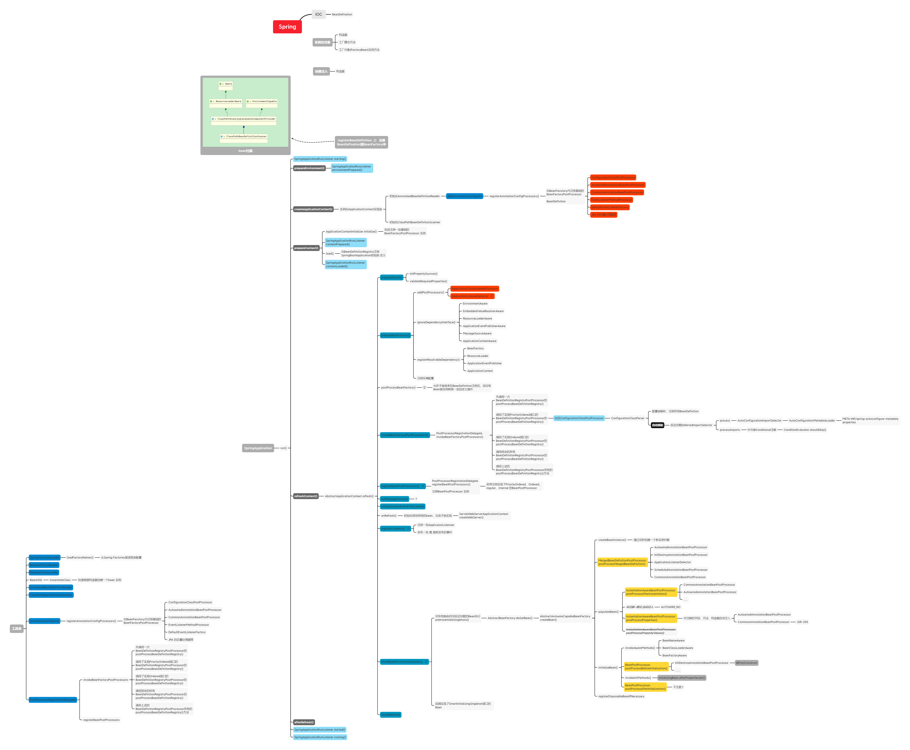

###  SpringBoot应用的启动过程

spring 如何自动装配的？

spring boot的启动过程？

spring boot是如何完成对sping的封装，实现可插拔的stater模式的？

这些问题作为一个程序员不会有人不知道吧？ 不会吧 不会吧！

今天整理笔记，把之前阅读SpringBoot源码时记录的笔记给翻出来，再整理一遍。

#### Spring Boot 应用启动过程图

看了遍源码，先上图：

够详细不？看不清可以直接拉xmind附件看。

#### 简要分析

个人觉得，要理解SpringBoot的启动流程，有几个关键知识点需要先了解，分别是：

* BeanFactoryPostProcessor
* BeanPostProcessor
* BeanFactory
* ApplicationContext
* ConfigurationClassPostProcessor
* ConfigurationClassParser
* AutowiredAnnotationBeanPostProcessor
* @Import 注解 与@DefferedImportSelector注解

基本上，知道了这些个类及其作用，SpringBoot的启动流程也就知道的差不多了。

