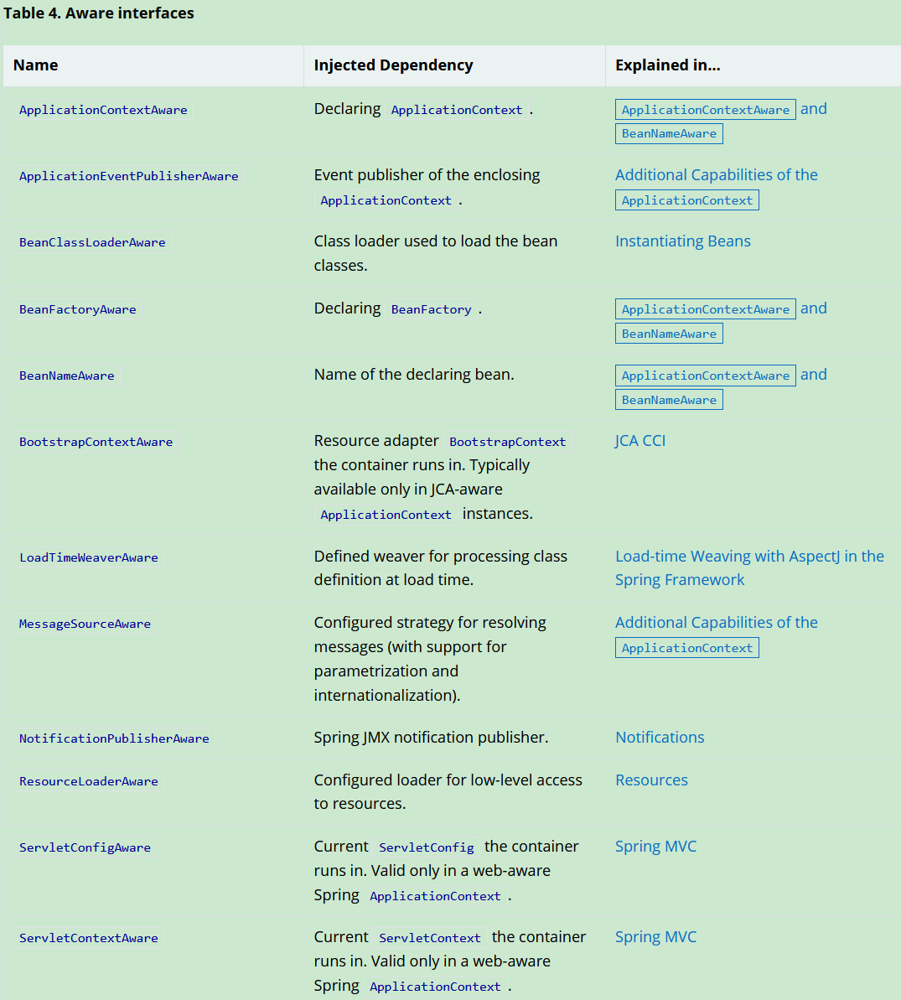
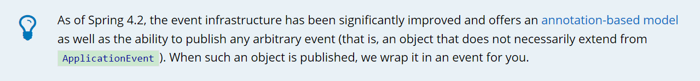
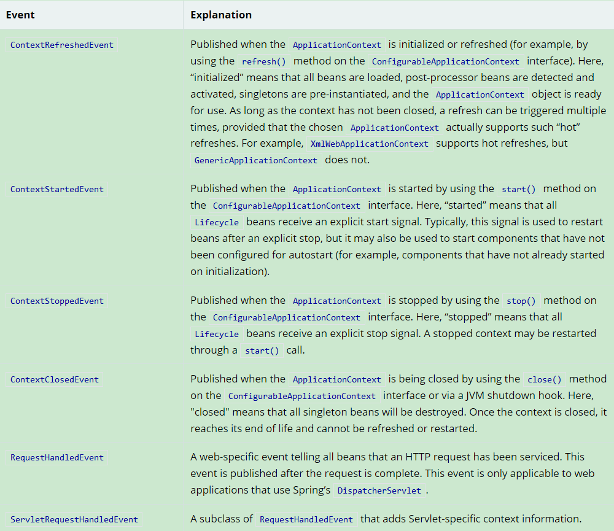

## Spring Core

Spring Core即spring核心，而Spring的核心是什么呢？

* IoC 控制反转
* AOP  切面编程

Spring 这么大一个家族，要了解其他的工程，了解SpringCore是关键，之前抽空的时候把Spring Core的官方文档结合着源码看了下，测了一下，现在把笔记贴出来。


### 一、IoC Container **依赖注入**

#### 1.注入方式

spring支持两种依赖注入的方式：

1. 基于构造器的依赖注入，在构造器中基于类型匹配注入，或手工指定参数
2. 基于setter方法的依赖注入，在bean被调用无参构造器实例化后注入依赖

> 循环依赖，是由构造器注入的两个类相互依赖导致的
>
> 
>
> spring中所有生命周期为单例的bean都是容器创建后自动提前创建的（可以手动@Lazy)，
>
> 这样做的原因是为了尽可能的提前发现spring的bean之间是否有依赖问题。


#### 2. 单例依赖多例

当一个bean需要引用另一个bean，且每次引用的bean不能是同一个实例时。set注入与构造器注入就无法满足需求了。这时候，**method injection**就有用了。

使用方法应配合 @Lookup注解使用，被Lookup注解的方法的形式：

```java
<public|protected> [abstract] <return-type> theMethodName(no-arguments);
```

> 而错误的做法是直接使用ApplicationContext去根据类型或名称获取指定实例,进行代码开发；或者是实现ApplicationContextAware接口。都是错误做法，因为那样做耦合度太高了。

实例：

```java
@RestController
@RequestMapping("/login")
public class TestController {
    @RequestMapping("/test6")
    public AjaxResult test6(){
        System.out.println(getProto());
        System.out.println(getSingle());
        //单例对象每次获取的仍是单例
        //多例每次都是新实例
        return AjaxResult.markSuccess();
    }
    //被LookUp注解的抽象方法会被spring进行方法注入,完成实现,
    //提供给你想要的对象实例
    @Lookup
    public PrototypeBean getProto();
    @Lookup
    public SingletonBean getSingle();

}

@Component
@Scope(value ="prototype")
public class PrototypeBean {
}

@Component
public class SingletonBean {
}
```


#### 3.Bean 回调方法

##### 1.InitializingBean 回调

在bean实例被容器new出来，然后完成依赖注入后才回调此方法。

```java
// bean 的 成员属性都赋值完成后由spring回调的方法， 可以检查成员变量是否正确设置 ， 等等等等。。。
public interface InitializingBean {
   void afterPropertiesSet() throws Exception;
}
```

上面这个接口由spring提供，但是更**推荐**使用javax.annotation提供的注解PostConstruct ，这是JSR-250规范中提出的注解，spring对其完成了实现

```java
@Documented
@Retention (RUNTIME)
@Target(METHOD)
public @interface PostConstruct {
}
```

##### 2.**BeanFactoryPostProcessor**

在bean 摧毁时回调

```
//bean被摧毁时的回调方法
public interface DisposableBean {
   void destroy() throws Exception;
}
```

同样的，javax.annotion提供了注解PreDestroy注解，同样可以实现这点。

```java
@Documented
@Retention (RUNTIME)
@Target(METHOD)
public @interface PreDestroy {
}
```

> **使用注解可以使代码与spring解耦，更推荐使用注解**


##### 3.Aware接口

Aware接口意思是告诉spring IoC 容器，我这个bean有一些特定的基础依赖，需要你ioc 容器来帮我提供。

通常，接口名中Aware前缀告诉了Spring IoC 我需要什么东西。


###### ApplicationContextAware与BeanNameAware

```java
public interface ApplicationContextAware extends Aware {
    //被容器管理的bean如果实现了此方法，容器会把自己作为对象传过来，bean可以持有ApplicationContext对象，做一些自定义的操作
    //另一种方法是直接 AutoWired
    void setApplicationContext(ApplicationContext var1) throws BeansException;
}
```

```java
public interface BeanNameAware extends Aware {
    //被容器管理的bean如果实现了此方法，容器会把这个bean的name通过这个方法传过来，可以实现这个方法，知道bean自己在容器中的名字
   void setBeanName(String name);

}
```

>  The callback is invoked after population of normal bean properties but before an initialization callback such as InitializingBean, afterPropertiesSet, or a custom init-method.
>
> 所有aware回调接口都是在容器为Bean初始化完所有字段值，然后执行完InitializingBean接口的方法、postConstruct方法后才执行的。

其他常用的aware接口：




##### **4.BeanPostProcessor**

bean后置处理器，实现此接口，并注册在IOC容器后，可以对这个Proccessor所处的容器生成的所有的bean做自定义处理；如果要控制多个BeanPostProcessor 直接的执行顺序，请实现Ordered接口。（其他方式都不行，Order 注解也无效）

其常用场景为， A bean post-processor typically checks for callback interfaces, or it may wrap a bean with a proxy。（引自spring官网）

```java
public interface BeanPostProcessor {
 
   //执行的顺序介于 属性值填充 与 ( init() afterPropertiesSet() 方法之间 )
   @Nullable
   default Object postProcessBeforeInitialization(Object bean, String beanName) throws BeansException {
      return bean;
   }
   
    //执行的顺序在 ( init() afterPropertiesSet() 方法之 ) 之后
   @Nullable
   default Object postProcessAfterInitialization(Object bean, String beanName) throws BeansException {
      return bean;
   }
}
```

注册BeanPostProcessor 到容器中的几种方式：

1、实现此接口，然后注解声明，@Component 等。。。

2、@Configuration 和@Bean 配置使用，但是 @Bean所注解的方法的返回类型 应该是BeanPostProcessor  或 一个实现了BeanPostProcessor 接口的类。

3、通过编程显示注册，通过ConfigurableBeanFactory接口的addBeanPostProcessor 方法。这样做更加灵活。这样做不会遵从Ordered接口，这种方式注册的Processor永远在上述两者注册的Processor之前执行。

> **需要注意的是**： 实现了BeanPostProcessor 的类以及其类中依赖的注入项都不适用于 AOP自动代理。因为：
>
> 1、所有BeanPostProcessor实现类都比较特殊，是优先于容器中的其他bean加载的。
>
> 2、而aop本身也是依赖于BeanPostProcessor实现的。
>
> 同样的道理，依赖项如果接受了其他 BeanPostProcessor的处理，也是不可取的！


##### 5.BeanFactoryPostProcess

```java
public interface BeanFactoryPostProcessor {
   void postProcessBeanFactory(ConfigurableListableBeanFactory beanFactory) throws BeansException;
}
```

spring容器在实例化  除实现了BeanFactoryPostProcessor 接口之外的bean之前，会调用所有实现了BeanFactoryPostProcessor 接口的类；控制调用顺序可以实现Ordered接口。

这个步骤处理的对象是容器本身，可以对容器内的一些beanDefination做一些自定义的修改，这一步是在BeanPostProcessor 之前的。

##### 6.Bean生命周期

这样的话，一个Bean的生命周期的雏形就出来了，整个过程的执行顺序类似于下：

1. spring容器创建 
2. 将所有配置转换为beanDedination 
3. **实例化实现了BeanFactoryPostProcessor接口的bean**
4. **调用BeanFactoryPostProcessor 的增强方法**
5. 实例化实现了BeanPostProcessor接口的Bean。
6. 实例化其他Bean，完成对象的属性赋值
7. 调用实现了BeanPostProcessor接口的bean的 postProcessBeforeInitialization() 方法；
8. 调用被实例化的bean的 init（）、 InitializingBean接口的 afterPropertiesSet()方法   （如果存在）
9. 调用实现了BeanPostProcessor接口的bean的 postProcessAfterInitialization() 方法；


#### 4.FacotoryBean?

这是个啥玩意儿呢？

```
public interface FactoryBean<T> {
 
   String OBJECT_TYPE_ATTRIBUTE = "factoryBeanObjectType";
 
   @Nullable
   T getObject() throws Exception;

   @Nullable
   Class<?> getObjectType();

   default boolean isSingleton() {
      return true;
   }

}
```

一个FactoryBean，用户生产 泛型指定类型的 Bean，当一个bean本身初始化时有很多特殊逻辑时，可以用FactoryBean，可以自己写在代码里加很多逻辑！

> 注意：通过applicationContext.getBean(String beanName); 调用时候， 如果要获取FactoryBean 自己的类实例，在beanName前加 & ；否则，spring会调用这个factroyBean 的getObject方法，去获取这个FacotryBean 所生成的bean实例！


#### 5.IoC中常用注解

##### **@Required**

```java
package org.springframework.beans.factory.annotation;
@Deprecated
@Retention(RetentionPolicy.RUNTIME)
@Target(ElementType.METHOD)
public @interface Required {
}

// 注解在 setter方式进行注入的 方法上。
// 从spring 5.1起 被弃用了
// 对于这种强制性 不可null 的依赖项，推荐使用
// 1) 构造器方式注入。
// 2) 实现InitializingBean接口的 afterPropertiesSet() 方法
// 3) 写个方法自己检测，然后注解为  @PostConstruct 
```

##### **@Autowired**

```java
@Target({ElementType.CONSTRUCTOR, ElementType.METHOD, ElementType.PARAMETER, ElementType.FIELD, ElementType.ANNOTATION_TYPE})
@Retention(RetentionPolicy.RUNTIME)
@Documented
public @interface Autowired {
   /**
    * Declares whether the annotated dependency is required.
    * <p>Defaults to {@code true}.
    */
   boolean required() default true;
}

// 从spring 4.3 开始，如果一个bean 类只有一个构造方法，就不用再构造方法上加此注解了
// 如果一个bean有多个构造方法，且没有一个默认构造方法（即无参构造方法），则需要加注解指定了；
// 如果有多个构造方法，且显示提供了无参构造方法，且不加次注解指定，则会调用无参数构造方法

// 次注解可以应用于 字段  构造方法  任意实体方法上  spring会根据类型自动完成注入

@重要
//也可获得数组 或 集合 或 Map<String,T> 的自动注入
eg:
    @Autowired 
    Student[]  students;
    @Autowired 
    List<Student> students;
    @Autowired 
    Map<String,Student> studnets;
    
```


##### **@Primary 与 Qualifier**

```java
@Target({ElementType.TYPE, ElementType.METHOD})
@Retention(RetentionPolicy.RUNTIME)
@Documented
public @interface Primary {
}
//配合 @Component @Servcie @Bean等注解使用，指出当前实现类为该 类型匹配注入时的第一选择


@Target({ElementType.FIELD, ElementType.METHOD, ElementType.PARAMETER, ElementType.TYPE, ElementType.ANNOTATION_TYPE})
@Retention(RetentionPolicy.RUNTIME)
@Inherited
@Documented
public @interface Qualifier {

   String value() default "";

}

//配合@AutoWired 使用， 自动注入时，可指定bean的名称，通过名称注入；前提是你知道Bean的名称，通常配合 Compoent Bean 等注解中的 name属性使用。
eg：
    用于setter方法注入时：（其他注入类似）
    @Autowired
    public void prepare(@Qualifier("main") MovieCatalog movieCatalog,
            CustomerPreferenceDao customerPreferenceDao) {
        this.movieCatalog = movieCatalog;
        this.customerPreferenceDao = customerPreferenceDao;
    }
    
    
@重要，Qualifier 注解的高级用法：注意此注解是可继承的
在配合Autowired使用时，Qualifier有巧妙的用法，你可以自定义你自己的注解，继承@qulifier注解，
请参照：https://docs.spring.io/spring-framework/docs/current/spring-framework-reference/core.html#beans-autowired-annotation-primary
eg：

@Target({ElementType.FIELD, ElementType.PARAMETER})
@Retention(RetentionPolicy.RUNTIME)
@Qualifier
public @interface Genre {

    String value();
}

public class MovieRecommender {

    @Autowired
    @Genre("Action")
    private MovieCatalog actionCatalog;

    private MovieCatalog comedyCatalog;

    @Autowired
    public void setComedyCatalog(@Genre("Comedy") MovieCatalog comedyCatalog) {
        this.comedyCatalog = comedyCatalog;
    } 
}
```

##### **@Resource **

由JSR-250提出，集成于javax.annotaion包中

```java
@Target({TYPE, FIELD, METHOD})
@Retention(RUNTIME)
public @interface Resource {
    
    String name() default "";

    String lookup() default "";
   
    Class<?> type() default java.lang.Object.class;
    
    enum AuthenticationType {
            CONTAINER,
            APPLICATION
    }

    AuthenticationType authenticationType() default AuthenticationType.CONTAINER;
    boolean shareable() default true;
    String mappedName() default "";
    String description() default "";
}
//@Resource装配顺序 
　　1. 如果同时指定了name和type，则从Spring上下文中找到唯一匹配的bean进行装配，找不到则抛出异常 
　　2. 如果指定了name，则从上下文中查找名称（id）匹配的bean进行装配，找不到则抛出异常 
　　3. 如果指定了type，则从上下文中找到类型匹配的唯一bean进行装配，找不到或者找到多个，都会抛出异常 
　　4. 如果既没有指定name，又没有指定type，则自动按照byName方式进行装配；如果没有匹配，则回退为一个原始类型进行匹配，如果匹配则自动装配
```

##### **@Autowired与@Resource 比较**

这两个注解都是spring所支持的自动注入的注解，前者是spring自带的，后者是JSR-250规范中提出的。

两者的区别在：

1、注入方式的不同

- Autowired是默认基于类型来自动注入的，如果有多个匹配项时，会注入失败，需要配合@Qualifier注解使用，再次通过beanName来完成注入。

- Resource注解提供了两种匹配方式：

- - name 注入，  resource注解中的name属性default to ""，

  - - 如果手动指定的话，spring会根据此name去寻找对应的bean，注入失败会报错；（如果注入失败的话，不会再根据type进行一次注入，会直接报错）

    - 如果不指定，（如果注入失败的话会再根据type进行一次注入）

    - - 如果注解应用于字段，spring会将字段解析为beanName，再去查找；
      - 注解于setter方法时，spring会将setter方法对应的propertiy name 接续出来，再根据name去查找对应的bean。 

  -  type 注入，即指定Class，由spring完成注入。

  - - 找不到或找到多个，都会报错

 2、作用域不同

- Autowired可作用于字段，方法，构造方法上。
- Resource可作用于字段和setter注入的方法上。


##### **@Value**

这个注解通常是用来注入外部的一些变量的。

多个 **逗号** 分割的值可以被作为数组注入


##### **@Component**

此注解是以下几个注解的基类注解，表明被注释的类需要被注册在ioc容器中。

- @Controller
- @Service
- @Repository

注意，spring会自动为@Repository这个注解会导致异常转义


##### @Configuration @Bean

特殊的：

> 1. @Bean注解可以注解于任何一个static方法上，而不用与configuration注解配合使用。

> 2. 对于非静态方法，@bean不可注解于 final 或private方法上，因为这个方法需要被代理重写


##### Full @Configuration mode  VS  lite @Bean mode

只有当@Configuration 与@Bean注解一起使用时为Full mode，其他情况都算@bean的lite mode。

在full mode 下，spring容器会代理被bean注解的方法，在单例模式下使得方法返回的对象永远是单例的，而在lite模式下，@Bean注解的factory-method返回的对象不保证是单例的（要看方法实现）。

```java
@Configuration
public class AppConfig {

    @Bean
    public ClientService clientService1() {
        ClientServiceImpl clientService = new ClientServiceImpl();
        clientService.setClientDao(clientDao());
        return clientService;
    }

    @Bean
    public ClientService clientService2() {
        ClientServiceImpl clientService = new ClientServiceImpl();
        clientService.setClientDao(clientDao());
        return clientService;
    }

    @Bean
    public ClientDao clientDao() {
        return new ClientDaoImpl();
    }
}
```

>说明: 
>
>clientDao() has been called once in clientService1() and once in clientService2(). Since this method creates a new instance of ClientDaoImpl and returns it, you would normally expect to have two instances (one for each service). **That definitely would be problematic**: In Spring, instantiated beans have a **singleton** **scope by default**. This is where the magic comes in: All @Configuration classes are subclassed at startup-time with CGLIB. In the subclass, the child method checks the container first for any cached (scoped) beans before it calls the parent method and creates a new instance.


##### **@Import**

告诉容器我需要引入这个类到容器中。

被引入的类可以是  Component ，Configuration ，或实现ImportSelector或ImportBeanDefinitionRegistrar接口的普通类。	

```java
/**
 * Indicates one or more {@link Configuration @Configuration} classes to import.
 *
 * Allows for importing {@code @Configuration} classes, {@link ImportSelector} and
 * {@link ImportBeanDefinitionRegistrar} implementations, as well as regular component
 * classes (as of 4.2; analogous to {@link AnnotationConfigApplicationContext#register}).
 *
 * <p>{@code @Bean} definitions declared in imported {@code @Configuration} classes should be
 * accessed by using {@link org.springframework.beans.factory.annotation.Autowired @Autowired}
 * injection. Either the bean itself can be autowired, or the configuration class instance
 * declaring the bean can be autowired. The latter approach allows for explicit, IDE-friendly
 * navigation between {@code @Configuration} class methods.
 *
 * <p>May be declared at the class level or as a meta-annotation.
 *
 * <p>If XML or other non-{@code @Configuration} bean definition resources need to be
 * imported, use the {@link ImportResource @ImportResource} annotation instead
 */
@Target(ElementType.TYPE)
@Retention(RetentionPolicy.RUNTIME)
@Documented
public @interface Import {
    
   Class<?>[] value();
}
```

##### **@ImportResource** 

##### **@DependsOn**

 

##### **@Conditional** 

此注解配合 Condition接口可以实现一些复杂的条件配置，确定Bean在某些条件下是否需要注册到Spring容器中。

##### **@Profile**

基于@Conditional 注解实现的，配置某个bean在指定的env-profile文件下才激活，需要注册到容器当中。


#### 6.**Additional Capabilities of the ApplicationContext**

##### **1、通过MessageSource接口实现国际化**

略...，感觉还用不上

##### **2、容器内的事件发布与监听**

通常是通过**ApplicationListener**与**ApplicationEventPublisher** 接口实现的。

发布方可通过两种方式实现事件发布，

- 通过实现ApplicationEventPublisherAware 接口，spring会为其注入一个publish对象，利用这个对象可以实现事件发布。
- 直接注入applicationContenxt对象（不推荐）

监听方可以通过两种方式实现事件监听：

- 通过实现ApplicationListener<T> 接口，来监听指定类型的时间，并对其作出一些处理。
- （since spring4.2) 在方法上添加@EventListener注解，以下几种方式都可以

```java
@EventListener
public void processBlackListEvent(BlackListEvent event) {
    // notify appropriate parties via notificationAddress...
}
    
@EventListener({ContextStartedEvent.class, ContextRefreshedEvent.class})
public void handleContextStart() {
    // ...
}
//也可在注解中自定义事件匹配表达式,略..
```

如果需要在事件A处理结束后随即发布事件B，你可以修改监听方法的返回值类型，eg：

```java
@EventListener
public EventB handleBlackListEvent(EventA event) {
}
```

> 但是这个特性不支持异步监听！


如果要发布不止一个事件，还可以返回一个Collection eg：

@EventListener public Collection handleBlackListEvent(EventA event) { }

##### **3.异步监听器：**

@Async  用这个注解，配合EventListener使用，spring会另启一个线程执行任务。有两点需要注意：

- If an asynchronous event listener throws an Exception, it is not propagated to the caller. See AsyncUncaughtExceptionHandler for more details.
-  Asynchronous event listener methods cannot publish a subsequent event by returning a value. If you need to publish another event as the result of the processing, inject an ApplicationEventPublisher to publish the event manually.

##### **4.监听器排序：**

使用@Order注解，配合EventListener注解使用


> 注：从spring4.2起，自定义事件可以不用再继承 ApplicationEvent类了。



附Spring 内嵌的一些事件；



#### 7.便捷的访问资源

首先，要知道ApplicationContext接口继承ResourceLoader接口。

其次，Spring中的Resource其实是java.net.URL类的封装，任何可用过URL访问的类，都可通过ResourceLoader获取到。

一个注册于容器中的bean可通过实现ResourceLoaderAware接口，由spring为其完成ResourceLoader对象的注入。


### 二、AOP

#### 1.Spring AOP与 AspectJ

首先要了解，aop是一个概念，不只spring实现了aop，非常著名的还有aspectJ，一个外部依赖包。而spring中支持两种实现aop的方式，一种是spring aop，另一种是aspectJ，先对比一下这两种方式：

* aspectJ   编译期织入，是一个单独的模块，不属于Spring，但是Spring aop中使用了aspectJ的部分注解。

* spring aop  运行时动态代理，是基于JDK的原生动态代理或者Cglib动态代理实现的。

  

一般来说，我们使用sping aop就可以满足实际业务需求了。如果要使用aspectJ的话，请：

```java
//1、保证引入了aspectjweaver.jar 的依赖
//2、通过xml或配置类启动aspectJ：
@Configuration
@EnableAspectJAutoProxy
public class AppConfig {

}
```

否则，我们在spring中使用的aop都是指spring aop。


#### 2.在spring中 使用aop编程步骤

在这里就只说基于注解的开发方式了，xml真的是让我很烦躁。


1. **声明一个aspect**

   在一个类上面加 @org.aspectj.lang.annotation.Aspect 注解，这个类与其他被容器管理的bean是一样的，也可以注入依赖，也可以有自己的属性等等。注意：

   * 为了保证这个aspect类可以被spring容器自动检测到，**请额外加注@Component**

   * 一个aspect不可以被其他aspect作为target代理。


2. **在aspect内声明一个pointcut**

   pointcut是指joinpoint关心的那部分切点，它决定了我们的advice将在哪个方法点切入。

   在aspect类的方法上加注 @Pointcut，此方法的返回值必须为void。

   @pointcut注解中的值为 感兴趣的方法的匹配表达式，详见：https://docs.spring.io/spring-framework/docs/current/spring-framework-reference/core.html#aop-introduction-proxies

> 注：spring aop只支持pointcut切入由sping管理的beans的方法。


3. **在aspect内声明一个advice**

   spring aop 支持的advice支持以下几种：

   **@Before**

```java
    @Before("com.xyz.myapp.SystemArchitecture.dataAccessOperation()")
    public void doAccessCheck() {
        // ...
    }
```

​		**@AfterReturning**

```java
    @AfterReturning(
        pointcut="com.xyz.myapp.SystemArchitecture.dataAccessOperation()",
        returning="retVal")
    public void doAccessCheck(Object retVal) {
        // ...
    }
```

**@AfterThrowing**

```java
    @AfterThrowing(pointcut="com.xyz.myapp.SystemArchitecture.dataAccessOperation()",
        throwing="ex")
    public void doRecoveryActions(DataAccessException ex) {
        // ...
    }
```

**@After**    after finally (需要应对正常和异常情况)

```java
    @After("com.xyz.myapp.SystemArchitecture.dataAccessOperation()")
    public void doReleaseLock() {
        // ...
    }
```

**@Around**

```java
    @Around("com.xyz.myapp.SystemArchitecture.businessService()")
    public Object doBasicProfiling(ProceedingJoinPoint pjp) throws Throwable {
        // start stopwatch
        Object retVal = pjp.proceed();
        // stop stopwatch
        return retVal;
    }
```

>**access to joinpoint**
>
>任何一个被advice的方法，都可以通过将方法的第一个参数声明为org.aspectj.lang.JoinPoint 类型（特别的，around需声明为ProceedingJoinPoint），spring会为你注入相应的对象，我们可以通过以下方法访问我们需要的信息。
>
>- getArgs(): Returns the method arguments.
>- getThis(): Returns the proxy object.
>- getTarget(): Returns the target object.
>- getSignature(): Returns a description of the method that is being advised.


#### 3.多个aspect的执行顺序

如果一个方法都多个切入点，切入点的执行顺序是需要手动声明的。有两种方式可选，

- 实现org.springframework.core.Ordered接口。
- 加注Order注解