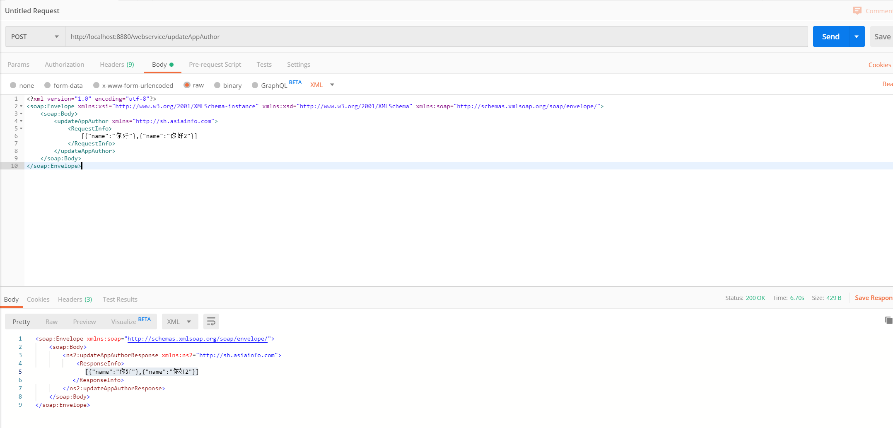

### SpringBoot集成webservice框架cxf 以及 用axis调用

项目中有个与外部系统对接的需求，对方系统竟然还是用的webservice接口，妈呀，我还以为这种古老的东西被淘汰了呢。

顺手记录一下SpringBoot中如何提供WS服务以及如何调用WS服务吧，具体步骤如下：

#### 1、添加pom依赖

```xml
<dependency>
        <groupId>org.springframework.boot</groupId>
        <artifactId>spring-boot-starter-web-services</artifactId>
</dependency>
<dependency>
        <groupId>org.apache.cxf</groupId>
        <artifactId>cxf-spring-boot-starter-jaxws</artifactId>
        <version>3.2.7</version>
</dependency>
```


#### 2、编写接口

```java
@WebService(name = "WangGeFor4A", targetNamespace = "http://sh.asiainfo.com")
public interface For4A {
    @WebMethod
    @WebResult(name = "ResponseInfo")     //定义返回的参数名
    String updateAppAuthor(@WebParam(name = "RequestInfo", targetNamespace = "http://sh.asiainfo.com") String requestXML);
                                       //绑定参数名 与 xmlns
}
```

#### 3、实现接口

```java
@Component
@WebService(serviceName = "WangGeFor4A",      //与接口中注解的 name需相同
        targetNamespace = "http://sh.asiainfo.com",
        endpointInterface = "com.asiainfo.grid.sop.manage.service.aaaa.called.For4A"    //实现的接口的全限定包名
)
public class For4AImpl implements For4A {
    @Override
    public String updateAppAuthor(String requestXML) {
        System.out.println(requestXML);
        return requestXML;
    }
}
```

> 注：上述两步骤中引入的注解的包为 javax.jws.xxx


#### 4、发布webservice服务

```java
package com.asiainfo.grid.sop.manage.config;
import com.asiainfo.grid.sop.manage.service.aaaa.called.For4A;
import org.apache.cxf.Bus;
import org.apache.cxf.bus.spring.SpringBus;
import org.apache.cxf.jaxws.EndpointImpl;
import org.apache.cxf.transport.servlet.CXFServlet;
import org.springframework.beans.factory.annotation.Autowired;
import org.springframework.beans.factory.annotation.Qualifier;
import org.springframework.boot.web.servlet.ServletRegistrationBean;
import org.springframework.context.annotation.Bean;
import org.springframework.context.annotation.Configuration;

import javax.xml.ws.Endpoint;

@Configuration
public class WebserviceConfig {

    @Autowired
    @Qualifier(Bus.DEFAULT_BUS_ID)
    private SpringBus bus;

    @Autowired
    private For4A for4A;

    @Bean
    public ServletRegistrationBean wsServlet(){
        return new ServletRegistrationBean(new CXFServlet(), "/webservice/*");
    }

    @Bean
    public Endpoint endpoint(){
        EndpointImpl endpoint = new EndpointImpl(bus, for4A);
        endpoint.publish("/updateAppAuthor");
        return endpoint;
    }
}
```


#### 5、使用axis调用。

```java
		Service service = new Service();
        String targetNamespace = "http://sh.asiainfo.com";
        String method = "updateAppAuthor";
        Call call = (Call) service.createCall();
        call.setTimeout(120 * 1000);
        call.setTargetEndpointAddress(new java.net.URL(url));
        call.setOperationName(new QName(targetNamespace, method));
        call.addParameter("RequestInfo",
                org.apache.axis.encoding.XMLType.XSD_STRING,
                javax.xml.rpc.ParameterMode.IN);
        //call.setReturnType(org.apache.axis.encoding.XMLType.XSD_STRING);
        //call.setUseSOAPAction(true);
        Object re = call.invoke(new Object[]{xml});
```


#### 6、使用postman调用调试



