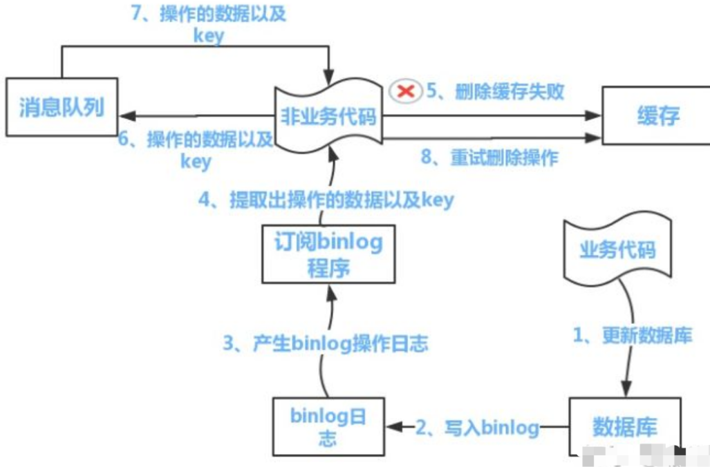

### 一、REDIS特性

redis现在这么火，为什么呢？我觉得是redis有如下特性：

* redis是内存性数据库，避免了很多磁盘io的操作，非常的块
* redis对多语言都提供了很好的支持

* redis的单计算线程，多io线程的，所有的操作都在计算线程内严格的按顺序串行化执行；可以更充分的利用cpu与网卡，并且单线程、高速的特性可以解决很多高并发下的难题
* redis支持丰富的数据结构，可以满足大多数下关系数据库实现不了的需求

### 二、Redis 基础

#### 数据类型

redis提供了5中基础数据类型（不包括stream  发布订阅等）

> 注：redis的数据都是基于二进制数据安全的，编码格式自己定

##### 1.string（本质是字节数组）

可以存string、数值、bitmap、文件流等。

##### 2.list（插入有序、但不会排序）

有点像LinkedList的感觉，有双端队列的特性。

list的key维护了一个指向头结点与指向尾结点的指针。

##### 3.hash

看做一个hashmap即可。

无序

效率有点慢，一般不推荐使用。使用的话可以把这类数据单独拎出来放到一个redis中，免得干扰其他redis

##### 4.set

去重；无序

##### 5.zset（sorted set）

在sort的基础上，为每一个元素提供了分值属性，根据score升序排序，在添加元素时要给元素一个score 分值，作为redis为set排序的依据。

zset会对元素去重，元素都是有序的。

>  拓展：zset底层数据结构是 skiplist  跳跃表

##### 几种数据类型的对比

| **几种数据类型对比** | **string**                           | **list**                               | **set**                                 | **hash**             | **sorted set**         | **stream** |
| -------------------- | ------------------------------------ | -------------------------------------- | --------------------------------------- | -------------------- | ---------------------- | ---------- |
| **顺序**             | 无                                   | 插入有序                               | 无                                      | 无                   | 根据分值排序           |            |
| **元素可重复**       | 否                                   | 是                                     | 否                                      | 否                   | 否                     |            |
| **特性**             | 支持数值、bitmap、bitmap的与或非操作 | 双端队列                               | 类似hashset                             | 类似hashmap          | 有序set                |            |
| **阻塞方法**         | 无                                   | BRPOPBLPOPBRPOPLPUSH                   | 无                                      | 无                   | BZPOPMAXBZPOPMIN       |            |
| **交并差集**         | bitmap可以bitop                      | 不支持                                 | SUNION  SINTER SDIFF....                | 不支持               | ZUNIONSTOREZINTERSTORE |            |
| **使用场景**         | 分布式计数二进制的与或非             | 微信发红包，提前算好份额；作为一个队列 | SRANDMEMBER随机抽奖共同好友推荐队列秒杀 | 存放结构化的item数据 | 范围查找排行榜         |            |

##### 使用场景举例

分析：严格的数据访问时，要搞成串行化！redis的操作是原子性的

redis单线程，浪费其他cpu-->  单机部署多实例--》网卡瓶颈 --》 io thread  多iothread   单worker线程  充分利用网卡 与 cpu

redis二进制安全 没有任何编解码系统  基于 二进制做的

基于string bitmap实现统计用户在指定时间范围内用户的登录天数。假设有2E 用户

// 首先先将用户id扁平化  1 2 3 .... then setbit 20200101 1 1  //1号用户1月1日登录 setbit 20200101 4 1  //4号用户1月1日登录 ...... setbit 20200201 465 1  //465号用户2月1日登录 setbit 20200201 433 1  //433号用户2月1日登录 ......... 统计1月1日，2月1日都登录了的用户数 bitop and result 20200101 20200201 bitcount result 0 -1 当然，用户数量如果特别多的话；我猜想应该是要分库路由的吧。

#### 常用命令

记住这些常用命令，基本就可以熟练操作各语言的api了，因为都差不多

##### 通用命令

| **命令**                             | **说明**                             | **eg**                       |
| ------------------------------------ | ------------------------------------ | ---------------------------- |
| help @                               | 类似于linux中的man命令               | help @stringhelp @sorted_set |
| keys  ${表达式}                      | 查看当前节点中符合表达式的所有key    |                              |
| flushall                             | 清空redis所有数据                    |                              |
| type key                             | 查看指定key的数据类型                |                              |
| EXPIRE key seconds                   | 指定key多少秒后过期失效              | EXPIRE test  10              |
| EXPIREAT key timestamp               | 为key设置失效的时间点                | EXPIREAT mykey 1293840000    |
| PEXPIRE key milliseconds             | 指定key多少毫秒后过期失效            |                              |
| PEXPIREAT key milliseconds-timestamp | 为key设置失效的时间点                |                              |
| TTL key                              | 返回指定key还有多少秒过期            |                              |
| PTTL key                             | 返回指定key还有多少毫秒过期          |                              |
| PERSIST key                          | 取消指定key的过期时间                |                              |
| EXISTS key                           | 判断指定key是否存在，1 存在；0不存在 |                              |
| DEL key [key ...]                    | 删除指定key                          |                              |
| TOUCH key [key ...]                  | 修改key的最后一次访问时间            |                              |

##### String类型

>  string的下表具有双向索引特性， 0为第一个； -1为最后一个  -2为倒数第二个；         0 ~ -1 为所有    -2 ~ -1 为最后两个

- set          
- get           
- mset  在一次原子操作内设置多个变量  mset key1  value1  key2 value2
- mget  在一次原子操作内读取多个变量  mget key1  key 2
- getset  key value   获取旧值并设置新值   原子操作
- append    向原string中追加内容
- strlen       评估string的长度，返回的length为**字节长度**
- getrange  即substr，可以支持从前往后，也可从后往前

redis> SET mykey "This is a string" "OK" redis> GETRANGE mykey 0 3 "This" redis> GETRANGE mykey -3 -1 "ing" redis> GETRANGE mykey 0 -1 "This is a string" redis> GETRANGE mykey 10 100 "string"

- incr  自增1
- incrby 增加指定值
- decr 自减1
- decrby 自减指定值

注：上面这四种类型只能操作integer

- incrbyfloat  浮点数增加指定值
- decrbyfloat  浮点数减少指定值

注：只能操作浮点数

- **setbit**   key   offset  value
- **getbit**   key   offset  value

注：setbit  getbit 都是二进制位操作，offset是从左往右数的！ 此处的offset是**二进制位的偏移**。

- **bitcount** key  start end   统计指定字节范围内的二进制值为1的位数；此处的start end 指的是**字节的偏移！**
- **bitop**  operation destkey key [key ...]         有四种操作类型  and 与；or  或；not 非；xor 异或

localhost:6379> setbit k1 3 1 (integer) 0 localhost:6379> setbit k2 11 1 (integer) 0 localhost:6379> bitop and k3 k1 k2 (integer) 4 localhost:6379> bitcount k3 0 -1 (integer) 0

- setex  key seconds value   等价于  set key value  &  expire key  seconds ；但是这个操作是atomic的
- psetex key milliseconds value  上一条指定的毫秒版本
- setnx  key  value  ；  是 SET if **N**ot e**X**ists 的缩写。当指定key不存在值时，设置为指定value；否则不做操
- msetnx key1 value1  key2  value2   上一条指令的批量原子操作

##### List类型

- LPUSH key element  a b c d e   在list的左侧依次push入元素a b c d e...
- RPUSH key element a b c...  在list的右侧依次push入多个元素
- LRANGE key start stop           获取指定区间内的元素，支持双向索引
- LPOP key      从指定队列的左侧取出一个元素
- RPOP key      从指定队列的右侧取出一个元素
- LPUSHX key element [element ...]    如果指定key已经存在，且是个list，才进行lpush操作，否则不做任何操作。
- RPUSHX key element [element ...]   同上
- LLEN key   返回队列目前的长度
- LINSERT key BEFORE|AFTER pivot element         在指定元素 前/后 添加一个元素

redis> RPUSH mylist "Hello" (integer) 1 redis> RPUSH mylist "World" (integer) 2 redis> LINSERT mylist BEFORE "World" "There" (integer) 3 redis> LRANGE mylist 0 -1 1) "Hello" 2) "There" 3) "World"

- LINDEX key index     返回指定位置的那个元素  （不是查找元素的位置哦！）
- BLPOP key [key ...] timeout           从指定的几个list中获取一个元素，如果key不存在或队列为空；则阻塞指定时间，直到另一个客户端连接向list中push入了数据；或超时时间达到，返回null。timeout的单位为秒；**0为永远阻塞；不支持负数。**
- BRPOP key [key ...] timeout     同上
- RPOPLPUSH source destination               从source list中的右侧pop出一个元素，然后lpush到目标list中；是个原子操作
- BRPOPLPUSH source destination timeout    上一个操作的阻塞版本
- LSET key index element     将list中指定位置的元素设置为新的元素
- LTRIM key start stop           移除list中指定区间之外的所有元素

##### Hash类型

- HSETkey field         为指定map的key设置value
- HGET key field         返回指定map的某个key的value
- HDEL key field [field ...]       删除指定key中的某些字段
- HEXISTS key field      判断指定key的字段是否存在   返回存在 1 或 不存在 0
- HGETALL key         返回指定key的所有  filed value
- HINCRBY key field increment        将指定key的某个字段值 增加或减少多少  支撑正负数  （ 只支持整数，不支持浮点数）
- HINCRBYFLOAT key field increment   上一个指定的浮点数版本， 不支持整数
- HKEYS key      返回指定map的所有key
- HLEN key      返回指定map的filed个数
- HVALS key    返回指定map的所有value值
- HMGET key field [field ...]     hget的批量操作的原子版
- HMSET key field value [field value ...]   同上
- HSETNX key field value       如果指定map不存在某个key，则设置新value 返回 1；如果key已存在，不做任何操作，返回0
- HSTRLEN key field    返回指定map中key对应的value的长度；

##### Set类型

- SADD key member [member ...]    向指定set中添加元素
- SREM key member [member ...]    删除set中的某些元素
- SMEMBERS key                  返回指定set的所有元素
- SCARD key                          返回指定set的元素数量
- SISMEMBER key member   判断指定元素是否是在集合中   是返回1；否返回0
- SRANDMEMBER key [count]       随机返回集合中的多少个元素；count为正数时返回结果不会重复；负数时元素可能重复    
- SUNION  key [key ...]  并集   返回几个集合的并集
- SINTER  key [key ...]  交集    返回几个集合的交集
- SDIFF    set1 set2   差集    返回前者比后者多的那部分的集合
- SUNIONSTORE destination key [key ...]    将计算出的交并差结果存放到新的集合当中，原子操作
- SINTERSTORE destination key [key ...]
- SINTERSTORE destination key [key ...]      
- SMOVE source destination member   将一个元素从源集合移到目标集合中
- SPOP key [count]   从集合中随机取出几个元素

##### ZSET类型

首先，明确一点：zset中的分值是一个用string表示的浮点数。

- ZADD key  score member [score member ...]         向一个有序集合添加元素（必须带分值）；如果元素已存在，则会更新分值，然后重新插入，以保证元素的顺序正确。
- ZSCORE key member      返回指定元素的分数
- ZCARD key            返回集合元素个数
- ZCOUNT key min max   返回指定分数区间的元素数量 左右闭区间
- ZINCRBY key increment member     将指定key的某个成员的分数增加指定值
- ZPOPMAX key [count]   返回set中分值最高的那几个元素
- ZPOPMIN key [count]   返回set中分值最小的那几个元素
- BZPOPMAX key [key ...] timeout   pop出几个集合中分值最大的元素；阻塞方法。 timeout=0时将一直阻塞。
- BZPOPMIN key [key ...] timeout      同上
- ZRANGE key start stop [WITHSCORES]       返回set中指定索引范围内的元素 左右都是闭区间;
- ZRANGEBYSCORE key min max [WITHSCORES]     支持开闭区间 与  inf   （无限）

zrangebyscore  set1 -inf  +inf     // 返回所有元素 zrangebyscore  set1  (10.5 +inf    //  返回大于10.5分的元素 zrangebyscore  set1  10.5 +inf    //  返回大于等于10.5分的元素

注：上面这两条指令，前者是基于位置索引返回元素的，支持双向索引；后者是基于socre的值取元素的。

- ZRANK key member   返回指定元素的排名
- ZREM key member [member ...]         删除指定元素
- ZREMRANGEBYRANK key start stop  删除指定排名区间的元素
- ZREMRANGEBYSCORE key min max   删除指定分数段时间的元素；同样支持开闭区间与 inf

降序操作：

- ZREVRANGE key start stop [WITHSCORES]       zrange是升序操作的， zrevrange是降序排序操作的。
- ZREVRANGEBYSCORE key max min [WITHSCORES]    zrangebyscore   从左到右降序; 返回指定分数区间的元素
- ZREVRANK key member    降序排序下,某个元素的名次

交并集操作

- ZUNIONSTORE destination numkeys key [key ...]
- ZINTERSTORE destination numkeys key [key ...]

##### PUB/SUB  发布订阅

- SUBSCRIBE channel [channel ...]            订阅多个channel;
- PUBLISH channel message                      想某个channel发送消息;监听该channel的客户端都可以立即收到

### 三、Redis 缓存

redis最基础的特性就是做缓存了，给数据库来缓解压力，现在面试都喜欢问redis缓存相关的问题，主要都有以下几点：

#### 1、关于缓存的一些常见问题及解决方案

##### 1.缓存穿透

> 名词解释  请求一些根本不存在的缓存，或访问尚未缓存的数据，导致数据库被频繁访问，导致数据库压力过大。

**解决方案**

> - 接口参数规范性进行校验。
> - 接口调用频率进行限制
> - 如果拿到缓存为空，也对空对象进行缓存，并设置失效时间；但也可能会适得其反，如果黑客频繁换主键，会导致有用的缓存被淘汰，这种情况下就得用**布隆过滤器**。

> 布隆算法：？？？ 存在hash碰撞--》 算法说存在 不一定存在；算法说不存在，一定不存在。？？？

##### 2.缓存击穿

缓存击穿是指数据库中存在，但缓存中不存在的数据（一般是缓存时间到期）；而且同时并发量特别大；很多线程同时访问数据库，导致数据库压力骤升。

**解决方案**

> - 一些热点数据，高访问量的，过期时间设大点，甚至永不过期。
> - 使用分布式互斥锁，只有一个线程读数据库，然后更新缓存。

##### 3.缓存雪崩

缓存雪崩是指，缓存层出现了错误，不能正常工作了，或是热门数据突然几种失效了。于是所有的请求都会达到存储层，存储层的调用量会暴增，造成存储层也会挂掉的情况。

##### 产生原因:

> - 缓存挂了，比如说redis挂了
> - 可能是缓存批量过期了

##### 解决方案：

> - 保证redis高可用
> - 为缓存设置不同的过期时间
> - 热点数据永不过期

##### 4.最终一致性 or 强一致性 or 弱一致性

对于关系型数据库，要求更新过的数据能被后续的访问都能看到，这是强一致性；如果经过一段时间后要求能访问到更新后的数据，则是最终一致性；如果能容忍后续的部分或者全部访问不到，则是弱一致性。

#### 二、如何保证缓存与数据库的双写一致性？

思考这个问题从两个维度来分析

> - 多线程并发角度
> - 业务场景角度 (即读写操作的权重)

##### 1.先写缓存，再写数据库?

- 缺陷：写数据库可能会失败，造成数据不一致

##### 2.先删除缓存,再更新数据库?

- **缺陷**: 线程a删除缓存后,如果有线程b发现缓存不存在,在线程a更新数据库操作完成之前重新读取旧数据,将旧数据刷回缓存,就会导致缓存脏数据.

##### 3.先写数据库，再更新缓存?

- 缺陷：写缓存可能会失败，但概率较小；数据可能读少写多，有很多多余的更新缓存的操作。

##### 4.Cache Aside Pattern（先写数据库，后删除缓存）（推荐）

最经典的缓存+数据库读写的模式，就是 Cache Aside Pattern。

- 读的时候，先读缓存，缓存没有的话，就读数据库，然后取出数据后放入缓存，同时返回响应。

- 更新的时候，**先更新数据库，然后再删除缓存**。为什么是删除缓存，而不是更新呢，因为可能数据是冷数据，即读少写多，此时频繁的更新缓存属于多余操作。

- **缺陷**：

  - 两个线程，一读一写。读的操作发生时，正好缓存miss，然后开始读数据库；此时线程B更新数据，删除缓存；然后线程a读到了旧的数据，再次更新了缓存。造成数据不一致。
  - 删除缓存操作失败，导致数据不一致。

- **分析**：

  - 前者这种情况发生的概率很低；因为数据库的读的速度比写的速度快，这一场景较难出现。

  - 后者可以使用失败重试；再失败将删除缓存的请求扔到一个消息队列中，由别人去处理。或者配合数据库的binlog实现队列接受binlog，将写操作全部执行一遍删缓存，可以保证最终一致性。如图所示：

    

***

### 五、SpringBoot 集成redis做缓存

参照demo-collection项目中的redis子项目，介绍了Spring中的缓存相关的几个注解使用

### 五、Redis 安装

见同级目录的手册，当年整理的，懒得复制了

### 六、Redis 集群

见同级目录的手册，当年整理的，懒得复制了

### 七、Redis问题集合

#### 1.Redis主从复制，数据一致性

**何为主从模式：**

Redis的性能固然很高，但是大量的并发请求也会给Redis节点带来压力，Redis提供了主从复制+读写分离的方式来提高性能。

主从模式支持1主n从的模式，主节点只接受写操作，而从节点只接收从主节点同步过来的读操作和客户端的写操作。主从+读写主要是为了提升Redis的读取性能。

**问题：**

涉及到主从模式，就会出现数据多节点间的数据不一致性问题。因为主节点向从节点同步数据是有延时的。

**如何解决：**

1、忽略：

脱离业务谈系统是不现实的，如果业务系统可以接受短暂的延时，可以直接忽略暂时的数据不一致行为。绝大部分业务，例如：百度搜索，淘宝订单，QQ消息，58帖子都允许短时间不一致。 