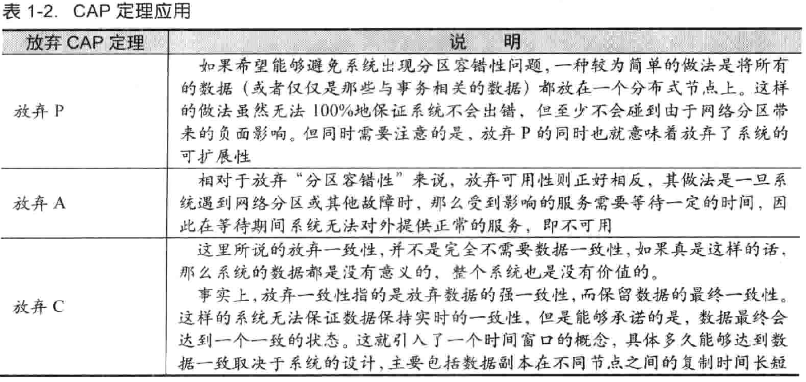

#### 三态

分布式系统基于网络通信进行的每一次调用，都存在三种情况：

* 成功

* 失败

* 超时   又可以细分为以下两种：

  * 接收方根本没有接收到请求，消息丢失。

  * 接收方接收到了请求，也作了响应处理，但是在将结果反馈给发送方的过程中，因为网络，消息丢失了。

当发生超时的情况时，调用方是无法确认当前请求是否被成功处理的。

## CAP理论

在开始讲Zookeeper之前，先了解一下著名的CAP理论，参考[论文](https://www.infoq.cn/article/cap-twelve-years-later-how-the-rules-have-changed/)

CAP 理论主张任何基于网络的数据共享系统，都最多只能拥有以下三条中的两条：

- 数据一致性（C）：指在对一个副本数据进行更新的同时，必须保证也能够更新其他副本，否则不同副本之间的数据不再一致。一致性级别有三：
  * 强一致性      在多个副本节点之间，数据时时刻刻保持同步，用户写入什么，读出来的也是什么；但是对分布式系统的性能影响较大。
  * 弱一致性      在数据被写入后，不保证结果可以被立刻读取到，但会尽可能的在某个时间范围内，达到数据的一致性。
  * 最终一致性   是弱一致性的一个特例，保证在一定的时间内，数据可达到一致的状态。
- 可用性（A）  ：   即我们的分布式服务必须一致保持为可用的状态，必须在有限的时间内作出响应。
- 能容忍网络分区（P）： 即我们的分布式系统在遇到任何分区故障时，仍然能够对外提供满足一致性和可用性的服务。

CAP的舍取：

## BASE 理论

BASE是 Basically  Available（基本可用），Soft state（软状态），Eventually consitent（最终一致性）三个短语的简写，是由来于eaby的一位架构师提出的。Base理论是对CAP中一致性和可用性权衡的结果，其来源于对大规模互联网系统分布式实践的总结，是基于CAP定理逐渐演化而来的，其核心思想是即使无法做到强一致性，但每个应用都可以根据自身业务的特点，采用适当的方式来使系统达到最终一致性。

#### 基本可用

指分布式系统在出现不可预知的故障的时候，允许损失部分可用性，但这并不等于系统不可用，一般来讲，损失的可用性有：

* **响应时间的损失**，比如分布式集群中的一些节点挂了，查询的响应时间增加到了1~2秒。
* **功能上的损失**，比如在流量高峰时，对用户限流，转到提醒页面。

#### 弱状态

和数据强一致性相对，即**允许**系统在不同节点的数据副本之间进行**数据同步**的过程中**存在时延**。

#### 最终一致性

指数据的最终一致性，不要求数据时时刻刻强一致，只要求数据在一定的时间同步之后，达到一致性的状态。

> 如何基于Base理论来进行大规模可扩展的分布式系统的架构设计，https://dl.acm.org/doi/10.1145/1394127.1394128

## 分布式协议

为了解决分布式一致性问题，在长期的探索过程中，涌现出了一大批经典的一致性协议和算法，其中最著名的就是二阶段提交协议、三阶段提交协议和Paxos算法。

二阶段与三阶段提交都需要引入一个称作”协调者“的组件来负责统一调度多个参与者的事务行为，并最终决定这些参与者是否需要把事务做真正的提交。

#### 2PC

Two Phase Commit，2阶段提交，广泛用于数据库领域。

##### 提交过程

两个阶段分别为：

* 阶段一：询问阶段（提交事务请求）

  1. 事务询问

     协调者向所有的参与者发送事务内容，询问是否可以执行事务提交操作，并开始等待各参与者的响应。

  2. 执行事务

     各参与者节点执行事务操作，并将Undo和Redo信息记入事务日志中。

  3. 各参与者向协调者反馈事务询问的响应

     如果参与者成功执行了事务操作，那么就反馈给协调者Yes 响应，表示事务可以执行;如果参与者没有成功执行事务，那么就反馈给协调者No响应，表示事务不可以执行。

* 阶段二：执行事务提交

  协调者根据各个参与者的反馈情况来决定大家是否要提交事务，还是要回滚：

  * 执行事务提交

    假如协调者从所有的参与者获得的反馈都是Yes响应，那么就会执行事务提交。

    1. 发送提交请求

       协调者向所有参与者节点发出Commit请求

    2. 事务提交

       参与者接收到Commit请求后，会正式执行事务提交操作，并在完成提交之后释放在整个事务执行期间占用的事务资源。

    3. 反馈事务提交结果

       参与者在完成事务提交之后，向协调者发送Ack消息

    4. 完成事务

       协调者接收到所有参与者反馈的Ack消息后，完成事务

  * 中断事务

    假如任何一个参与者向协调者反馈了No响应，或者在等待超时之后，协调者尚无法接收到所有参与者的反馈响应，那么就会中断事务。

    1. 发送回滚请求

       协调者向所有参与者节点发出Rollback请求

    2. 事务回滚

       参与者接收到Rollback请求后，会利用其在阶段一中记录的Undo信息来执行事务回滚操作，并在完成回滚之后释放在整个事务执行期间占用的资源。

    3. 反馈事务回滚结果

       参与者在完成事务回滚之后，向协调者发送Ack消息。

    4. 中断事务

       协调者接收到所有参与者反馈的Ack消息后，完成事务中断。

#####  缺陷分析

二阶段提交的缺点如下：

* 同步阻塞
* 单点问题
* 数据不一致
* 太过于保守      缺少较为完善的容错机制，任何一个节点的失败都会导致整个分布式事务的失败。

  

#### 3PC

三阶段提交协议，由2PC改进而来，主要是将2PC的提交事务请求过程一分为二，形成了由CanComiit，PreCommit和do commit三个阶段组成的事务处理协议，其协议设计如图：

参考https://www.cnblogs.com/AndyAo/p/8228099.html

#### Paxos

####  

## Zookeeper

### 一、zk如何保证强一致性的？

zk集群由多个节点组成，其中有且仅有一个leader，处理所有事务请求；follower及observer统称learner。learner需要同步leader的数据。follower还参与选举及事务决策过程。zk客户端会打散配置文件中的serverAddress 顺序并随机组成新的list，然后循环按序取一个服务器地址进行连接，直到成功。**follower及observer会将事务请求转交给leader处理**。leader会将事务请求同步给其他follower，只有在收到半数以上的follower节点请求确认之后，才会告诉最初请求的follower，处理成功。当zk 主节点挂掉，发生中心选举时，ZAB协议会保证选举的新leader一定会获取最新的数据。

### 二、选举过程

#### 1、选举机制

这篇主要分析leader的选择机制，zookeeper提供了三种方式：

* LeaderElection  

* AuthFastLeaderElection

* FastLeaderElection （最新默认）

  

  默认的算法是FastLeaderElection，所以这篇主要分析它的选举机制。

#### 2、选举流程简述

目前有5台服务器，每台服务器均没有数据，它们的编号分别是1,2,3,4,5,按编号依次启动，它们的选择举过程如下：

服务器1启动，给自己投票，然后发投票信息，由于其它机器还没有启动所以它收不到反馈信息，服务器1的状态一直属于Looking(选举状态)。
服务器2启动，给自己投票，同时与之前启动的服务器1交换结果，由于服务器2的编号大所以服务器2胜出，但此时投票数没有大于半数，所以两个服务器的状态依然是LOOKING。
服务器3启动，给自己投票，同时与之前启动的服务器1,2交换信息，由于服务器3的编号最大所以服务器3胜出，此时投票数正好大于半数，所以服务器3成为领导者，服务器1,2成为小弟。
服务器4启动，给自己投票，同时与之前启动的服务器1,2,3交换信息，尽管服务器4的编号大，但之前服务器3已经胜出，所以服务器4只能成为小弟。
服务器5启动，后面的逻辑同服务器4成为小弟。

