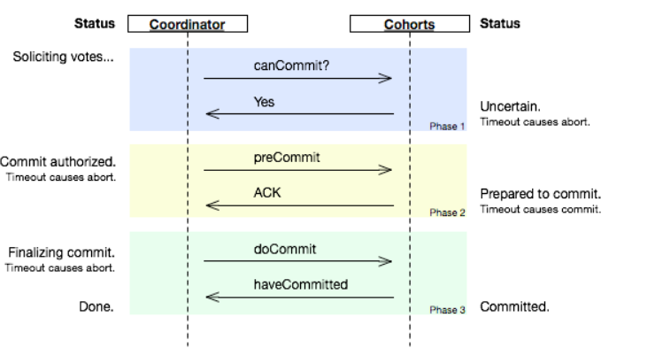

#### 三态

分布式系统基于网络通信进行的每一次调用，都存在三种情况：

* 成功

* 失败

* 超时   又可以细分为以下两种：

  * 接收方根本没有接收到请求，消息丢失。

  * 接收方接收到了请求，也作了响应处理，但是在将结果反馈给发送方的过程中，因为网络，消息丢失了。

当发生超时的情况时，调用方是无法确认当前请求是否被成功处理的。

## CAP理论

在开始讲Zookeeper之前，先了解一下著名的CAP理论，参考[论文](https://www.infoq.cn/article/cap-twelve-years-later-how-the-rules-have-changed/)

CAP 理论主张任何基于网络的数据共享系统，都最多只能拥有以下三条中的两条：

- 数据一致性（C）：指在对一个副本数据进行更新的同时，必须保证也能够更新其他副本，否则不同副本之间的数据不再一致。一致性级别有三：
  * 强一致性      在多个副本节点之间，数据时时刻刻保持同步，用户写入什么，读出来的也是什么；但是对分布式系统的性能影响较大。
  * 弱一致性      在数据被写入后，不保证结果可以被立刻读取到，但会尽可能的在某个时间范围内，达到数据的一致性。
  * 最终一致性   是弱一致性的一个特例，保证在一定的时间内，数据可达到一致的状态。
- 可用性（A）  ：   即我们的分布式服务必须一致保持为可用的状态，必须在有限的时间内作出响应。
- 能容忍网络分区（P）： 即我们的分布式系统在遇到任何分区故障时，仍然能够对外提供满足一致性和可用性的服务。

CAP的舍取：

## BASE 理论

BASE是 Basically  Available（基本可用），Soft state（软状态），Eventually consitent（最终一致性）三个短语的简写，是由来于eaby的一位架构师提出的。Base理论是对CAP中一致性和可用性权衡的结果，其来源于对大规模互联网系统分布式实践的总结，是基于CAP定理逐渐演化而来的，其核心思想是即使无法做到强一致性，但每个应用都可以根据自身业务的特点，采用适当的方式来使系统达到最终一致性。

#### 基本可用

指分布式系统在出现不可预知的故障的时候，允许损失部分可用性，但这并不等于系统不可用，一般来讲，损失的可用性有：

* **响应时间的损失**，比如分布式集群中的一些节点挂了，查询的响应时间增加到了1~2秒。
* **功能上的损失**，比如在流量高峰时，对用户限流，转到提醒页面。

#### 弱状态

和数据强一致性相对，即**允许**系统在不同节点的数据副本之间进行**数据同步**的过程中**存在时延**。

#### 最终一致性

指数据的最终一致性，不要求数据时时刻刻强一致，只要求数据在一定的时间同步之后，达到一致性的状态。

> 如何基于Base理论来进行大规模可扩展的分布式系统的架构设计，https://dl.acm.org/doi/10.1145/1394127.1394128

## 分布式协议

为了解决分布式一致性问题，在长期的探索过程中，涌现出了一大批经典的一致性协议和算法，其中最著名的就是二阶段提交协议、三阶段提交协议和Paxos算法。

二阶段与三阶段提交都需要引入一个称作”协调者“的组件来负责统一调度多个参与者的事务行为，并最终决定这些参与者是否需要把事务做真正的提交。

#### 2PC

Two Phase Commit，2阶段提交，广泛用于数据库领域。

##### 提交过程

两个阶段分别为：

* 阶段一：询问阶段（提交事务请求）

  1. 事务询问

     协调者向所有的参与者发送事务内容，询问是否可以执行事务提交操作，并开始等待各参与者的响应。

  2. 执行事务

     各参与者收到事务咨询请求号，开始执行事务操作，并将Undo和Redo信息记入事务日志中。

  3. 响应

     如果参与者成功执行了事务操作，那么就反馈给协调者Yes 响应，表示事务可以执行；如果参与者没有成功执行事务，那么就反馈给协调者No响应，表示事务不可以执行。

* 阶段二：执行事务提交

  协调者根据各个参与者的反馈情况来决定大家是否要提交事务，还是要回滚：

  * 执行事务提交

    假如协调者从所有的参与者获得的反馈都是Yes响应，那么就会执行事务提交。

    1. 发送提交请求

       协调者向所有参与者节点发出Commit请求

    2. 事务提交

       参与者接收到Commit请求后，会正式执行事务提交操作，并在完成提交之后释放在整个事务执行期间占用的事务资源。

    3. 反馈事务提交结果

       参与者在完成事务提交之后，向协调者发送Ack消息

    4. 完成事务

       协调者接收到所有参与者反馈的Ack消息后，完成事务

  * 中断事务

    假如任何一个参与者向协调者反馈了No响应，或者在等待超时之后，协调者尚无法接收到所有参与者的反馈响应，那么就会中断事务。

    1. 发送回滚请求

       协调者向所有参与者节点发出Rollback请求

    2. 事务回滚

       参与者接收到Rollback请求后，会利用其在阶段一中记录的Undo信息来执行事务回滚操作，并在完成回滚之后释放在整个事务执行期间占用的资源。

    3. 反馈事务回滚结果

       参与者在完成事务回滚之后，向协调者发送Ack消息。

    4. 中断事务

       协调者接收到所有参与者反馈的Ack消息后，完成事务中断。

#####  缺陷分析

二阶段提交的缺点如下：

* 同步阻塞         二阶段提交是没有超时机制的，在各个阶段，各个参与者都无限市场的等待下一步操作的指示，极大的影响了性能。
* 单点问题         如果事务进展至阶段二时，协调者崩溃了，那么各参与者会一致锁定资源，导致事务既无法继续，也无法回滚。
* 数据不一致     在事务提交阶段，如果协调者向参与者发送commit请求，但是因为各种原因，某一协调者没有接收到commit请求；就会引起数据不一致。
* 太过于保守     缺少较为完善的容错机制，任何一个节点的失败都会导致整个分布式事务的失败。

  

#### 3PC

三阶段提交协议，由2PC改进而来，主要是将2PC的提交事务请求过程一分为二，形成了由CanComiit，PreCommit和do commit三个阶段组成的事务处理协议，其协议设计如图：

>  参考 https://www.cnblogs.com/AndyAo/p/8228099.html

##### 提交过程

3PC的提交过程主要分为三个阶段：

* canCommit

  1. 事务询问，协调者询问所有事务参与者，是否可以开始事务。
  2. 参与者反馈，参与者接收到协调者的canCommit咨询请求后，如果认为可以继续开始事务，则返回yes，进入准备状态；否则返回no。（在等待协调者作出指示的等待状态中，如果超时，则直接abort）。

* preCommit

  在阶段二，协调者会根据参与者在阶段一作出的反馈，决定下一步的行动：

  * 如果所有事务参与者都对canCommit作出yes响应，则
    1. 协调者向参与者发出preCommit请求，自己进入prepared状态。
    2. 参与者接收到preCommit请求，开始执行事务操作，并将undo和redo信息记入事务日志中。
    3. 参与者向协调者反馈事务执行结果，并进入等待状态，等待协调者作出最后决定，commit or  rollback。
  * 如果任何一个事务参与者对CanCommit作出no响应，或者协调者等待参与者响应超时，则
    1. 协调者向所有事务参与者发出 abort请求，终止此次分布式事务。

* doCommit

  在阶段三，协调者将决定是否要提交事务，存在以下两种情况：

  * 如果收到了所有参与者的事务操作执行成功的确认，
    1. 协调者从parared状态进如 commi状态，向所有的参与者提交doCommit请求。
    2. 参与者接收到doCommit请求后，会执行事务提交操作，在完成之后释放整个事务占用的资源。
    3. 参与者向协调者发送ack消息。
  * 如果任一参与者在preCommit，即事务性操作执行阶段反馈了no；或者协调者等待参与者响应超时，则中断分布式事务：
    1. 协调者向所有的参与者发送abort请求。
    2. 参与者收到abort请求后，利用undo信息回滚事务。
    3. 参与者反馈给协调者ack消息。

> 需要注意的是，一旦进入阶段三，可能会存在两种故障：
>
> * 协调者出现问题。
> * 协调者和参与者之间的网络出现故障。
>
> 上述两种情况都是导致参与者无法获取协调者发出的 commit 或者 abort请求；注意：**无论如何，参与者在等待超时的情况下，都会继续进行事务提交。**

##### **优缺点：**

* **三阶段提交能够在协调者在单点故障时，使参与者的事务达成一致。**
* **在preCommit阶段，如果一个参与者执行事务操作后，网络异常，其ack消息无法被协调者接收；协调者会发出abort请求使其他参与者回滚，而参与者自己在超时后会commit事务，造成数据不一致。**

#### Paxos

在介绍完2PC  3PC后，介绍一下Paxos算法，它是一种基于消息传递且具有高度容错特性的一致性算法，是目前公认的解决分布式一致性问题最有效的算法之一。

> paxos的核心是一个一致性算法。

。。。 太复杂了，不记录了，回头看懂了再说吧，大概就是说引入了半数机制。

### Chubby

google chubby 是一个大名鼎鼎的面向分布式系统的锁服务，其底层实现就是以paxos算法为基础的。

chubby是个粗粒度的锁。

#### 应用场景

chubby针对的应用场景是客户端获取锁之后会进行长时间的持有（数小时或数天），而非短暂的获取锁的场景。

## Zookeeper

### 一、ZK分布式特性：

* 顺序一致性

  从同一个客户端发起的事务请求，最终会严格地按照其发起的顺序被应用到zk集群中去。

* 原子性

  所有事务请求的处理结果在整个集群中所有机器上的应用情况是一致的。要么整个集群所有机器都成功应用了某一事务，要么都没应用；**一定不会出现集群中部分机器应用了该事务，而另一部分没有应用的情况。**

* 单一视图

  无论客户端连接的是哪一个zk服务器节点，其看到的数据模型都是一致的。

* 可靠性

  一旦服务器成功地应用了某一事务，并完成对客户端的响应，那么该事务所引起的服务端状态变更将会被一致保留下来，除非有另一个事务又对其进行了变更。

* 实时性

  ZK仅仅能保证在一定的时间段内，客户端最终一定能够从服务器上读取到最新的状态。

### 二、ZK的设计目标

* 简单的数据模型

  zk通过一个树形的目录结构来进行多节点之间的相互协调

* 集群化

  zk可以组建集群，只要保证半数以上的节点正常，集群就可以对外保持服务。

  客户端会随意连接任意一个集群节点，当节点不可用时，客户端会换一个节点进行连接。

* 顺序访问

  来自于客户端的每一个**更新**请求，zk都会分配一个全局唯一的递增编号，这个编号反映了所有事务操作的先后顺序。

* 高性能

  数据全部存放在内存当中，3台zk的读请求的QPS 大概在12w

### 三、zk节点的角色

* leader

  可以处理读和写请求。

* follower

  只处理读请求，写请求全部转派给leader；参与写请求时的过半投票行为。

* observer

  只处理读请求，不参与写请求时的半数投票行为；用来提升读的性能。

  

### 四、ZAB协议

zab协议的核心为：

> 所有事务请求必须由一个全局唯一的服务器来协调处理，这样的服务器被称为 Leader服务器，而余下的其他服务器则成为Follower服务器。Leader服务器负责将一个客户端事务请求转换成一个事务Proposal（提议)，并将该Proposal分发给集群中所有的Follower服务器。之后Leader 服务器需要等待所有Follower服务器的反馈，一旦超过半数的Follower服务器进行了正确的反馈后，那么Leader就会再次向所有的Follower服务器分发Commit 消息，要求其将前一个Proposal进行提交。

zab协议包括两种模式，这两种模式同时也是zk集群的两种状态：

* 崩溃恢复

  当整个zk集群初始启动、leader崩溃、重启等情况时，zab协议就会进入恢复模式去选举新的leader。当选举完毕，并且集群中所有过半的机器与该leader完成数据同步之后，zab协议就会推出崩溃恢复模式。

* 消息广播

  当集群中过半的follower完成了与leader的数据同步之后，集群开始进入消息广播模式，

#### 消息广播

zab协议的消息广播过程使用的是一个原子广播协议，类似于一个二阶段提交过程。针对客户端的事务请求，leader会为其生成一个proposal，将其发送给集群中的其他机器，然后收集其ack信息，超过半数同一的情况下，leader就会向所有follower发送commit请求。

#### 崩溃恢复

zab协议需要确保leader上提交的事务最终被所有服务器都接受。

zab协议需要确保只在leader上提交的事务最终被其他服务器丢弃。

#### 数据同步

完成leader选举之后，在集群恢复正常工作之前，leader会确认 proposal是否被超半数的follower提交了。具体过程如下：

1. leader服务器会为所有follower各维护一个队列，将follower各自未确认的proposal以消息的形式发送给follower，并在每个消息后加一个commit请求。

 

### 二、zk如何保证强一致性的？

zk集群由多个节点组成，其中有且仅有一个leader，处理所有事务请求；follower及observer统称learner。learner需要同步leader的数据。follower还参与选举及事务决策过程。zk客户端会打散配置文件中的serverAddress 顺序并随机组成新的list，然后循环按序取一个服务器地址进行连接，直到成功。**follower及observer会将事务请求转交给leader处理**。leader会将事务请求同步给其他follower，只有在收到半数以上的follower节点请求确认之后，才会告诉最初请求的follower，处理成功。当zk 主节点挂掉，发生中心选举时，ZAB协议会保证选举的新leader一定会获取最新的数据。

#### zxid

对于每一个事务性请求，zk leader都会为其分配一个全局唯一的事务id，通常被称为zxid，它是一个64位的数字。每一个zxid对应一次更新操作。**从zxid可以间接判断出zk处理这些更新操作请求的全局顺序。**

#### 节点类型

zk中每个节点都是有生命周期的，其生命周期的长短取决于数据节点的类型，节点属性有三种：

* 永久生效
* 临时生效
* 是否有顺序

通过组合使用这三种属性，可以生成四种类型的节点：

* 永久节点
* 永久顺序节点
* 临时节点
* 临时顺序节点

### 三、选举过程

#### 1、选举机制

这篇主要分析leader的选择机制，zookeeper提供了三种方式：

* LeaderElection  

* AuthFastLeaderElection

* FastLeaderElection （最新默认）

  

  默认的算法是FastLeaderElection，所以这篇主要分析它的选举机制。

#### 2、选举流程简述

首先，明确一个定义，zk每个节点的投票信息包括以下几个元素：

* vote_zid    将票投给了哪个zid
* vote_sid  
* self_zid
* self_sid

一组(sid,zid)代表一个节点，所以可以理解为投出去的票包括 票是谁投的，票投给了谁两部分信息，每部分又包含那个节点的zid与sid

#### 1、数据订阅/发布

通过zk的watcher机制，客户端向服务端注册自己需要关注的节点，一旦该节点数据发生变化，服务端就会向客户端发出事件通知。

适用于 数据量较小，全局一致性，可能会动态变化的配置。

#### 2、负载均衡

类似于DNS，基于zk实现 DDNS，dynamic dns。核心思想就是将域名配置在zk节点中。

#### 3、分布式锁

* zk实现排它锁

* zk实现共享锁
* zk可以实现公平锁

