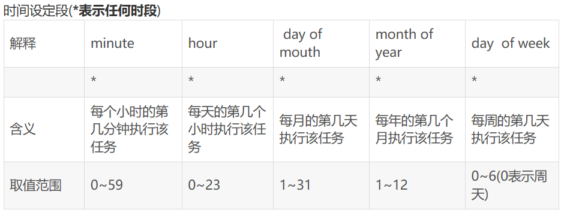
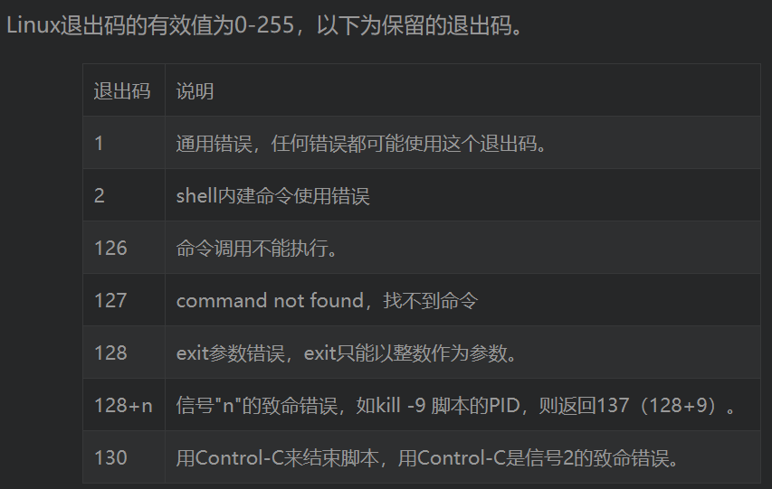

## Linux 的一些常识以及相关常用命令

### 一、命令


#### awk

awk默认是以行为单位处理文本的，对输入流中的每一行都执行后面 "{ }" 中的语句。

awk中的两个术语：

* 记录（默认就是文本的每一行）

* 字段 （默认就是每个记录中由空格或TAB分隔的字符串  也可以指定单个或多个分隔符  使用-F

假设test.txt文件内容为`I am Poe,my qq is 33794712`

awk   -F  '[ ,]'  '{print $3" " $7 }'   test.txt  注意:[]中为两个字符   空格与逗号  每行都分别以此字符分割

输出 Poe 33794712

$0就表示一个记录，$1表示记录中的第一个字段。

一般 print $0 就是打印整行内容（$0前面不需要反斜杠），print $1表示只打印每行第一个字段。

awk内简单编程

```shell
ps -ef |grep java |grep SA_CENTER_CSF |awk '

{

    for(i=1;i<=NF;i++)

    {

        if  (index($i,"SA_CENTER_CSF")==1) {print $i }

    }

}'
```


#### crontab

通过crontab可以在主机上设置一些定时任务

选项：

* -l   列出所有定时任务

* -e  vi模式编辑定时任务

表达式：



eg：

```shell
#eg：
5 * * * * Command                          每小时的第5分钟执行一次命令
30 18 * * * Command                     指定每天下午的 6:30 执行一次命令 
30 7 8 * * Command                      指定每月8号的7：30分执行一次命令 
30 5 8 6 * Command                     指定每年的6月8日5：30执行一次命令 
30 6 * * 0 Command                      指定每星期日的6:30执行一次命令 
```


#### find

查找文件的命令

eg：

```shell
find ./  -mtime  +10     //查找修改时间是10天之前的文件
find ./ -mtime  -10      //查找修改时间在10天之内的文件
find / -name "*.txt" -print 用于查找所有的‘ *.txt’文件在当前目录及子目录中；
find / -name "[A-Z]*" -print 用于根目录查找文件名以一个大写字母开头的文件；    .是当前目录  ..是上级目录
find / -name "[a-z][a-z][0--9][0--9].txt" -print 在当前目录查找文件名以两个小写字母开头，跟着是两个数字，最后是.txt的文件；
```


#### mkdir

创建文件夹

-p    创建不存在的父文件夹


#### chage

查看用户密码策略

eg：

```shell
chage -l wggl
```


#### date

输出时间或者设置时间

eg：

```shell
date '+%Y-%m-%d %H:%M:%S'     //输出为 2019-12-03 14:14:45 
date -d "-30 day" +%m-%d    //输出当前日期减30天得到的日期,并格式化输出
```


#### useradd 

新增用户

#### userdel

删除用户

#### env

输出所有环境变量


#### less

一个文本阅读器，并不会一次性读取所有文件内容，适合读取非常大的文件。

相关指令：

```shell
/字符串：向下搜索“字符串”的功能
?字符串：向上搜索“字符串”的功能
n：重复前一个搜索（与 / 或 ? 有关）
N：反向重复前一个搜索（与 / 或 ? 有关）
-N  显示每行的行号
-m 显示类似more命令的百分比
跳转指定某行  eg: 200g
q  退出
```

#### iptables

```shell
#显示当前iptables规则链，带序号：
iptables  -L -n --line-number
#对指定网段、端口开放，追加在规则列表末尾
iptables -A INPUT -s 10.14.49.0/24  -p tcp --dport 10000 -j ACCEPT
#对指定网段、端口开放，插入至规则列表第一条
iptables -I  INPUT  1 -s 10.14.49.0/24  -p tcp --dport 10000 -j ACCEPT
#删除input链的第二条规则
iptables -D INPUT 2
```


#### tee

可同时将输出  输出至控制台与文件当中

```shell
-a 表示追加文件模式
echo hello | tee -a test.log   ----将 hello同时输出至屏幕与test.log文件中
```


#### hostname

查看主机名，修改主机名

```shell
hostname    //输出当前主机名
hostname {newName} //设置新的hostname ,reboot后失效
nmtui    //弹出的界面中修改主机名    永久生效
```


#### tail

输出文件的尾部数据。

用法：`tail  [选项] {fileName}`

选项:

* -f  追加模式，会输出文件新追加的内容
* -n  {number}    输出文件最后的n行

#### head

输出文件头部的数据

用法 `head  -n  {number}  {fileName}`   输出文件头number行的数据


#### nc

即netcat

**选项：**

-l  {port}   监听端口 eg:  `nc   -l  80`

-v  显示连接过程的冗余信息 eg:`nc  10.9.238.35  22 -v`

可以在一台主机-l监听某端口，然后在另一台主机去连接，测试tcp端口是否通畅。


#### sed

利用此命令可以来处理文件流，单位是每一行


#### nl

输出文件，类似于cat，但是带有行号

eg: `nl  {fileName}`


#### ping

-c4  ping 4次

`ping www.baidu.com -c4`


#### stat

stat 命令, 查看指定文件或目录的状态.

```shell
stat -c %y sa-center-shcmcc-assembly-release.tar   ---输出文件最后修改时间
```


#### xargs 

xargs 命令   两个作用:

* 读取输入数据重新格式化后输出。

  ```shell
  cat  test.txt |xargs          多行输入转化为单行输出
  ```

* 格式化输入后作为参数传给命令

   ```shell
    ps -ef |grep java | awk '{print $2 }' |xargs kill -9     获取所有java进程的进程号  然后格式化为1行 传给kill -9命令作为参数
   ```

    


### 二、解决方案

#### 1、配置JDK环境变量

如果想要  环境变量永久生效  可以修改下面两个文件中的任何一个：

* /etc/profile    全局的  针对所有用户生效的
*   ~/.bash_profile    仅对当前用户生效的

在文件末尾追加：

```shell
export JAVA_HOME="/usr/jdk1.8"
export PATH="$PATH:$JAVA_HOME/bin"
export JRE_HOME="$JAVA_HOME/jre"
export CLASSPATH=".:$JAVA_HOME/lib:$JAVA_HOME/lib"
```

最后source一下配置文件。


#### 2、修改IP配置

修改ip配置文件 的文件所处的位置:   `/etc/sysconfig/networkd-scripts/`


#### 3、配置Ssh互信

##### 1、ssh登录的过程

ssh root@192.168.85.2    -p  222       以root身份登录85.2主机  SSH的默认端口是22，也就是说，你的登录请求会送进远程主机的22端口。使用p参数，可以修改这个端口
1.第一次登录远程主机的时候 会有如下提示:

`The authenticity of host '192.168.85.3 (192.168.85.3)' can't be established.
ECDSA key fingerprint is a6:dc:fe:45:43:a6:63:2b:94:f4:b3:f1:de:1b:f5:f9.
Are you sure you want to continue connecting (yes/no)?`

这段话的意思是，无法确认host主机的真实性，只知道它的公钥指纹，问你还想继续连接吗？
所谓"公钥指纹"，是指公钥长度较长（这里采用RSA算法，长达1024位），很难比对，所以对其进行MD5计算，将它变成一个128位的指纹。上例中是98:2e:d7:e0:de:9f:ac:67:28:c2:42:2d:37:16:58:4d，再进行比较，就容易多了。
很自然的一个问题就是，用户怎么知道远程主机的公钥指纹应该是多少？回答是没有好办法，远程主机必须在自己的网站上贴出公钥指纹，以便用户自行核对。

2.假定经过风险衡量以后，用户决定接受这个远程主机的公钥。
`Are you sure you want to continue connecting (yes/no)? yes`

3.系统会出现一句提示，表示host主机已经得到认可。
`Warning: Permanently added '192.168.85.3' (ECDSA) to the list of known hosts.`

4.接下来会提示你输入远程主机的用户密码:
`root@192.168.85.3's password:`       -----输入之后就顺利登录了远程主机

当远程主机的公钥被接受以后，它就会被保存在文件$HOME/.ssh/known_hosts之中。下次再连接这台主机，系统就会认出它的公钥已经保存在本地了，从而跳过警告部分，直接提示输入密码。
每个SSH用户都有自己的known_hosts文件，此外系统也有一个这样的文件，通常是/etc/ssh/ssh_known_hosts，保存一些对所有用户都可信赖的远程主机的公钥。

#####  2.使用ssh 公钥登录

使用密码登录，每次都必须输入密码，非常麻烦。好在SSH还提供了公钥登录，可以省去输入密码的步骤。
所谓"公钥登录"，原理很简单，就是用户将自己的公钥储存在远程主机上。登录的时候，远程主机会向用户发送一段随机字符串，用户用自己的私钥加密后，再发回来。
远程主机用事先储存的公钥进行解密，如果成功，就证明用户是可信的，直接允许登录shell，不再要求密码。

1. 这种方法要求用户必须提供自己的公钥。如果没有现成的，可以直接用ssh-keygen生成一个：
   `ssh-keygen -t rsa`        ---期间提示什么可以都不用输入  直接回车跳过
2. 运行结束以后，在$HOME/.ssh/目录下，会新生成两个文件：id_rsa.pub和id_rsa。前者是你的公钥，后者是你的私钥。
3. 这时再输入下面的命令，将公钥传送到远程主机host上面：
   `ssh-copy-id user@host`          -----  会提示你输入远程主机用户的密码  然后 会自动把你客户端的公钥追加到 远程主机的~/.ssh/authorized_keys文件末尾   然后你以后登录就不需要输入密码了

> 说明: authorized_keys文件
> 远程主机将用户的公钥，保存在登录后的用户主目录的$HOME/.ssh/authorized_keys文件中。公钥就是一段字符串，只要把它追加在authorized_keys文件的末尾就行了。

 

#### 4、多个shell编写时，获得上个shell的返回状态值

编写shell时，如何获取管道符衔接的各个命令的返回值呢？答案是使用  ${PIPESTATUS[0]}

```shell
ps -ef |grep java | wc -l ;echo ${PIPESTATUS[0]}
ps -ef |grep java | wc -l ;echo ${PIPESTATUS[1]}
ps -ef |grep java | wc -l ;echo ${PIPESTATUS[2]}
#则 ${PIPESTATUS[0]} 表示ps -ef 的返回值
#则 ${PIPESTATUS[1]} 表示grep java 的返回值
#则 ${PIPESTATUS[2]} 表示wc -l  的返回值
```

返回码说明：通过返回码可以判断shell的执行结果，成功或失败，自己写的子shell可以通过exit n ，将n回传给父shell




### 三、Shell例子

#### 1、定时删除日志的脚本

```shell
#!/bin/sh
find /home/sa/sa-center/logs/  -mtime +30 -type d -name \* | xargs rm -rf        //方法1 :  保留31天之内的日志,按文件最后修改的日期删除  每天执行  删除30天前创建的日志

find ${log_path}   -type d -name `date -d "-30 days" +%m%d  `| xargs rm -rf      //方法2 :  按文件名删除      每天执行  删除30天前的当天的日志
```

#### 2、将当前目录所有小写文件名转换为大写

```shell
#!/bin/bash
ls ./ |grep -v chna |while read filename 
do
        mv $filename `echo $filename | awk  -F . {'print toupper($1)".sh"} `;
done
```


