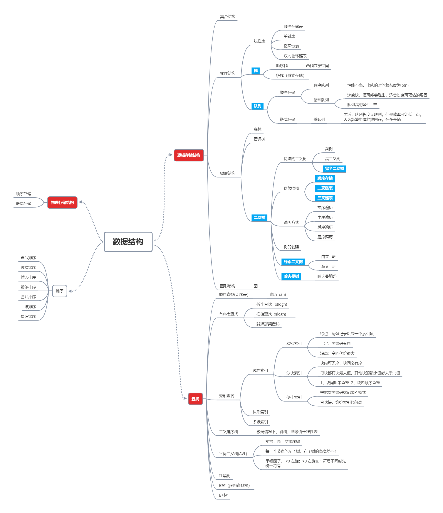

### 说明

大学时候几乎没有认真的上过一堂数据结构与算法的课，导致这方面的功底就非常的薄弱。在工作中也基本是crud，用到的数据结构不多。但是为了提高自己，这方面的东西还是需要理解并且熟记于心的。

于是在工作空闲的时候把《大话数据结构》看了一下，讲的通俗易懂，非常棒，现在把当时阅读时记录的笔记贴出来，当然理解的不是非常深入，但是对常用的数据结构的特性已经有了基本了解。图这块没看明白，还不是特别理解。

