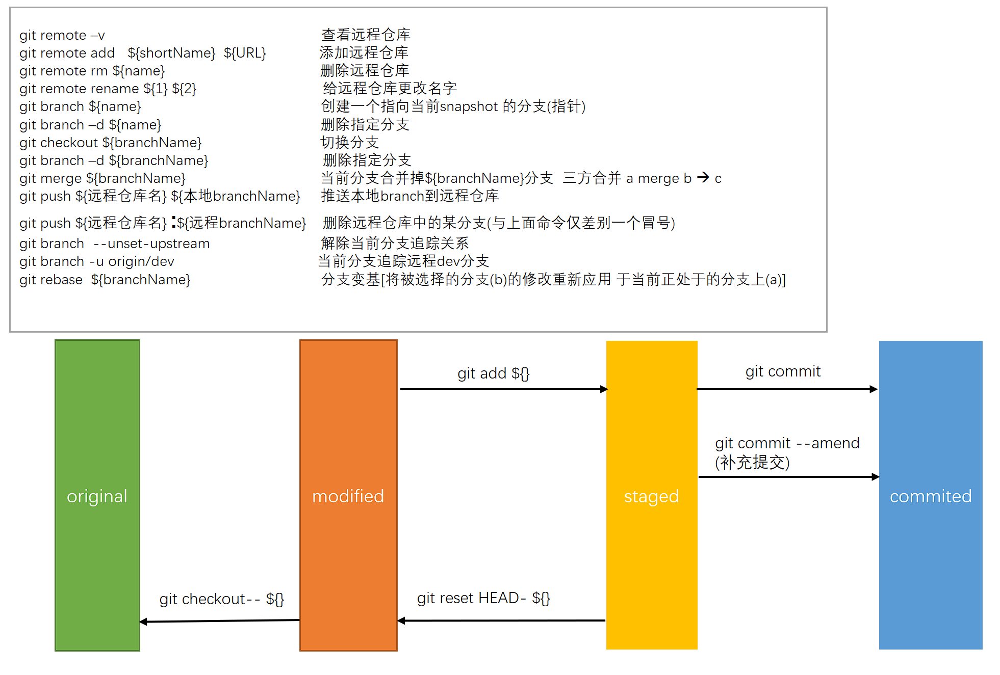

### 前言

今天整理以前的文档，看到以前刚开始接触git的时候，几乎把所有的命令都学了个遍，可惜，两年过去，只剩下些基础的命令会用了。但是回想当初仔细看官方文档的时候还是很有用的，不然不会很好的理解 rebase 与cherry-pick这两个神级命令。今天把当初的笔记从word里拷出来，懒得整理了，想看的话可以仔细过一遍附件的word，那个是当初一个个字敲出来的。Git一个图说清楚：




***

### Git 基础

​    Git俨然已经超越SVN，成为版本管理控制工具的首选了。Git 和其他版本控制系统的主要差别在于，Git 只关心文件数据的整体是否发生变化，而大多数其他系统则只关心文件内容的具体差异。

 

#### Git中文件的状态

文件的三种状态：

* 已提交（committed）: 表示该文件已经被安全地保存在本地数据库中了

* 已修改（modified）:  表示修改了某个文件，但还没有提交保存

* 已暂存（staged） 表示把已修改的文件放在下次提交时要保存的清单中。

每个项目都有一个 Git 目录（译注：如果 git clone 出来的话，就是其中 .git 的目录；如果 git clone --bare 的话，新建的目录本身就是 Git 目录。），它是 Git 用来保存元数据和对象数据库的地方。该目录非常重要，每次克隆镜像仓库的时候，实际拷贝的就是这个目录里面的数据。

从项目中取出某个版本的所有文件和目录，用以开始后续工作的叫做工作目录。这些文件实际上都是从 Git 目录中的压缩对象数据库中提取出来的，接下来就可以在工作目录中对这些文件进行编辑。


**基本的 Git 工作流程如下：**

1. 在工作目录中修改某些文件。

2. 对修改后的文件进行快照，然后保存到暂存区域。

3. 提交更新，将保存在暂存区域的文件快照永久转储到 Gi目录中。

 

#### git仓库

##### git init

第一种是在现存的目录下，通过导入所有文件来创建新的 Git 仓库。

对现有的某个项目开始用 Git 管理，只需到此项目所在的目录，执行：

```
git init
```

初始化后，在**当前目录**下**会出现一个名为** **.git** **的目录**，**所有** **Git** **需要的数据和资源都存放在这个目录中..**不过目前，仅仅是按照既有的结构框架初始化好了里边所有的文件和目录，但我们**还没有开始跟踪管理**项目中的**任何一个文件**。。

如果当前目录下有几个文件想要纳入版本控制，需要先用 git add 命令告诉 Git 开始对这些文件进行跟踪，然后提交：

```
$ git add  *.c
$ git add README
$ git commit -m 'initial project version'
```

##### git clone

**第二种**是从已有的 Git 仓库克隆出一个新的镜像仓库来。

如果想对某个开源项目出一份力，可以先把该项目的 Git 仓库复制一份出来，这就需要用到 **git clone** 命令。 Git 收取的是项目历史的所有数据（每一个文件的每一个版本），服务器上有的数据克隆之后本地也都有了。实际上，即便服务器的磁盘发生故障，用任何一个克隆出来的客户端都可以重建服务器上的仓库，回到当初克隆时的状态.clone指令的格式为

```
git clone [url]
```

比如，要克隆 Ruby 语言的 Git 代码仓库 Grit，可以用下面的命令：

```
git clone git://github.com/schacon/grit.git
```

这会在当前目录下创建一个名为grit的目录，其中包含一个 .git 的目录，用于保存下载下来的所有版本记录，然后从中取出最新版本的文件拷贝。如果进入这个新建的 grit 目录，你会看到项目中的所有文件已经在里边了，准备好后续的开发和使用。如果希望在克隆的时候，自己定义要新建的项目目录名称，可以在上面的命令末尾指定新的名字：

```
Git  clone  git://github.com/schacon/grit.git  mygrit
```

唯一的差别就是，现在新建的目录成了 mygrit，其他的都和上边的一样。

 

>  注意!! 工作目录下面的所有文件都不外乎这两种状态：已跟踪 或 未跟踪 

已跟踪的文件是指本来就被纳入版本控制管理的文件，在上次快照中有它们的记录，工作一段时间后，它们的状态可能是未更新，已修改或者已放入暂存区。而所有其他文件都属于未跟踪文件。它们既没有上次更新时的快照，也不在当前的暂存区域。初次克隆某个仓库时，工作目录中的所有文件都属于已跟踪文件，且状态为未修改。

在编辑过某些文件之后，Git 将这些文件标为已修改。我们逐步把这些修改过的文件放到暂存区域，直到最后一次性提交所有这些暂存起来的文件，如此重复。所以使用 Git 时的文件状态变化周期如图 2-1 所示

 

要确定哪些文件当前处于什么状态，可以用 **git status** 命令。

输入git status后 输出的内容中

​     Changes to be committed 已暂存状态。如果此时提交，那么该文件此时此刻的版本将被留存在历史记录中

​     Changes not staged for commit:  说明已跟踪文件的内容发生了变化，但还没有放到暂存区。要暂存这次更新

 

 

> 注意: git add**了一个文件放入暂存区后,****如果突然又改了这个文件,****再调用git status****查看会发现在暂存区** **和** **未暂存区中都** **出现了两次这个文件.****这是因为上一次git add****后文件还在暂存区中,****最新修改后的文件还未被添加到暂存区中.****如果此时提交(git commit)** **提交上去的是上一个版本.** **而不是上一次add****结束后新修改出来的最新版.****此时需要重新git add****一次最新版本的文件.** **将新的文件add****进去,****将上一次的旧版本替换掉.**

 

 

 

#### 忽略一些不需要追踪的文件

一般我们总会有些文件无需纳入 Git 的管理，也不希望它们总出现在未跟踪文件列表。通常都是些自动生成的文件，比如日志文件，或者编译过程中创建的临时文件等。我们可以创建一个名为 .gitignore 的文件，列出要忽略的文件模式。

认在目录下存在一个.gitignore文件,是隐藏的 .

 

文件 .gitignore 的格式规范如下：

1.**所有空行或者以注释符号** **＃** 开头的行都**会被** **Git** **忽略**。

2.可以使用标准的 glob 模式匹配。

3.**匹配模式最后跟反斜杠（/****）说明要忽略的是目录**。

4.要忽略指定模式以外的文件或目录，可以在模式前加上惊叹号（!）取反。

 

所谓的 glob 模式是指 shell 所使用的简化了的正则表达式。星号（*）匹配零个或多个任意字符；[abc] 匹配任何一个列在方括号中的字符（这个例子要么匹配一个 a，要么匹配一个 b，要么匹配一个 c）；问号（?）只匹配一个任意字符；如果在方括号中使用短划线分隔两个字符，表示所有在这两个字符范围内的都可以匹配（比如 [0-9] 表示匹配所有 0 到 9 的数字）。

 

我们再看一个 .gitignore 文件的例子：

​     

​        # 此为注释    – 将被 Git 忽略    # 忽略所有 .a 结尾的文件    *.a    # 但 lib.a 除外    !lib.a    # 仅仅忽略项目根目录下的 TODO 文件，不包括    subdir/TODO    /TODO    # 忽略 build/ 目录下的所有文件    build/    # 会忽略 doc/notes.txt 但不包括    doc/server/arch.txt    doc/*.txt    #    ignore all .txt files in the doc/ directory    doc/**/*.txt        

 


#### 提交更新

 

现在的暂存区域已经准备妥当可以提交了。提交之前，请一定要确认还有什么修改过的或新建的文件还没有 git add 过，否则提交的时候不会记录这些还没暂存起来的变化。所以，每次准备提交前，先用 git status 看下，是不是都已暂存起来了，然后再运行提交命令 git commit：

 

​     可以看到，默认的提交消息包含最后一次运行 git status 的输出，放在注释行里，另外开头还有一空行，供你输入提交说明(必须的)。你完全可以去掉这些注释行，不过留着也没关系，多少能帮你回想起这次更新的内容有哪些。（如果觉得这还不够，可以用 -v 选项将修改差异的每一行都包含到注释中来。）退出编辑器时，Git 会丢掉注释行，将说明内容和本次更新提交到仓库。

 

另外也可以用 -m 参数后跟提交说明的方式，在一行命令中提交更新：

git commit  -m  "-m + 参数可以省略启动vim再输入提交说明的步骤 "

[master 463dc4f] Story 182: Fix benchmarks for speed

 2 files changed, 3 insertions(+)

 create mode 100644 README

好，现在你已经创建了第一个提交！可以看到，提交后它会告诉你，当前是在哪个分支（master）提交的，本次提交的完整 SHA-1 校验和是什么（463dc4f），以及在本次提交中，有多少文件修订过，多少行添改和删改过。

记住，提交时记录的是放在暂存区域的快照，任何还未暂存的仍然保持已修改状态，可以在下次提交时纳入版本管理。每一次运行提交操作，都是对你项目作一次快照，以后可以回到这个状态，或者进行比较。

 

好，现在你已经创建了第一个提交！可以看到，提交后它会告诉你，当前是在哪个分支（master）提交的，本次提交的完整 SHA-1 校验和是什么（463dc4f），以及在本次提交中，有多少文件修订过，多少行添改和删改过。

 

#### 撤回更新

撤回可能需要撤消刚才所做的某些操作. 请注意，有些撤销操作是不可逆的，所以请务必谨慎小心，一旦失误，就有可能丢失部分工作成果

(1)修改最后一次提交

```
Git commit --amend
```

此命令将使用当前的暂存区域覆盖上一次commit时的使用的暂存区.如果两次相同的话,那么相同于你只能修改上一次提交时写的注释了.

(2)取消已经暂存的文件

```
Git reset HEAD 文件名
```

此命令将会将该文件从暂存区给去掉,再次变成需要暂存的状态.

(3)取消对文件的所有修改 (就是回复到上一次commit时的状态).

```
Git checkout -- filename
```

 这样就可以忽略对这个文件的所有修改并将其恢复到git仓库中其上一次被commit时的状态了. **注意:**如果已经git add将其放入了 暂存区 中. 然后再git checkout 忽略修改的话, 虽然至此步已经恢复文件的初始状态了. 但是如果不把暂存区中的此文件去掉, 这种情况下 git commit 的话,仍然会把暂存区中的内容提交掉.

 

 

#### Git远程仓库的使用

远程仓库是指托管在网络上的项目仓库，可能会有好多个，其中有些你只能读，另外有些可以写。同他人协作开发某个项目时，需要管理这些远程仓库，以便推送或拉取数据，分享各自的工作进展。

(1)查看当前的远程仓库

```
Git remote --verbose
```

它会列出每个远程库的简短名字。在克隆完某个项目后，至少可以看到一个名为 origin 的远程库，Git 默认使用这个名字来标识你所克隆的原始仓库,

这样一来，我就可以非常轻松地从这些用户的仓库中，拉取他们的提交到本地。请注意，上面列出的地址只有 origin 用的是 SSH URL 链接，所以也只有这个仓库我能推送数据上去

 

(2) 添加远程仓库

要添加一个新的远程仓库，可以指定一个简单的名字，以便将来引用

```
git remote add [shortname] [url]
```

(3) 从远程仓库抓取数据

```
git fetch remote remotename   
```

​     此命令会到远程仓库中拉取所有你本地仓库中还没有的数据。运行完成后，你就可以在本地访问该远程仓库中的所有分支，将其中某个分支合并到本地，或者只是取出某个分支，一探究竟。

​     如果是克隆了一个仓库，此命令会自动将远程仓库归于 origin 名下。所以，git fetch origin 会抓取从你上次克隆以来别人上传到此远程仓库中的所有更新（或是上次 fetch 以来别人提交的更新）。有一点很重要，需要记住，fetch 命令只是将远端的数据拉到本地仓库，并不自动合并到当前工作分支，只有当你确实准备好了，才能手工合并。

 

(4) 推送数据到远程仓库

项目进行到一个阶段，要同别人分享目前的成果，可以将本地仓库中的数据推送到远程仓库。实现这个任务的命令很简单：

```
Git push origin master
```

只有在所克隆的服务器上有写权限，或者同一时刻没有其他人在推数据，这条命令才会如期完成任务。如果在你推数据前，已经有其他人推送了若干更新，那你的推送操作就会被驳回。你必须先把他们的更新抓取到本地，合并到自己的项目中，然后才可以再次推送。

(5) [查看远程仓库信息](https://git-scm.com/book/zh/v1/Git-基础-远程仓库的使用#查看远程仓库信息)

```
git remote show [remote-name]
```

 

#### Git分支

**本地分支**

​     几乎每一种版本控制系统都以某种形式支持分支。使用分支意味着你可以从开发主线上分离开来，然后在不影响主线的同时继续工作。在很多版本控制系统中，这是个昂贵的过程，常常需要创建一个源代码目录的完整副本，对大型项目来说会花费很长时间。

有人把 Git 的分支模型称为“必杀技特性”，而正是因为它，将 Git 从版本控制系统家族里区分出来。Git 有何特别之处呢？Git 的分支可谓是难以置信的轻量级，它的新建操作几乎可以在瞬间完成，并且在不同分支间切换起来也差不多一样快。和许多其他版本控制系统不同，Git 鼓励在工作流程中频繁使用分支与合并，哪怕一天之内进行许多次都没有关系。理解分支的概念并熟练运用后，你才会意识到为什么 Git 是一个如此强大而独特的工具，并从此真正改变你的开发方式。

```

Git branch branchname  创建新分支
Git checkout branchname 切换到这个分支
git branch –all        查看所有分支情况
git merge branchname   合并某个分支   
git checkout master 切换至master分支
git merge hotfix    合并hotfix分支
```

 

**远程分支**

远程分支（remote branch）是对远程仓库中的分支的索引。它们是一些无法移动的本地分支；只有在 Git 进行网络交互时才会更新。远程分支就像是书签，提醒着你上次连接远程仓库时上面各分支的位置. 我们用 (远程仓库名)/(分支名) 这样的形式表示远程分支。

当你从一个url  git clone url后,本地就会下载这个仓库的所有版本的所有文件数据. 如果远程仓库中是有多个分支的,例如远程仓库有三个分支: master branch1 branch2  它在本地会将这些远程分支命名为 origin/master origin/branch1 origin/branch2  (git branch –a 命令可以查看)

但是你无法修直接修改这些远程分支(如果你强行checkout至origin/branch1分支下进行修改文档,当你commit时,也不会直接保存在origin/branch1分支下,git会自动为你分离出一个分支供你去commit 然后需要你手工将这个新的快照和一个新的本地分支联系起来). 如果你需要从最新的远程分支中去开始工作 ,应该先checkout至这个远程分支,然后以此为原点新建一个新的分支,然后checkout至新建的分支中再开始你的工作. 当然,在你git clone url

到本地的时候, Git 通常会自动创建一个名为 master 的分支来跟踪 origin/master。

当你从服务器git fetch origin 获取了最新版本的远程仓库时(例如git master 分支的最新内容) 然后从此分支为原点checkout切换至本地master分支开始工作 ,当你工作结束想要将自己的工作内容推送到远程 master分支,然而有人已经提前一步修改了master分支,此时远程master分支与本地master分支已经分流进入了不同的方向,你应该先git fetch origin 获取最新的远程分支版本.然后checkout 至本地分支然后将origin/master分支将其合并进来.,如果有文件冲突,手动结局之后,就可以git push origin将自己所做的更新推送到远程仓库了.

 

**推送本地分支**:

```
git push origin branchname:远程仓库的分支名
```

通过此语法，你可以把本地分支推送到某个命名不同的远程分支：若想把远程分支叫作 awesomebranch，可以用 git push origin serverfix:awesomebranch 来推送数据。


**删除远程分支**

​     git push origin :serverfix

啪,远程仓库中的serverfix的分支就被你删除啦!


#### Git 常用命令

克隆仓库的命令格式为

```
git clone [url]

git confit --list                              查看已有的git配置信息

git config --global user.name "xxx"**             修改全局的用户名

git config --global user.email "xxx"**             修改全局的邮件

git status                               查看哪些文件处于哪些状态

gid add  文件或目录名                 git add 后面可以指明要跟踪的文件或目录路径。如果是目录的话，就说明要递归跟踪该目录下的所有文件

**译注：其实 git add** **的潜台词就是把目标文件快照放入暂存区域，也就是 add file into staged area****，同时未曾跟踪过的文件标记为需要跟踪。这样就好理解后续 add** **操作的实际意义了。**

**这是个多功能命令，根据目标文件的状态不同，此命令的效果也不同：****可以用它开始跟踪新文件****，或者把已跟踪的文件放到暂存区，****还能用于合并时把有冲突的文件标记为已解决状态****等**

 
git diff   不过是显示还没有暂存起来的改动，而不是这次工作和上次提交之间的差异

git diff --cached   看已经暂存起来的文件和上次提交时的快照之间的差异

git commit   提交更新

git commit -a 选项，Git 就会自动把所有已经跟踪过的文件暂存起来一并提交，

git log   默认不用任何参数的话，git log 会按提交时间列出所有的更新，最近的更新排在最上面 **-p** 选项展开显示每次提交的内容差异，用 **-2** 则仅显示最近的两次更新

git commit –amend  使用当前的暂存区域覆盖上一次commit时的使用的暂存区.

git reset HEAD filename 将文件从暂存区中去除

git checkout filename      忽略对这个文件的修改并恢复到其上一次被commit时的状态了

git remote               查看当前配置有哪些远程仓库, 也可以加上 **-v** 选项（译注：此为 **--verbose** 的简写，取首字母），显示对应的克隆地址

git checkout branchname  切换到这个分支

git branch branchname  创建新分支

git branch –all        查看所有分支情况

git checkout -b iss53  ----à等价于   **git branch iss53**

git checkout iss53 两条命令

git merge branchname      合并某个分支   

git branch –d hotfix      删除某个分支

git branch –v                   若要查看各个分支最后一个提交对象的信息，运行 

git branch --no-merged          查看哪个分支没有合并

git branch –merged                  查看已经融合的分支

 


git branch --unset-upstream   解除当前分支追踪关系

git branch -u origin/dev        当前分支追踪远程dev分支

git push –force        不论如何 直接将本地分支当前内容强行覆盖远程分支

git config --global core.quotepath false   解决git bash中文件夹乱码的问题

git checkout -- ${fileName}    忽略已修改的文件内容(即恢复文件至上一次commit状态)

git commit –amend      补充提交,再
```

